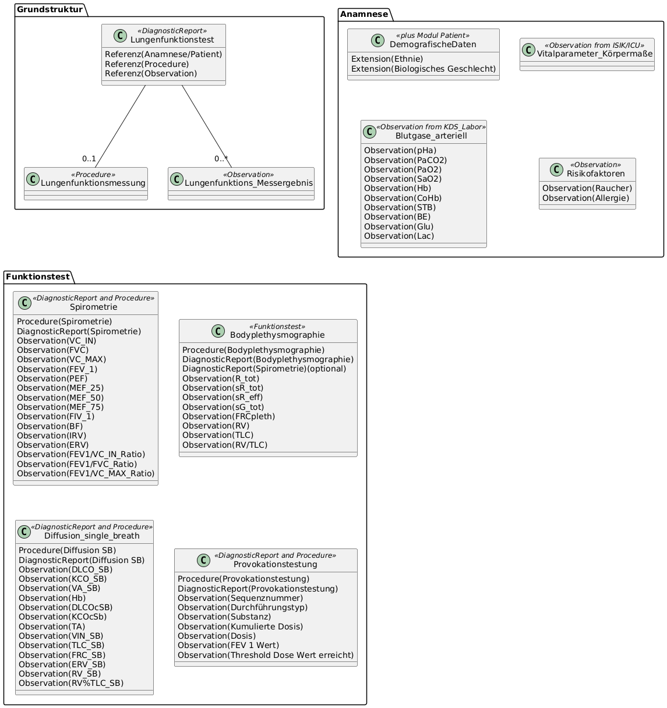

# UML Diagrams - MII IG Kerndatensatz-Modul Lungenfunktion v2027.0.0-ballot.rc1

* [**Table of Contents**](toc.md)
* [**Guidance**](guidance.md)
* **UML Diagrams**

## UML Diagrams

The class diagram below shows the information model of the Pulmonary Function module with its domain concepts and their relationships. It serves as an overview; the normative artifacts are the [profiles](profiles.md), and the element structure is described by the [logical model](logical-models.md).

