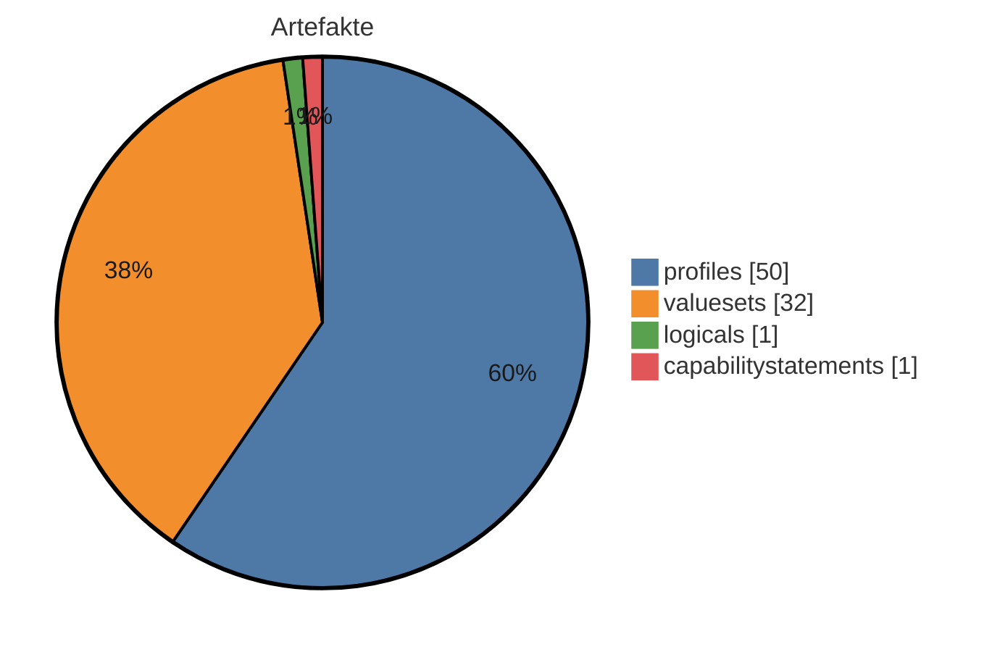
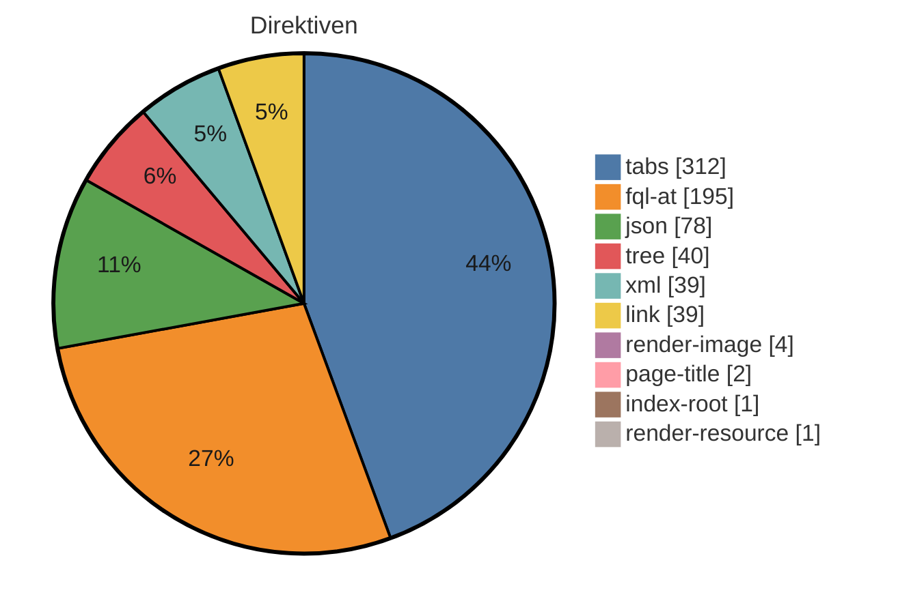

# IG-Statistik — Lungenfunktion 2026.0.0 (Quelle)

_Modus: `static` · Stand: 2026-08-28T08:13:57Z · Commit: `7a42ed7`_

## Kennzahlen-Überblick

### Artefakte (Σ 84 publiziert)

_Hier wird gezählt, wie viele FHIR-Bausteine (Profile, Extensions, ValueSets usw.) der IG je Typ definiert._

<div align="center">



</div>

<div align="center">

| Typ | Anzahl |
|---|---|
| profiles | 50 |
| valuesets | 32 |
| logicals | 1 |
| capabilitystatements | 1 |

</div>

_Interne FSH-Konstrukte (nicht in Σ): 24 rulesets, 1 mappings._

### Plattform-Direktiven — Σ 711 (unbekannt: 0)

_Dieser Abschnitt listet die plattformspezifischen Platzhalter in den Erklärseiten, die ein generischer IG Publisher nicht versteht und die daher umgesetzt werden müssen._

<div align="center">



</div>

<div align="center">

| Direktive | Anzahl |
|---|---|
| tabs | 312 |
| fql-at | 195 |
| json | 78 |
| tree | 40 |
| xml | 39 |
| link | 39 |
| render-image | 4 |
| page-title | 2 |
| index-root | 1 |
| render-resource | 1 |

</div>

## Inhaltsumfang & Repo-Hygiene

_Linguistische Kennzahlen zum Textumfang (Wörter je Seite, Durchschnitt) sowie Hinweise auf inhaltliche Dopplungen und nicht referenzierte Dateien (Dead-Code-Analogie) - hilft, Umfang und Aufräumpotenzial einzuschätzen._

<div align="center">

| Kennzahl | Wert |
|---|---|
| Inhalts-Seiten | 49 |
| Wörter gesamt | 7796 |
| Ø Wörter / Seite | 159,1 |
| Median Wörter / Seite | 142 |
| kürzeste / längste Seite | 85 / 652 Wörter |
| doppelte Inhaltsblöcke | 8 |
| identische Seiten (Gruppen) | 1 |
| Bilder nicht referenziert | 0 von 1 |
| Beispiele nicht in Narrativen | 0 von 0 |

</div>

_Heuristik: 'nicht referenziert' = Dateiname/Artefaktname kommt in keiner Erklärseite vor. Kein Beweis für Ungenutztheit (Referenz kann über Konfiguration/Build erfolgen)._

## Reife-Komponenten (gezählt)

_Gezählte Reife-Komponenten nebeneinander: Status, Vollständigkeit der Dokumentation, Beispiel-Abdeckung der Profile und Governance-Merkmale. Bewusst kein verdichteter Score und kein Freigabe-Urteil — die Einordnung bleibt menschlich._

<div align="center">

| Komponente | Wert |
|---|---|
| Status | active |
| Doku-Vollständigkeit (Inhalt vs. Stubs) | 86 % |
| Beispiel-Abdeckung Profile | 0 % (0/50) |
| Governance (CI · ig.ini · publication · devcontainer) | 25/100 |

</div>

**Profile ohne Beispiel (50):** `MII_PR_Lungenfunktion_Bodyplethysmographie`, `MII_PR_Lungenfunktion_Bodyplethysmographie_Messung`, `MII_PR_Lungenfunktion_FRC`, `MII_PR_Lungenfunktion_RVL`, `MII_PR_Lungenfunktion_RVL_TLC`, `MII_PR_Lungenfunktion_R`, `MII_PR_Lungenfunktion_TLC`, `MII_PR_Lungenfunktion_sG_Total`, `MII_PR_Lungenfunktion_R_Effektiv`, `MII_PR_Lungenfunktion_R_Spezifisch`, `MII_PR_Lungenfunktion_Befund`, `MII_PR_Lungenfunktion_Diffusion_Messung`, `MII_PR_Lungenfunktion_Diffusion`, `MII_PR_Lungenfunktion_DLCO`, `MII_PR_Lungenfunktion_DLCOc`, `MII_PR_Lungenfunktion_Hb`, `MII_PR_Lungenfunktion_KCO`, `MII_PR_Lungenfunktion_KCOc`, `MII_PR_Lungenfunktion_VA`, `MII_PR_Lungenfunktion_1_Viskositaet`, `MII_PR_Lungenfunktion_Diffusionskapzitaet`, `MII_PR_Lungenfunktion_Fluss`, `MII_PR_Lungenfunktion_Prozent`, `MII_PR_Lungenfunktion_Widerstand`, `MII_PR_Lungenfunktion_Transferkoeffizient`, `MII_PR_Lungenfunktion_Viskositaet`, `MII_PR_Lungenfunktion_Volumen`, `MII_PR_Lungenfunktion_Gewicht`, `MII_PR_Lungenfunktion_Dosis_Gabe`, `MII_PR_Lungenfunktion_Methacholine`, `MII_PR_Lungenfunktion_Dosis`, `MII_PR_Lungenfunktion_Provokationstest_Messung`, `MII_PR_Lungenfunktion_Provokationstest`, `MII_PR_Lungenfunktion_BF`, `MII_PR_Lungenfunktion_FEV`, `MII_PR_Lungenfunktion_FEV1_VC`, `MII_PR_Lungenfunktion_FEV_FVC`, `MII_PR_Lungenfunktion_FIV`, `MII_PR_Lungenfunktion_FVC`, `MII_PR_Lungenfunktion_IC`, `MII_PR_Lungenfunktion_MEF`, `MII_PR_Lungenfunktion_PEF`, `MII_PR_Lungenfunktion_RV`, `MII_PR_Lungenfunktion_VC`, `MII_PR_Lungenfunktion_Spirometrie`, `MII_PR_Lungenfunktion_Spirometrie_Messung`, `MII_PR_Lungenfunktion_Umgebung`, `MII_PR_Lungenfunktion_Luftfeuchtigkeit`, `MII_PR_Lungenfunktion_Lufttemperatur`, `MII_PR_Lungenfunktion_CO2_Konzentration`

## Strategie: Wiederverwendung, Lock-in & Zukunftssicherheit

_Strategische Kennzahlen: Bindung an die Quellplattform (Lock-in), Anteil standardisierter Terminologie, Wiederverwendung externer Bausteine und Zukunftssicherheit (FHIR-Version, Pflege-Aktivität)._

<div align="center">

| Kennzahl | Wert |
|---|---|
| Hersteller-Lock-in | 100/100 (hoch) · 14,5 Direktiven/Seite |
| Standard-Terminologie-Anteil | 100 % (SNOMED CT, LOINC, ICD-10, UCUM, ATC) |
| Wiederverwendung externer Profile (Parents) | 46 % (23 von 50 Profil-Parents extern; abstrakte LM-Basistypen ausgeschlossen) |
| FHIR-Version | R4 — aktuell verbreitet |
| Dependency-Veraltung | 0 veraltet (Heuristik) |
| Pflege-Kadenz | 89.8 Commits/Jahr · letzter Commit vor 56 Tagen |

</div>

_Lock-in und Standard-Terminologie-Anteil sind grobe Heuristiken aus Textvorkommen. Heuristik aus CalVer-Jahr; exakt nur via Package-Registry (extern)._

## Risiko & Compliance

_Entscheidungsrelevante Risiken für die Freigabe: Terminologie-Lizenzen, unterdrückte Warnungen, Datenschutz-Substanz, Wissenskonzentration (Bus-Faktor) und Kompatibilitätsbruch zur Vorversion._

<div align="center">

| Risiko | Bewertung |
|---|---|
| Terminologie-Lizenz | Lizenzbedarf möglich — SNOMED CT: lizenzpflichtig (Affiliate/Land), LOINC: frei (Registrierung), ICD-10: frei, UCUM: frei, ATC: eingeschränkt |
| Unterdrückte QA-Warnungen | 0 (davon 0 breit) → keine |
| Datenschutz-Seite (Substanz) | fehlt/nur Stub (0 Wörter) |
| PII-artige Beispieldaten | keine erkannt |
| Bus-Faktor (Wissenskonzentration) | 73 % Top-Autor → mittel |
| Breaking-Change-Risiko ggü. Vorversion | — (nur per Build/Vorversions-Diff) |

</div>

## Befunde & Einordnung

_Je Themenbereich der gemessene Befund und eine neutrale Einordnung, was er über den Guide aussagt — keine Handlungs- oder Migrationsanweisungen._

<div align="center">

| Bereich | Befund | Einordnung |
|---|---|---|
| Artefakte (FSH) | 84 publiziert, FSH vorhanden | Zählt die publizierten Konformitätsressourcen und ob FSH-Quelltext vorliegt. FSH-Quellen machen den Bestand direkt les-, diff- und weiterverarbeitbar; ohne sie ist nur das generierte JSON/XML die Quelle. |
| Narrative | 49 Inhalts-Seiten, Format source | Anzahl und Format der Erklärseiten (source = Plattformformat, target = IG-Publisher-Format). Das Format bestimmt, welche Werkzeuge die Seiten unverändert verarbeiten können. |
| Direktiven | 711 (0 unbekannt) | Vorkommen plattformspezifischer Platzhalter/Tags, die nur die Quellplattform interpretiert. Je mehr davon, desto stärker ist die Darstellung an die Plattform gebunden (vgl. Lock-in-Kennzahl). |
| Dependencies | 4 (0 floating) | Deklarierte Paket-Abhängigkeiten und ihr Pinning. Floating-Einträge folgen automatisch neuen Versionen und machen Builds weniger reproduzierbar — der Wert zeigt, wie reproduzierbar der aktuelle Stand ist. |
| Mehrsprachigkeit | FSH-Übersetzung ja, Supplements 0 | Ob Übersetzungen in den FSH-Quellen (translation-Extensions) und/oder als Publisher-Supplements vorliegen. Die beiden Mechanismen decken unterschiedliche Textarten ab; der Wert zeigt den vorhandenen Stand, nicht den Bedarf. |
| Pflichtseiten | 0/13 im Zielformat | Wie viele Seiten des hinterlegten Pflicht-Rasters (mandatory_pages in dieser Datei) im Zielformat existieren. Die Aussagekraft hängt vom Raster ab: Nutzt ein Guide legitim ein anderes Seitenraster, wird das Raster korrigiert — nicht die Seiten als fehlend gewertet. |
| QC-Regeln | 8 definiert | Anzahl der im Projekt definierten Qualitätsregeln (qc/custom.rules.yaml). Statisch wird nur die Definition gezählt; Verletzungen zeigt erst der Qualitätslauf eines Builds. |
| Metadaten/Config | id mii-ig-lungenfunktion, v2026.0.0 | Kern-Identität (id, Version) wie in sushi-config.yaml/package.json deklariert; die vollständigen Identitätsfelder stehen im Anhang. |

</div>

## Direktiven-Mapping (Detail)

_Dieser Abschnitt ordnet jedem Direktiven-Typ sein dokumentiertes Standard-Gegenstück im IG-Publisher-Format zu — eine Faktenreferenz, kein Arbeitsauftrag; sortiert nach Häufigkeit._

<div align="center">

| Direktive | Anzahl | Was es tut | Standard-Gegenstück (IG Publisher) |
|---|---|---|---|
| tabs | 312 | Gruppiert mehrere Inhalte (z.B. Darstellung, XML, JSON) in umschaltbare Reiter. | Die einzelnen Reiterinhalte durch die jeweils passenden generierten Anzeige-Fragmente (Struktur, XML, JSON) ersetzen; eine eigene Reiter-Mechanik ist meist nicht nötig. |
| fql-at | 195 | Markiert einen Abfrage-Codeblock in besonderer Schreibweise (mit @-Präfix). | Wie einen normalen Abfrageblock behandeln und durch ein generiertes Tabellen-Fragment oder eine statische Tabelle ersetzen. |
| json | 78 | Zeigt eine Ressource oder ein Beispiel in JSON-Darstellung an. | Durch das vom IG Publisher erzeugte JSON-Anzeige-Fragment ersetzen. |
| tree | 40 | Zeigt die Struktur eines Profils/einer Extension als aufklappbaren Strukturbaum an. | Durch das vom IG Publisher erzeugte Struktur-Fragment ersetzen (Snapshot- oder Differential-Ansicht bzw. Element-Wörterbuch). |
| xml | 39 | Zeigt eine Ressource oder ein Beispiel in XML-Darstellung an. | Durch das vom IG Publisher erzeugte XML-Anzeige-Fragment ersetzen. |
| link | 39 | Erzeugt einen Verweis auf ein einzelnes Artefakt (z.B. dessen Übersichtsseite). | Durch einen normalen Markdown-Link auf die generierte Artefaktseite ersetzen (Form Typ-id.html). |
| render-image | 4 | Bindet ein Bild bzw. eine Grafik in die Seite ein. | Das Bild in das Bilderverzeichnis des Ziel-IG (input/images/) legen und über ein normales Markdown- oder HTML-Bild einbinden. |
| page-title | 2 | Setzt an dieser Stelle den Titel der Seite, der aus den Seiteneinstellungen gezogen wird. | Entfällt ersatzlos - Seitentitel und Überschrift steuert man zentral über die Seiten- und Menükonfiguration. |
| index-root | 1 | Erzeugt an dieser Stelle ein automatisches Inhaltsverzeichnis bzw. die Wurzel der Navigationsstruktur. | Entfällt - Navigation und Inhaltsverzeichnis erzeugt der IG Publisher selbst aus der konfigurierten Seitenstruktur. |
| render-resource | 1 | Rendert eine vollständige FHIR-Ressource (z.B. ein CapabilityStatement) in die Seite hinein. | Meist entfernen, da der IG Publisher für jedes Artefakt automatisch eine eigene Seite erzeugt; alternativ das passende vorgefertigte Anzeige-Fragment einbinden. |

</div>

# Anhang: Detailaufschlüsselung

_Im Anhang steht jeder Einzelwert mit seiner Quelle, damit man die Kennzahlen nachvollziehen kann, ohne im Projekt suchen zu müssen._

## Identität & Herkunft

<div align="center">

| Feld | Wert | Quelle |
|---|---|---|
| id | mii-ig-lungenfunktion | sushi-config.yaml / package.json |
| canonical | https://www.medizininformatik-initiative.de/fhir/ext/modul-lungenfunktion | sushi-config.yaml / package.json |
| packageId | de.medizininformatikinitiative.kerndatensatz.lungenfunktion | sushi-config.yaml / package.json |
| name | MII_IG_Lungenfunktion | sushi-config.yaml / package.json |
| title |  | sushi-config.yaml / package.json |
| version | 2026.0.0 | sushi-config.yaml / package.json |
| status | active | sushi-config.yaml / package.json |
| fhirVersion | 4.0.1 | sushi-config.yaml / package.json |
| license |  | sushi-config.yaml / package.json |
| publisher | Medizininformatik Initiative | sushi-config.yaml / package.json |
| calver | True | version-Regex |

</div>

## Dependencies

_Die FHIR-Pakete, auf denen der IG aufbaut, samt Version und ob diese fest oder offen angegeben ist._

<div align="center">

| Package | Version | Pin |
|---|---|---|
| de.medizininformatikinitiative.kerndatensatz.meta | 2026.0.0 | gepinnt |
| de.medizininformatikinitiative.kerndatensatz.base | 2026.0.0 | gepinnt |
| de.basisprofil.r4 | 1.5.4 | gepinnt |
| hl7.fhir.r4.core | 4.0.1 | gepinnt |

</div>

## Pre-flight (Migration Gate 0)

- Lizenz-Evidenz: **KEINE — in keiner Quelle deklariert**

- Canonical-Raum: 0 außerhalb + 3 id/url-abweichend → special-url-Prognose: 3

- Dependency-Gesundheit: old-style=keine; THO direkt gepinnt=False, Extensions-Pack=False — **Injektionsrisiko: der Publisher lädt zur Buildzeit das JEWEILS NEUESTE Release**; externe Parents: 4

- QA-Baseline: **keine im Baum** — für Vorher/Nachher-Beweise die unmigrierte Quelle bauen oder deren gerendertes qa beziehen

## Artefakte (Quelle: input/fsh (FSH-Deklarationen))

_Jedes definierte Artefakt mit Typ, Name und Fundort in den Quelldateien._

<div align="center">

| Typ | Name | InstanceOf | Quelle |
|---|---|---|---|
| RuleSet | SupportResource |  | input/fsh/capabilitystatements/CapabilityStatement.fsh:1 |
| RuleSet | Profile |  | input/fsh/capabilitystatements/CapabilityStatement.fsh:6 |
| RuleSet | SupportProfile |  | input/fsh/capabilitystatements/CapabilityStatement.fsh:11 |
| RuleSet | SupportInteraction |  | input/fsh/capabilitystatements/CapabilityStatement.fsh:17 |
| RuleSet | SupportSearchParam |  | input/fsh/capabilitystatements/CapabilityStatement.fsh:23 |
| Instance | mii-cps-lungenfunktion-capabilitystatement | CapabilityStatement | input/fsh/capabilitystatements/CapabilityStatement.fsh:31 |
| Logical | MII_LM_Lungenfunktion |  | input/fsh/logicals/LogicalModelLungenfunktion.fsh:3 |
| Mapping | Lungenfunktion-LogicalModel |  | input/fsh/logicals/LogicalModelLungenfunktion.fsh:94 |
| Profile | MII_PR_Lungenfunktion_Bodyplethysmographie |  | input/fsh/profiles/Bodyplethysmographie/BodyplethymograhpyReport.fsh:2 |
| Profile | MII_PR_Lungenfunktion_Bodyplethysmographie_Messung |  | input/fsh/profiles/Bodyplethysmographie/BodyplethymographyProcedure.fsh:2 |
| Profile | MII_PR_Lungenfunktion_FRC |  | input/fsh/profiles/Bodyplethysmographie/Observation_FRC.fsh:2 |
| Profile | MII_PR_Lungenfunktion_RVL |  | input/fsh/profiles/Bodyplethysmographie/Observation_RVL.fsh:2 |
| Profile | MII_PR_Lungenfunktion_RVL_TLC |  | input/fsh/profiles/Bodyplethysmographie/Observation_RVL_TLC.fsh:2 |
| Profile | MII_PR_Lungenfunktion_R |  | input/fsh/profiles/Bodyplethysmographie/Observation_R_tot.fsh:2 |
| Profile | MII_PR_Lungenfunktion_TLC |  | input/fsh/profiles/Bodyplethysmographie/Observation_TLC.fsh:2 |
| Profile | MII_PR_Lungenfunktion_sG_Total |  | input/fsh/profiles/Bodyplethysmographie/Observation_sG_tot.fsh:2 |
| Profile | MII_PR_Lungenfunktion_R_Effektiv |  | input/fsh/profiles/Bodyplethysmographie/Observation_sR_eff.fsh:2 |
| Profile | MII_PR_Lungenfunktion_R_Spezifisch |  | input/fsh/profiles/Bodyplethysmographie/Observation_sR_tot.fsh:2 |
| Profile | MII_PR_Lungenfunktion_Befund |  | input/fsh/profiles/DiagnosticReport.fsh:2 |
| Profile | MII_PR_Lungenfunktion_Diffusion_Messung |  | input/fsh/profiles/Diffusion/DiffusionProcedure.fsh:2 |
| Profile | MII_PR_Lungenfunktion_Diffusion |  | input/fsh/profiles/Diffusion/DiffusionReport.fsh:2 |
| Profile | MII_PR_Lungenfunktion_DLCO |  | input/fsh/profiles/Diffusion/Observation_DLCO.fsh:2 |
| Profile | MII_PR_Lungenfunktion_DLCOc |  | input/fsh/profiles/Diffusion/Observation_DLCOc.fsh:2 |
| Profile | MII_PR_Lungenfunktion_Hb |  | input/fsh/profiles/Diffusion/Observation_Hb.fsh:2 |
| Profile | MII_PR_Lungenfunktion_KCO |  | input/fsh/profiles/Diffusion/Observation_KCO.fsh:2 |
| Profile | MII_PR_Lungenfunktion_KCOc |  | input/fsh/profiles/Diffusion/Observation_KCOc.fsh:2 |
| Profile | MII_PR_Lungenfunktion_VA |  | input/fsh/profiles/Diffusion/Observation_VA.fsh:2 |
| Profile | MII_PR_Lungenfunktion_1_Viskositaet |  | input/fsh/profiles/Observation_1_Viscosity.fsh:2 |
| Profile | MII_PR_Lungenfunktion_Diffusionskapzitaet |  | input/fsh/profiles/Observation_Diffcapacity.fsh:2 |
| Profile | MII_PR_Lungenfunktion_Fluss |  | input/fsh/profiles/Observation_Flow.fsh:2 |
| Profile | MII_PR_Lungenfunktion_Prozent |  | input/fsh/profiles/Observation_Percent.fsh:2 |
| Profile | MII_PR_Lungenfunktion_Widerstand |  | input/fsh/profiles/Observation_Resistance.fsh:2 |
| Profile | MII_PR_Lungenfunktion_Transferkoeffizient |  | input/fsh/profiles/Observation_Transcoefficient.fsh:2 |
| Profile | MII_PR_Lungenfunktion_Viskositaet |  | input/fsh/profiles/Observation_Viscosity.fsh:2 |
| Profile | MII_PR_Lungenfunktion_Volumen |  | input/fsh/profiles/Observation_Volume.fsh:2 |
| Profile | MII_PR_Lungenfunktion_Gewicht |  | input/fsh/profiles/Observation_Weight.fsh:2 |
| Profile | MII_PR_Lungenfunktion_Dosis_Gabe |  | input/fsh/profiles/Provakationstest/Administration_Dosis.fsh:2 |
| Profile | MII_PR_Lungenfunktion_Methacholine |  | input/fsh/profiles/Provakationstest/Medication_Methacholine.fsh:2 |
| Profile | MII_PR_Lungenfunktion_Dosis |  | input/fsh/profiles/Provakationstest/Observation_Dosis.fsh:2 |
| Profile | MII_PR_Lungenfunktion_Provokationstest_Messung |  | input/fsh/profiles/Provakationstest/ProvocationProcedure.fsh:2 |
| Profile | MII_PR_Lungenfunktion_Provokationstest |  | input/fsh/profiles/Provakationstest/ProvocationReport.fsh:2 |
| Profile | MII_PR_Lungenfunktion_BF |  | input/fsh/profiles/Spirometrie/Observation_BF.fsh:2 |
| Profile | MII_PR_Lungenfunktion_FEV |  | input/fsh/profiles/Spirometrie/Observation_FEV.fsh:2 |
| Profile | MII_PR_Lungenfunktion_FEV1_VC |  | input/fsh/profiles/Spirometrie/Observation_FEV1_VC.fsh:2 |
| Profile | MII_PR_Lungenfunktion_FEV_FVC |  | input/fsh/profiles/Spirometrie/Observation_FEV_FVC.fsh:2 |
| Profile | MII_PR_Lungenfunktion_FIV |  | input/fsh/profiles/Spirometrie/Observation_FIV1.fsh:2 |
| Profile | MII_PR_Lungenfunktion_FVC |  | input/fsh/profiles/Spirometrie/Observation_FVC.fsh:2 |
| Profile | MII_PR_Lungenfunktion_IC |  | input/fsh/profiles/Spirometrie/Observation_IC.fsh:2 |
| Profile | MII_PR_Lungenfunktion_MEF |  | input/fsh/profiles/Spirometrie/Observation_MEF.fsh:2 |
| Profile | MII_PR_Lungenfunktion_PEF |  | input/fsh/profiles/Spirometrie/Observation_PEF.fsh:2 |
| Profile | MII_PR_Lungenfunktion_RV |  | input/fsh/profiles/Spirometrie/Observation_RV.fsh:2 |
| Profile | MII_PR_Lungenfunktion_VC |  | input/fsh/profiles/Spirometrie/Observation_VC.fsh:2 |
| Profile | MII_PR_Lungenfunktion_Spirometrie |  | input/fsh/profiles/Spirometrie/SpirometryReport.fsh:2 |
| Profile | MII_PR_Lungenfunktion_Spirometrie_Messung |  | input/fsh/profiles/Spirometrie/SpriometryProcedure.fsh:2 |
| Profile | MII_PR_Lungenfunktion_Umgebung |  | input/fsh/profiles/Umgebungsvariablen/Location.fsh:2 |
| Profile | MII_PR_Lungenfunktion_Luftfeuchtigkeit |  | input/fsh/profiles/Umgebungsvariablen/Observation_Humidity.fsh:2 |
| Profile | MII_PR_Lungenfunktion_Lufttemperatur |  | input/fsh/profiles/Umgebungsvariablen/Observation_Temperature.fsh:2 |
| Profile | MII_PR_Lungenfunktion_CO2_Konzentration |  | input/fsh/profiles/Umgebungsvariablen/Observavtion_CO2_concentration.fsh:2 |
| RuleSet | DICOM_Copyright |  | input/fsh/rulesets/copyright.fsh:1 |
| RuleSet | SNOMED_Copyright |  | input/fsh/rulesets/copyright.fsh:4 |
| RuleSet | LOINC_Copyright |  | input/fsh/rulesets/copyright.fsh:7 |
| RuleSet | PR_CS_VS_Date |  | input/fsh/rulesets/date.fsh:1 |
| RuleSet | Date |  | input/fsh/rulesets/date.fsh:4 |
| RuleSet | ExtensionContext |  | input/fsh/rulesets/extensions-context.fsh:1 |
| RuleSet | LicenseCodeableCCBY40 |  | input/fsh/rulesets/license-terms.fsh:3 |
| RuleSet | LicenseCodeableCCBY40Instance |  | input/fsh/rulesets/license-terms.fsh:7 |
| RuleSet | Publisher |  | input/fsh/rulesets/publisher.fsh:1 |
| RuleSet | SP_Publisher |  | input/fsh/rulesets/publisher.fsh:6 |
| RuleSet | Translation |  | input/fsh/rulesets/translation.fsh:1 |
| RuleSet | AddSnomedCodingTranslation |  | input/fsh/rulesets/translation.fsh:8 |
| RuleSet | AddLoincCodingTranslation |  | input/fsh/rulesets/translation.fsh:16 |
| RuleSet | AddObservationTranslation |  | input/fsh/rulesets/translation.fsh:24 |
| RuleSet | AddDiagnosticReportTranslation |  | input/fsh/rulesets/translation.fsh:144 |
| RuleSet | AddProcedureTranslation |  | input/fsh/rulesets/translation.fsh:229 |
| RuleSet | AddObservationTranslationAmbient |  | input/fsh/rulesets/translation.fsh:243 |
| RuleSet | Version |  | input/fsh/rulesets/version.fsh:1 |
| RuleSet | PR_CS_VS_Version |  | input/fsh/rulesets/version.fsh:4 |
| ValueSet | MII_VS_Lufu_SCT_Technique |  | input/fsh/valuesets/ValueSet-LuFu-SCT_Technique.fsh:1 |
| ValueSet | MII_VS_Lufu_LNC_DLCO |  | input/fsh/valuesets/ValueSet-LuFu_LNC_DLCO.fsh:1 |
| ValueSet | MII_VS_Lufu_LNC_DLCOc |  | input/fsh/valuesets/ValueSet-LuFu_LNC_DLCOc.fsh:1 |
| ValueSet | MII_VS_Lufu_LNC_FEV |  | input/fsh/valuesets/ValueSet-LuFu_LNC_FEV.fsh:1 |
| ValueSet | MII_VS_Lufu_LNC_FEV_FVC |  | input/fsh/valuesets/ValueSet-LuFu_LNC_FEVFVC.fsh:1 |
| ValueSet | MII_VS_Lufu_LNC_FRC |  | input/fsh/valuesets/ValueSet-LuFu_LNC_FRC.fsh:1 |
| ValueSet | MII_VS_Lufu_LNC_FVC |  | input/fsh/valuesets/ValueSet-LuFu_LNC_FVC.fsh:1 |
| ValueSet | MII_VS_Lufu_LNC_IC |  | input/fsh/valuesets/ValueSet-LuFu_LNC_IC.fsh:1 |
| ValueSet | MII_VS_Lufu_LNC_KCO |  | input/fsh/valuesets/ValueSet-LuFu_LNC_KCO.fsh:1 |
| ValueSet | MII_VS_Lufu_LNC_MEF |  | input/fsh/valuesets/ValueSet-LuFu_LNC_MEF.fsh:1 |
| ValueSet | MII_VS_Lufu_LNC_Observable |  | input/fsh/valuesets/ValueSet-LuFu_LNC_Observable.fsh:1 |
| ValueSet | MII_VS_Lufu_LNC_PEF |  | input/fsh/valuesets/ValueSet-LuFu_LNC_PEF.fsh:1 |
| ValueSet | MII_VS_Lufu_LNC_Procedure |  | input/fsh/valuesets/ValueSet-LuFu_LNC_Procedure.fsh:1 |
| ValueSet | MII_VS_Lufu_LNC_R |  | input/fsh/valuesets/ValueSet-LuFu_LNC_R.fsh:1 |
| ValueSet | MII_VS_Lufu_LNC_RV |  | input/fsh/valuesets/ValueSet-LuFu_LNC_RV.fsh:1 |
| ValueSet | MII_VS_Lufu_LNC_RVL |  | input/fsh/valuesets/ValueSet-LuFu_LNC_RVL.fsh:1 |
| ValueSet | MII_VS_Lufu_LNC_RVL_TLC |  | input/fsh/valuesets/ValueSet-LuFu_LNC_RVL_TLC.fsh:1 |
| ValueSet | MII_VS_Lufu_LNC_TLC |  | input/fsh/valuesets/ValueSet-LuFu_LNC_TLC.fsh:1 |
| ValueSet | MII_VS_Lufu_LNC_VC |  | input/fsh/valuesets/ValueSet-LuFu_LNC_VC.fsh:1 |
| ValueSet | MII_VS_Lufu_LNC_sR |  | input/fsh/valuesets/ValueSet-LuFu_LNC_sR.fsh:1 |
| ValueSet | MII_VS_Lufu_LNC_sR_eff |  | input/fsh/valuesets/ValueSet-LuFu_LNC_sR_eff.fsh:1 |
| ValueSet | MII_VS_Lufu_SCT_FEV |  | input/fsh/valuesets/ValueSet-LuFu_SCT_FEV.fsh:1 |
| ValueSet | MII_VS_Lufu_SCT_FEV_FVC |  | input/fsh/valuesets/ValueSet-LuFu_SCT_FEVFVC.fsh:1 |
| ValueSet | MII_VS_Lufu_SCT_FVC |  | input/fsh/valuesets/ValueSet-LuFu_SCT_FVC.fsh:1 |
| ValueSet | MII_VS_Lufu_SCT_MEF |  | input/fsh/valuesets/ValueSet-LuFu_SCT_MEF.fsh:1 |
| ValueSet | MII_VS_Lufu_SCT_Observable |  | input/fsh/valuesets/ValueSet-LuFu_SCT_Observable.fsh:1 |
| ValueSet | MII_VS_Lufu_SCT_PEF |  | input/fsh/valuesets/ValueSet-LuFu_SCT_PEF.fsh:1 |
| ValueSet | MII_VS_Lufu_SCT_RV |  | input/fsh/valuesets/ValueSet-LuFu_SCT_RV.fsh:1 |
| ValueSet | MII_VS_Lufu_SCT_VC |  | input/fsh/valuesets/ValueSet-LuFu_SCT_VC.fsh:1 |
| ValueSet | MII_VS_Lufu_SCT_Findings |  | input/fsh/valuesets/ValueSet-Lufu_SCT_Findings.fsh:1 |
| ValueSet | MII_VS_Lufu_SCT_Location |  | input/fsh/valuesets/ValueSet-Lufu_SCT_Location.fsh:1 |
| ValueSet | MII_VS_Lufu_SCT_Procedure |  | input/fsh/valuesets/ValueSet-Lufu_SCT_Procedure.fsh:1 |

</div>

## Narrative-Seiten (49 Inhalt / 57 gesamt)

_Die Erklärseiten des IG mit Umfang und der Angabe, ob es sich um Inhalts- oder reine Platzhalterseiten handelt._

<div align="center">

| Datei | Wörter | Format | Stub? |
|---|---|---|---|
| implementation-guides/mii-ig-lungenfunktion-de-v2026/MIIIGModulLungenfunktion/BeschreibungModul.page.md | 652 | source |  |
| implementation-guides/mii-ig-lungenfunktion-de-v2026/MIIIGModulLungenfunktion/KontextimGesamtprojektBezgezuanderenModulen.page.md | 314 | source |  |
| implementation-guides/mii-ig-lungenfunktion-de-v2026/MIIIGModulLungenfunktion/Index.page.md | 270 | source |  |
| implementation-guides/mii-ig-lungenfunktion-de-v2026/MIIIGModulLungenfunktion/AnwendungsflleInformationsmodell/BeschreibungvonSzenarienfrdieAnwendungderModule.page.md | 247 | source |  |
| implementation-guides/mii-ig-lungenfunktion-de-v2026/MIIIGModulLungenfunktion/AnwendungsflleInformationsmodell/UML/Index.page.md | 196 | source |  |
| implementation-guides/mii-ig-lungenfunktion-de-v2026/MIIIGModulLungenfunktion/Referenzen.page.md | 177 | source |  |
| implementation-guides/mii-ig-lungenfunktion-de-v2026/MIIIGModulLungenfunktion/TechnischeImplementierung/FHIR-Profile/Bodyplethysmographie/Observation/RVLTLC.page.md | 145 | source |  |
| implementation-guides/mii-ig-lungenfunktion-de-v2026/MIIIGModulLungenfunktion/TechnischeImplementierung/FHIR-Profile/Umgebungsvariablen/Luftfeuchtigkeit.page.md | 145 | source |  |
| implementation-guides/mii-ig-lungenfunktion-de-v2026/MIIIGModulLungenfunktion/TechnischeImplementierung/FHIR-Profile/Bodyplethysmographie/Observation/R_tot.page.md | 143 | source |  |
| implementation-guides/mii-ig-lungenfunktion-de-v2026/MIIIGModulLungenfunktion/TechnischeImplementierung/FHIR-Profile/Bodyplethysmographie/Observation/sG_tot.page.md | 143 | source |  |
| implementation-guides/mii-ig-lungenfunktion-de-v2026/MIIIGModulLungenfunktion/TechnischeImplementierung/FHIR-Profile/Bodyplethysmographie/Observation/sR_eff.page.md | 143 | source |  |
| implementation-guides/mii-ig-lungenfunktion-de-v2026/MIIIGModulLungenfunktion/TechnischeImplementierung/FHIR-Profile/Bodyplethysmographie/Observation/sR_tot.page.md | 143 | source |  |
| implementation-guides/mii-ig-lungenfunktion-de-v2026/MIIIGModulLungenfunktion/TechnischeImplementierung/FHIR-Profile/Bodyplethysmographie/Procedure.page.md | 143 | source |  |
| implementation-guides/mii-ig-lungenfunktion-de-v2026/MIIIGModulLungenfunktion/TechnischeImplementierung/FHIR-Profile/Diffusion/Procedure.page.md | 143 | source |  |
| implementation-guides/mii-ig-lungenfunktion-de-v2026/MIIIGModulLungenfunktion/TechnischeImplementierung/FHIR-Profile/Provokationstest/Procedure.page.md | 143 | source |  |
| implementation-guides/mii-ig-lungenfunktion-de-v2026/MIIIGModulLungenfunktion/TechnischeImplementierung/FHIR-Profile/Spirometrie/Procedure.page.md | 143 | source |  |
| implementation-guides/mii-ig-lungenfunktion-de-v2026/MIIIGModulLungenfunktion/TechnischeImplementierung/FHIR-Profile/Umgebungsvariablen/CO2-Konzentration.page.md | 143 | source |  |
| implementation-guides/mii-ig-lungenfunktion-de-v2026/MIIIGModulLungenfunktion/TechnischeImplementierung/FHIR-Profile/Umgebungsvariablen/Lufttemperatur.page.md | 143 | source |  |
| implementation-guides/mii-ig-lungenfunktion-de-v2026/MIIIGModulLungenfunktion/TechnischeImplementierung/FHIR-Profile/Umgebungsvariablen/Umgebung.page.md | 143 | source |  |
| implementation-guides/mii-ig-lungenfunktion-de-v2026/MIIIGModulLungenfunktion/TechnischeImplementierung/FHIR-Profile/Bodyplethysmographie/Observation/RVL.page.md | 142 | source |  |
| implementation-guides/mii-ig-lungenfunktion-de-v2026/MIIIGModulLungenfunktion/TechnischeImplementierung/FHIR-Profile/Bodyplethysmographie/Report.page.md | 142 | source |  |
| implementation-guides/mii-ig-lungenfunktion-de-v2026/MIIIGModulLungenfunktion/TechnischeImplementierung/FHIR-Profile/Diffusion/Report.page.md | 142 | source |  |
| implementation-guides/mii-ig-lungenfunktion-de-v2026/MIIIGModulLungenfunktion/TechnischeImplementierung/FHIR-Profile/Provokationstest/Observation/FEV.page.md | 142 | source |  |
| implementation-guides/mii-ig-lungenfunktion-de-v2026/MIIIGModulLungenfunktion/TechnischeImplementierung/FHIR-Profile/Provokationstest/Report.page.md | 142 | source |  |
| implementation-guides/mii-ig-lungenfunktion-de-v2026/MIIIGModulLungenfunktion/TechnischeImplementierung/FHIR-Profile/Spirometrie/Observation/FEV.page.md | 142 | source |  |
| implementation-guides/mii-ig-lungenfunktion-de-v2026/MIIIGModulLungenfunktion/TechnischeImplementierung/FHIR-Profile/Spirometrie/Observation/FEVFVC.page.md | 142 | source |  |
| implementation-guides/mii-ig-lungenfunktion-de-v2026/MIIIGModulLungenfunktion/TechnischeImplementierung/FHIR-Profile/Spirometrie/Observation/FEVVC.page.md | 142 | source |  |
| implementation-guides/mii-ig-lungenfunktion-de-v2026/MIIIGModulLungenfunktion/TechnischeImplementierung/FHIR-Profile/Spirometrie/Observation/IC.page.md | 142 | source |  |
| implementation-guides/mii-ig-lungenfunktion-de-v2026/MIIIGModulLungenfunktion/TechnischeImplementierung/FHIR-Profile/Spirometrie/Report.page.md | 142 | source |  |
| implementation-guides/mii-ig-lungenfunktion-de-v2026/MIIIGModulLungenfunktion/TechnischeImplementierung/FHIR-Profile/Bodyplethysmographie/Observation/FRC.page.md | 141 | source |  |
| implementation-guides/mii-ig-lungenfunktion-de-v2026/MIIIGModulLungenfunktion/TechnischeImplementierung/FHIR-Profile/Bodyplethysmographie/Observation/TLC.page.md | 141 | source |  |
| implementation-guides/mii-ig-lungenfunktion-de-v2026/MIIIGModulLungenfunktion/TechnischeImplementierung/FHIR-Profile/Diffusion/Observation/DLCO.page.md | 141 | source |  |
| implementation-guides/mii-ig-lungenfunktion-de-v2026/MIIIGModulLungenfunktion/TechnischeImplementierung/FHIR-Profile/Diffusion/Observation/DLCOc.page.md | 141 | source |  |
| implementation-guides/mii-ig-lungenfunktion-de-v2026/MIIIGModulLungenfunktion/TechnischeImplementierung/FHIR-Profile/Diffusion/Observation/Hb.page.md | 141 | source |  |
| implementation-guides/mii-ig-lungenfunktion-de-v2026/MIIIGModulLungenfunktion/TechnischeImplementierung/FHIR-Profile/Diffusion/Observation/KCO.page.md | 141 | source |  |
| implementation-guides/mii-ig-lungenfunktion-de-v2026/MIIIGModulLungenfunktion/TechnischeImplementierung/FHIR-Profile/Diffusion/Observation/KCOc.page.md | 141 | source |  |
| implementation-guides/mii-ig-lungenfunktion-de-v2026/MIIIGModulLungenfunktion/TechnischeImplementierung/FHIR-Profile/Diffusion/Observation/TA.page.md | 141 | source |  |
| implementation-guides/mii-ig-lungenfunktion-de-v2026/MIIIGModulLungenfunktion/TechnischeImplementierung/FHIR-Profile/Diffusion/Observation/VA.page.md | 141 | source |  |
| implementation-guides/mii-ig-lungenfunktion-de-v2026/MIIIGModulLungenfunktion/TechnischeImplementierung/FHIR-Profile/Spirometrie/Observation/BF.page.md | 140 | source |  |
| implementation-guides/mii-ig-lungenfunktion-de-v2026/MIIIGModulLungenfunktion/TechnischeImplementierung/FHIR-Profile/Spirometrie/Observation/FIV.page.md | 140 | source |  |
| implementation-guides/mii-ig-lungenfunktion-de-v2026/MIIIGModulLungenfunktion/TechnischeImplementierung/FHIR-Profile/Spirometrie/Observation/FVC.page.md | 140 | source |  |
| implementation-guides/mii-ig-lungenfunktion-de-v2026/MIIIGModulLungenfunktion/TechnischeImplementierung/FHIR-Profile/Spirometrie/Observation/MEF.page.md | 140 | source |  |
| implementation-guides/mii-ig-lungenfunktion-de-v2026/MIIIGModulLungenfunktion/TechnischeImplementierung/FHIR-Profile/Spirometrie/Observation/PEF.page.md | 140 | source |  |
| implementation-guides/mii-ig-lungenfunktion-de-v2026/MIIIGModulLungenfunktion/TechnischeImplementierung/FHIR-Profile/Spirometrie/Observation/RV.page.md | 140 | source |  |
| implementation-guides/mii-ig-lungenfunktion-de-v2026/MIIIGModulLungenfunktion/TechnischeImplementierung/FHIR-Profile/Spirometrie/Observation/VC.page.md | 140 | source |  |
| implementation-guides/mii-ig-lungenfunktion-de-v2026/MIIIGModulLungenfunktion/TechnischeImplementierung/FHIR-Profile/Index.page.md | 120 | source |  |
| implementation-guides/mii-ig-lungenfunktion-de-v2026/MIIIGModulLungenfunktion/TechnischeImplementierung/Terminologien.page.md | 117 | source |  |
| implementation-guides/mii-ig-lungenfunktion-de-v2026/MIIIGModulLungenfunktion/AnwendungsflleInformationsmodell/Datensaetze_inkl._Beschreibungen.page.md | 86 | source |  |
| implementation-guides/mii-ig-lungenfunktion-de-v2026/MIIIGModulLungenfunktion/TechnischeImplementierung/CapabilityStatement.page.md | 85 | source |  |
| implementation-guides/mii-ig-lungenfunktion-de-v2026/MIIIGModulLungenfunktion/AnwendungsflleInformationsmodell/Index.page.md | 13 | source | ja |
| implementation-guides/mii-ig-lungenfunktion-de-v2026/MIIIGModulLungenfunktion/TechnischeImplementierung/Index.page.md | 12 | source | ja |
| implementation-guides/mii-ig-lungenfunktion-de-v2026/MIIIGModulLungenfunktion/TechnischeImplementierung/FHIR-Profile/Bodyplethysmographie/Index.page.md | 5 | source | ja |
| implementation-guides/mii-ig-lungenfunktion-de-v2026/MIIIGModulLungenfunktion/TechnischeImplementierung/FHIR-Profile/Diffusion/Index.page.md | 5 | source | ja |
| implementation-guides/mii-ig-lungenfunktion-de-v2026/MIIIGModulLungenfunktion/TechnischeImplementierung/FHIR-Profile/Provokationstest/Index.page.md | 5 | source | ja |
| implementation-guides/mii-ig-lungenfunktion-de-v2026/MIIIGModulLungenfunktion/TechnischeImplementierung/FHIR-Profile/Spirometrie/Index.page.md | 5 | source | ja |
| implementation-guides/mii-ig-lungenfunktion-de-v2026/MIIIGModulLungenfunktion/Release-Notes.page.md | 4 | source | ja |
| implementation-guides/mii-ig-lungenfunktion-de-v2026/MIIIGModulLungenfunktion/TechnischeImplementierung/FHIR-Profile/Umgebungsvariablen/Index.page.md | 3 | source | ja |

</div>

> Format = **source**: die Pflichtseiten existieren im Quell-Guide; „fehlende Zielseiten" wird hier daher nicht als Lücke gewertet.

## Direktiven-Fundstellen

_Jede gefundene Direktive mit genauer Fundstelle und Originaltext zur weiteren Bearbeitung._

<div align="center">

| Fundstelle | Direktive | Text (gekürzt) |
|---|---|---|
| implementation-guides/mii-ig-lungenfunktion-de-v2026/MIIIGModulLungenfunktion/AnwendungsflleInformationsmodell/Datensaetze_inkl._Beschreibungen.page.md:7 | tree | {{tree:MII_LM_Lungenfunktion}} |
| implementation-guides/mii-ig-lungenfunktion-de-v2026/MIIIGModulLungenfunktion/AnwendungsflleInformationsmodell/UML/Index.page.md:9 | render-image | {{render:implementation-guides/ImplementationGuide-Common/images/UML_Modul_Bildg |
| implementation-guides/mii-ig-lungenfunktion-de-v2026/MIIIGModulLungenfunktion/AnwendungsflleInformationsmodell/UML/Index.page.md:14 | render-image | {{render:implementation-guides/ImplementationGuide-Common/images/UML_Modul_Bildg |
| implementation-guides/mii-ig-lungenfunktion-de-v2026/MIIIGModulLungenfunktion/BeschreibungModul.page.md:3 | render-image | {{render:implementation-guides/ImplementationGuide-Common/images/Moduluebersicht |
| implementation-guides/mii-ig-lungenfunktion-de-v2026/MIIIGModulLungenfunktion/Index.page.md:15 | index-root | {{index:root}} |
| implementation-guides/mii-ig-lungenfunktion-de-v2026/MIIIGModulLungenfunktion/Release-Notes.page.md:1 | page-title | ## {{page-title}} |
| implementation-guides/mii-ig-lungenfunktion-de-v2026/MIIIGModulLungenfunktion/TechnischeImplementierung/CapabilityStatement.page.md:4 | page-title | ## {{page-title}} |
| implementation-guides/mii-ig-lungenfunktion-de-v2026/MIIIGModulLungenfunktion/TechnischeImplementierung/CapabilityStatement.page.md:15 | render-resource | {{render:https://www.medizininformatik-initiative.de/fhir/ext/modul-lungenfunkti |
| implementation-guides/mii-ig-lungenfunktion-de-v2026/MIIIGModulLungenfunktion/TechnischeImplementierung/FHIR-Profile/Bodyplethysmographie/Observation/FRC.page.md:11 | fql-at | @``` |
| implementation-guides/mii-ig-lungenfunktion-de-v2026/MIIIGModulLungenfunktion/TechnischeImplementierung/FHIR-Profile/Bodyplethysmographie/Observation/FRC.page.md:22 | tabs | <tabs> |
| implementation-guides/mii-ig-lungenfunktion-de-v2026/MIIIGModulLungenfunktion/TechnischeImplementierung/FHIR-Profile/Bodyplethysmographie/Observation/FRC.page.md:23 | tree | <tab title="Darstellung">{{tree, buttons}}</tab> |
| implementation-guides/mii-ig-lungenfunktion-de-v2026/MIIIGModulLungenfunktion/TechnischeImplementierung/FHIR-Profile/Bodyplethysmographie/Observation/FRC.page.md:23 | tabs | <tab title="Darstellung">{{tree, buttons}}</tab> |
| implementation-guides/mii-ig-lungenfunktion-de-v2026/MIIIGModulLungenfunktion/TechnischeImplementierung/FHIR-Profile/Bodyplethysmographie/Observation/FRC.page.md:24 | tabs | <tab title="Beschreibung"> |
| implementation-guides/mii-ig-lungenfunktion-de-v2026/MIIIGModulLungenfunktion/TechnischeImplementierung/FHIR-Profile/Bodyplethysmographie/Observation/FRC.page.md:25 | fql-at | @``` |
| implementation-guides/mii-ig-lungenfunktion-de-v2026/MIIIGModulLungenfunktion/TechnischeImplementierung/FHIR-Profile/Bodyplethysmographie/Observation/FRC.page.md:35 | fql-at | @``` |
| implementation-guides/mii-ig-lungenfunktion-de-v2026/MIIIGModulLungenfunktion/TechnischeImplementierung/FHIR-Profile/Bodyplethysmographie/Observation/FRC.page.md:46 | tabs | </tab> |
| implementation-guides/mii-ig-lungenfunktion-de-v2026/MIIIGModulLungenfunktion/TechnischeImplementierung/FHIR-Profile/Bodyplethysmographie/Observation/FRC.page.md:47 | xml | <tab title="XML">{{xml}}</tab> |
| implementation-guides/mii-ig-lungenfunktion-de-v2026/MIIIGModulLungenfunktion/TechnischeImplementierung/FHIR-Profile/Bodyplethysmographie/Observation/FRC.page.md:47 | tabs | <tab title="XML">{{xml}}</tab> |
| implementation-guides/mii-ig-lungenfunktion-de-v2026/MIIIGModulLungenfunktion/TechnischeImplementierung/FHIR-Profile/Bodyplethysmographie/Observation/FRC.page.md:48 | json | <tab title="JSON">{{json}}</tab> |
| implementation-guides/mii-ig-lungenfunktion-de-v2026/MIIIGModulLungenfunktion/TechnischeImplementierung/FHIR-Profile/Bodyplethysmographie/Observation/FRC.page.md:48 | tabs | <tab title="JSON">{{json}}</tab> |
| implementation-guides/mii-ig-lungenfunktion-de-v2026/MIIIGModulLungenfunktion/TechnischeImplementierung/FHIR-Profile/Bodyplethysmographie/Observation/FRC.page.md:49 | link | <tab title="Link">{{link}}</tab> |
| implementation-guides/mii-ig-lungenfunktion-de-v2026/MIIIGModulLungenfunktion/TechnischeImplementierung/FHIR-Profile/Bodyplethysmographie/Observation/FRC.page.md:49 | tabs | <tab title="Link">{{link}}</tab> |
| implementation-guides/mii-ig-lungenfunktion-de-v2026/MIIIGModulLungenfunktion/TechnischeImplementierung/FHIR-Profile/Bodyplethysmographie/Observation/FRC.page.md:50 | tabs | </tabs> |
| implementation-guides/mii-ig-lungenfunktion-de-v2026/MIIIGModulLungenfunktion/TechnischeImplementierung/FHIR-Profile/Bodyplethysmographie/Observation/FRC.page.md:54 | fql-at | @``` |
| implementation-guides/mii-ig-lungenfunktion-de-v2026/MIIIGModulLungenfunktion/TechnischeImplementierung/FHIR-Profile/Bodyplethysmographie/Observation/FRC.page.md:71 | fql-at | @``` from CapabilityStatement where url = 'https://www.medizininformatik-initiat |
| implementation-guides/mii-ig-lungenfunktion-de-v2026/MIIIGModulLungenfunktion/TechnischeImplementierung/FHIR-Profile/Bodyplethysmographie/Observation/FRC.page.md:81 | json | {{json:fsh-generated/resources/DiagnosticReport-mii-exa-bildgebung-radiologische |
| implementation-guides/mii-ig-lungenfunktion-de-v2026/MIIIGModulLungenfunktion/TechnischeImplementierung/FHIR-Profile/Bodyplethysmographie/Observation/RVL.page.md:11 | fql-at | @``` |
| implementation-guides/mii-ig-lungenfunktion-de-v2026/MIIIGModulLungenfunktion/TechnischeImplementierung/FHIR-Profile/Bodyplethysmographie/Observation/RVL.page.md:22 | tabs | <tabs> |
| implementation-guides/mii-ig-lungenfunktion-de-v2026/MIIIGModulLungenfunktion/TechnischeImplementierung/FHIR-Profile/Bodyplethysmographie/Observation/RVL.page.md:23 | tree | <tab title="Darstellung">{{tree, buttons}}</tab> |
| implementation-guides/mii-ig-lungenfunktion-de-v2026/MIIIGModulLungenfunktion/TechnischeImplementierung/FHIR-Profile/Bodyplethysmographie/Observation/RVL.page.md:23 | tabs | <tab title="Darstellung">{{tree, buttons}}</tab> |
| implementation-guides/mii-ig-lungenfunktion-de-v2026/MIIIGModulLungenfunktion/TechnischeImplementierung/FHIR-Profile/Bodyplethysmographie/Observation/RVL.page.md:24 | tabs | <tab title="Beschreibung"> |
| implementation-guides/mii-ig-lungenfunktion-de-v2026/MIIIGModulLungenfunktion/TechnischeImplementierung/FHIR-Profile/Bodyplethysmographie/Observation/RVL.page.md:25 | fql-at | @``` |
| implementation-guides/mii-ig-lungenfunktion-de-v2026/MIIIGModulLungenfunktion/TechnischeImplementierung/FHIR-Profile/Bodyplethysmographie/Observation/RVL.page.md:35 | fql-at | @``` |
| implementation-guides/mii-ig-lungenfunktion-de-v2026/MIIIGModulLungenfunktion/TechnischeImplementierung/FHIR-Profile/Bodyplethysmographie/Observation/RVL.page.md:46 | tabs | </tab> |
| implementation-guides/mii-ig-lungenfunktion-de-v2026/MIIIGModulLungenfunktion/TechnischeImplementierung/FHIR-Profile/Bodyplethysmographie/Observation/RVL.page.md:47 | xml | <tab title="XML">{{xml}}</tab> |
| implementation-guides/mii-ig-lungenfunktion-de-v2026/MIIIGModulLungenfunktion/TechnischeImplementierung/FHIR-Profile/Bodyplethysmographie/Observation/RVL.page.md:47 | tabs | <tab title="XML">{{xml}}</tab> |
| implementation-guides/mii-ig-lungenfunktion-de-v2026/MIIIGModulLungenfunktion/TechnischeImplementierung/FHIR-Profile/Bodyplethysmographie/Observation/RVL.page.md:48 | json | <tab title="JSON">{{json}}</tab> |
| implementation-guides/mii-ig-lungenfunktion-de-v2026/MIIIGModulLungenfunktion/TechnischeImplementierung/FHIR-Profile/Bodyplethysmographie/Observation/RVL.page.md:48 | tabs | <tab title="JSON">{{json}}</tab> |
| implementation-guides/mii-ig-lungenfunktion-de-v2026/MIIIGModulLungenfunktion/TechnischeImplementierung/FHIR-Profile/Bodyplethysmographie/Observation/RVL.page.md:49 | link | <tab title="Link">{{link}}</tab> |
| implementation-guides/mii-ig-lungenfunktion-de-v2026/MIIIGModulLungenfunktion/TechnischeImplementierung/FHIR-Profile/Bodyplethysmographie/Observation/RVL.page.md:49 | tabs | <tab title="Link">{{link}}</tab> |
| implementation-guides/mii-ig-lungenfunktion-de-v2026/MIIIGModulLungenfunktion/TechnischeImplementierung/FHIR-Profile/Bodyplethysmographie/Observation/RVL.page.md:50 | tabs | </tabs> |
| implementation-guides/mii-ig-lungenfunktion-de-v2026/MIIIGModulLungenfunktion/TechnischeImplementierung/FHIR-Profile/Bodyplethysmographie/Observation/RVL.page.md:54 | fql-at | @``` |
| implementation-guides/mii-ig-lungenfunktion-de-v2026/MIIIGModulLungenfunktion/TechnischeImplementierung/FHIR-Profile/Bodyplethysmographie/Observation/RVL.page.md:71 | fql-at | @``` from CapabilityStatement where url = 'https://www.medizininformatik-initiat |
| implementation-guides/mii-ig-lungenfunktion-de-v2026/MIIIGModulLungenfunktion/TechnischeImplementierung/FHIR-Profile/Bodyplethysmographie/Observation/RVL.page.md:81 | json | {{json:fsh-generated/resources/DiagnosticReport-mii-exa-bildgebung-radiologische |
| implementation-guides/mii-ig-lungenfunktion-de-v2026/MIIIGModulLungenfunktion/TechnischeImplementierung/FHIR-Profile/Bodyplethysmographie/Observation/RVLTLC.page.md:11 | fql-at | @``` |
| implementation-guides/mii-ig-lungenfunktion-de-v2026/MIIIGModulLungenfunktion/TechnischeImplementierung/FHIR-Profile/Bodyplethysmographie/Observation/RVLTLC.page.md:22 | tabs | <tabs> |
| implementation-guides/mii-ig-lungenfunktion-de-v2026/MIIIGModulLungenfunktion/TechnischeImplementierung/FHIR-Profile/Bodyplethysmographie/Observation/RVLTLC.page.md:23 | tree | <tab title="Darstellung">{{tree, buttons}}</tab> |
| implementation-guides/mii-ig-lungenfunktion-de-v2026/MIIIGModulLungenfunktion/TechnischeImplementierung/FHIR-Profile/Bodyplethysmographie/Observation/RVLTLC.page.md:23 | tabs | <tab title="Darstellung">{{tree, buttons}}</tab> |
| implementation-guides/mii-ig-lungenfunktion-de-v2026/MIIIGModulLungenfunktion/TechnischeImplementierung/FHIR-Profile/Bodyplethysmographie/Observation/RVLTLC.page.md:24 | tabs | <tab title="Beschreibung"> |
| implementation-guides/mii-ig-lungenfunktion-de-v2026/MIIIGModulLungenfunktion/TechnischeImplementierung/FHIR-Profile/Bodyplethysmographie/Observation/RVLTLC.page.md:25 | fql-at | @``` |
| implementation-guides/mii-ig-lungenfunktion-de-v2026/MIIIGModulLungenfunktion/TechnischeImplementierung/FHIR-Profile/Bodyplethysmographie/Observation/RVLTLC.page.md:35 | fql-at | @``` |
| implementation-guides/mii-ig-lungenfunktion-de-v2026/MIIIGModulLungenfunktion/TechnischeImplementierung/FHIR-Profile/Bodyplethysmographie/Observation/RVLTLC.page.md:46 | tabs | </tab> |
| implementation-guides/mii-ig-lungenfunktion-de-v2026/MIIIGModulLungenfunktion/TechnischeImplementierung/FHIR-Profile/Bodyplethysmographie/Observation/RVLTLC.page.md:47 | xml | <tab title="XML">{{xml}}</tab> |
| implementation-guides/mii-ig-lungenfunktion-de-v2026/MIIIGModulLungenfunktion/TechnischeImplementierung/FHIR-Profile/Bodyplethysmographie/Observation/RVLTLC.page.md:47 | tabs | <tab title="XML">{{xml}}</tab> |
| implementation-guides/mii-ig-lungenfunktion-de-v2026/MIIIGModulLungenfunktion/TechnischeImplementierung/FHIR-Profile/Bodyplethysmographie/Observation/RVLTLC.page.md:48 | json | <tab title="JSON">{{json}}</tab> |
| implementation-guides/mii-ig-lungenfunktion-de-v2026/MIIIGModulLungenfunktion/TechnischeImplementierung/FHIR-Profile/Bodyplethysmographie/Observation/RVLTLC.page.md:48 | tabs | <tab title="JSON">{{json}}</tab> |
| implementation-guides/mii-ig-lungenfunktion-de-v2026/MIIIGModulLungenfunktion/TechnischeImplementierung/FHIR-Profile/Bodyplethysmographie/Observation/RVLTLC.page.md:49 | link | <tab title="Link">{{link}}</tab> |
| implementation-guides/mii-ig-lungenfunktion-de-v2026/MIIIGModulLungenfunktion/TechnischeImplementierung/FHIR-Profile/Bodyplethysmographie/Observation/RVLTLC.page.md:49 | tabs | <tab title="Link">{{link}}</tab> |
| implementation-guides/mii-ig-lungenfunktion-de-v2026/MIIIGModulLungenfunktion/TechnischeImplementierung/FHIR-Profile/Bodyplethysmographie/Observation/RVLTLC.page.md:50 | tabs | </tabs> |
| implementation-guides/mii-ig-lungenfunktion-de-v2026/MIIIGModulLungenfunktion/TechnischeImplementierung/FHIR-Profile/Bodyplethysmographie/Observation/RVLTLC.page.md:54 | fql-at | @``` |
| implementation-guides/mii-ig-lungenfunktion-de-v2026/MIIIGModulLungenfunktion/TechnischeImplementierung/FHIR-Profile/Bodyplethysmographie/Observation/RVLTLC.page.md:71 | fql-at | @``` from CapabilityStatement where url = 'https://www.medizininformatik-initiat |
| implementation-guides/mii-ig-lungenfunktion-de-v2026/MIIIGModulLungenfunktion/TechnischeImplementierung/FHIR-Profile/Bodyplethysmographie/Observation/RVLTLC.page.md:81 | json | {{json:fsh-generated/resources/DiagnosticReport-mii-exa-bildgebung-radiologische |
| implementation-guides/mii-ig-lungenfunktion-de-v2026/MIIIGModulLungenfunktion/TechnischeImplementierung/FHIR-Profile/Bodyplethysmographie/Observation/R_tot.page.md:11 | fql-at | @``` |
| implementation-guides/mii-ig-lungenfunktion-de-v2026/MIIIGModulLungenfunktion/TechnischeImplementierung/FHIR-Profile/Bodyplethysmographie/Observation/R_tot.page.md:22 | tabs | <tabs> |
| implementation-guides/mii-ig-lungenfunktion-de-v2026/MIIIGModulLungenfunktion/TechnischeImplementierung/FHIR-Profile/Bodyplethysmographie/Observation/R_tot.page.md:23 | tree | <tab title="Darstellung">{{tree, buttons}}</tab> |
| implementation-guides/mii-ig-lungenfunktion-de-v2026/MIIIGModulLungenfunktion/TechnischeImplementierung/FHIR-Profile/Bodyplethysmographie/Observation/R_tot.page.md:23 | tabs | <tab title="Darstellung">{{tree, buttons}}</tab> |
| implementation-guides/mii-ig-lungenfunktion-de-v2026/MIIIGModulLungenfunktion/TechnischeImplementierung/FHIR-Profile/Bodyplethysmographie/Observation/R_tot.page.md:24 | tabs | <tab title="Beschreibung"> |
| implementation-guides/mii-ig-lungenfunktion-de-v2026/MIIIGModulLungenfunktion/TechnischeImplementierung/FHIR-Profile/Bodyplethysmographie/Observation/R_tot.page.md:25 | fql-at | @``` |
| implementation-guides/mii-ig-lungenfunktion-de-v2026/MIIIGModulLungenfunktion/TechnischeImplementierung/FHIR-Profile/Bodyplethysmographie/Observation/R_tot.page.md:35 | fql-at | @``` |
| implementation-guides/mii-ig-lungenfunktion-de-v2026/MIIIGModulLungenfunktion/TechnischeImplementierung/FHIR-Profile/Bodyplethysmographie/Observation/R_tot.page.md:46 | tabs | </tab> |
| implementation-guides/mii-ig-lungenfunktion-de-v2026/MIIIGModulLungenfunktion/TechnischeImplementierung/FHIR-Profile/Bodyplethysmographie/Observation/R_tot.page.md:47 | xml | <tab title="XML">{{xml}}</tab> |
| implementation-guides/mii-ig-lungenfunktion-de-v2026/MIIIGModulLungenfunktion/TechnischeImplementierung/FHIR-Profile/Bodyplethysmographie/Observation/R_tot.page.md:47 | tabs | <tab title="XML">{{xml}}</tab> |
| implementation-guides/mii-ig-lungenfunktion-de-v2026/MIIIGModulLungenfunktion/TechnischeImplementierung/FHIR-Profile/Bodyplethysmographie/Observation/R_tot.page.md:48 | json | <tab title="JSON">{{json}}</tab> |
| implementation-guides/mii-ig-lungenfunktion-de-v2026/MIIIGModulLungenfunktion/TechnischeImplementierung/FHIR-Profile/Bodyplethysmographie/Observation/R_tot.page.md:48 | tabs | <tab title="JSON">{{json}}</tab> |
| implementation-guides/mii-ig-lungenfunktion-de-v2026/MIIIGModulLungenfunktion/TechnischeImplementierung/FHIR-Profile/Bodyplethysmographie/Observation/R_tot.page.md:49 | link | <tab title="Link">{{link}}</tab> |
| implementation-guides/mii-ig-lungenfunktion-de-v2026/MIIIGModulLungenfunktion/TechnischeImplementierung/FHIR-Profile/Bodyplethysmographie/Observation/R_tot.page.md:49 | tabs | <tab title="Link">{{link}}</tab> |
| implementation-guides/mii-ig-lungenfunktion-de-v2026/MIIIGModulLungenfunktion/TechnischeImplementierung/FHIR-Profile/Bodyplethysmographie/Observation/R_tot.page.md:50 | tabs | </tabs> |
| implementation-guides/mii-ig-lungenfunktion-de-v2026/MIIIGModulLungenfunktion/TechnischeImplementierung/FHIR-Profile/Bodyplethysmographie/Observation/R_tot.page.md:54 | fql-at | @``` |
| implementation-guides/mii-ig-lungenfunktion-de-v2026/MIIIGModulLungenfunktion/TechnischeImplementierung/FHIR-Profile/Bodyplethysmographie/Observation/R_tot.page.md:71 | fql-at | @``` from CapabilityStatement where url = 'https://www.medizininformatik-initiat |
| implementation-guides/mii-ig-lungenfunktion-de-v2026/MIIIGModulLungenfunktion/TechnischeImplementierung/FHIR-Profile/Bodyplethysmographie/Observation/R_tot.page.md:81 | json | {{json:fsh-generated/resources/DiagnosticReport-mii-exa-bildgebung-radiologische |
| implementation-guides/mii-ig-lungenfunktion-de-v2026/MIIIGModulLungenfunktion/TechnischeImplementierung/FHIR-Profile/Bodyplethysmographie/Observation/TLC.page.md:11 | fql-at | @``` |
| implementation-guides/mii-ig-lungenfunktion-de-v2026/MIIIGModulLungenfunktion/TechnischeImplementierung/FHIR-Profile/Bodyplethysmographie/Observation/TLC.page.md:22 | tabs | <tabs> |
| implementation-guides/mii-ig-lungenfunktion-de-v2026/MIIIGModulLungenfunktion/TechnischeImplementierung/FHIR-Profile/Bodyplethysmographie/Observation/TLC.page.md:23 | tree | <tab title="Darstellung">{{tree, buttons}}</tab> |
| implementation-guides/mii-ig-lungenfunktion-de-v2026/MIIIGModulLungenfunktion/TechnischeImplementierung/FHIR-Profile/Bodyplethysmographie/Observation/TLC.page.md:23 | tabs | <tab title="Darstellung">{{tree, buttons}}</tab> |
| implementation-guides/mii-ig-lungenfunktion-de-v2026/MIIIGModulLungenfunktion/TechnischeImplementierung/FHIR-Profile/Bodyplethysmographie/Observation/TLC.page.md:24 | tabs | <tab title="Beschreibung"> |
| implementation-guides/mii-ig-lungenfunktion-de-v2026/MIIIGModulLungenfunktion/TechnischeImplementierung/FHIR-Profile/Bodyplethysmographie/Observation/TLC.page.md:25 | fql-at | @``` |
| implementation-guides/mii-ig-lungenfunktion-de-v2026/MIIIGModulLungenfunktion/TechnischeImplementierung/FHIR-Profile/Bodyplethysmographie/Observation/TLC.page.md:35 | fql-at | @``` |
| implementation-guides/mii-ig-lungenfunktion-de-v2026/MIIIGModulLungenfunktion/TechnischeImplementierung/FHIR-Profile/Bodyplethysmographie/Observation/TLC.page.md:46 | tabs | </tab> |
| implementation-guides/mii-ig-lungenfunktion-de-v2026/MIIIGModulLungenfunktion/TechnischeImplementierung/FHIR-Profile/Bodyplethysmographie/Observation/TLC.page.md:47 | xml | <tab title="XML">{{xml}}</tab> |
| implementation-guides/mii-ig-lungenfunktion-de-v2026/MIIIGModulLungenfunktion/TechnischeImplementierung/FHIR-Profile/Bodyplethysmographie/Observation/TLC.page.md:47 | tabs | <tab title="XML">{{xml}}</tab> |
| implementation-guides/mii-ig-lungenfunktion-de-v2026/MIIIGModulLungenfunktion/TechnischeImplementierung/FHIR-Profile/Bodyplethysmographie/Observation/TLC.page.md:48 | json | <tab title="JSON">{{json}}</tab> |
| implementation-guides/mii-ig-lungenfunktion-de-v2026/MIIIGModulLungenfunktion/TechnischeImplementierung/FHIR-Profile/Bodyplethysmographie/Observation/TLC.page.md:48 | tabs | <tab title="JSON">{{json}}</tab> |
| implementation-guides/mii-ig-lungenfunktion-de-v2026/MIIIGModulLungenfunktion/TechnischeImplementierung/FHIR-Profile/Bodyplethysmographie/Observation/TLC.page.md:49 | link | <tab title="Link">{{link}}</tab> |
| implementation-guides/mii-ig-lungenfunktion-de-v2026/MIIIGModulLungenfunktion/TechnischeImplementierung/FHIR-Profile/Bodyplethysmographie/Observation/TLC.page.md:49 | tabs | <tab title="Link">{{link}}</tab> |
| implementation-guides/mii-ig-lungenfunktion-de-v2026/MIIIGModulLungenfunktion/TechnischeImplementierung/FHIR-Profile/Bodyplethysmographie/Observation/TLC.page.md:50 | tabs | </tabs> |
| implementation-guides/mii-ig-lungenfunktion-de-v2026/MIIIGModulLungenfunktion/TechnischeImplementierung/FHIR-Profile/Bodyplethysmographie/Observation/TLC.page.md:54 | fql-at | @``` |
| implementation-guides/mii-ig-lungenfunktion-de-v2026/MIIIGModulLungenfunktion/TechnischeImplementierung/FHIR-Profile/Bodyplethysmographie/Observation/TLC.page.md:71 | fql-at | @``` from CapabilityStatement where url = 'https://www.medizininformatik-initiat |
| implementation-guides/mii-ig-lungenfunktion-de-v2026/MIIIGModulLungenfunktion/TechnischeImplementierung/FHIR-Profile/Bodyplethysmographie/Observation/TLC.page.md:81 | json | {{json:fsh-generated/resources/DiagnosticReport-mii-exa-bildgebung-radiologische |
| implementation-guides/mii-ig-lungenfunktion-de-v2026/MIIIGModulLungenfunktion/TechnischeImplementierung/FHIR-Profile/Bodyplethysmographie/Observation/sG_tot.page.md:11 | fql-at | @``` |
| implementation-guides/mii-ig-lungenfunktion-de-v2026/MIIIGModulLungenfunktion/TechnischeImplementierung/FHIR-Profile/Bodyplethysmographie/Observation/sG_tot.page.md:22 | tabs | <tabs> |
| implementation-guides/mii-ig-lungenfunktion-de-v2026/MIIIGModulLungenfunktion/TechnischeImplementierung/FHIR-Profile/Bodyplethysmographie/Observation/sG_tot.page.md:23 | tree | <tab title="Darstellung">{{tree, buttons}}</tab> |
| implementation-guides/mii-ig-lungenfunktion-de-v2026/MIIIGModulLungenfunktion/TechnischeImplementierung/FHIR-Profile/Bodyplethysmographie/Observation/sG_tot.page.md:23 | tabs | <tab title="Darstellung">{{tree, buttons}}</tab> |
| implementation-guides/mii-ig-lungenfunktion-de-v2026/MIIIGModulLungenfunktion/TechnischeImplementierung/FHIR-Profile/Bodyplethysmographie/Observation/sG_tot.page.md:24 | tabs | <tab title="Beschreibung"> |
| implementation-guides/mii-ig-lungenfunktion-de-v2026/MIIIGModulLungenfunktion/TechnischeImplementierung/FHIR-Profile/Bodyplethysmographie/Observation/sG_tot.page.md:25 | fql-at | @``` |
| implementation-guides/mii-ig-lungenfunktion-de-v2026/MIIIGModulLungenfunktion/TechnischeImplementierung/FHIR-Profile/Bodyplethysmographie/Observation/sG_tot.page.md:35 | fql-at | @``` |
| implementation-guides/mii-ig-lungenfunktion-de-v2026/MIIIGModulLungenfunktion/TechnischeImplementierung/FHIR-Profile/Bodyplethysmographie/Observation/sG_tot.page.md:46 | tabs | </tab> |
| implementation-guides/mii-ig-lungenfunktion-de-v2026/MIIIGModulLungenfunktion/TechnischeImplementierung/FHIR-Profile/Bodyplethysmographie/Observation/sG_tot.page.md:47 | xml | <tab title="XML">{{xml}}</tab> |
| implementation-guides/mii-ig-lungenfunktion-de-v2026/MIIIGModulLungenfunktion/TechnischeImplementierung/FHIR-Profile/Bodyplethysmographie/Observation/sG_tot.page.md:47 | tabs | <tab title="XML">{{xml}}</tab> |
| implementation-guides/mii-ig-lungenfunktion-de-v2026/MIIIGModulLungenfunktion/TechnischeImplementierung/FHIR-Profile/Bodyplethysmographie/Observation/sG_tot.page.md:48 | json | <tab title="JSON">{{json}}</tab> |
| implementation-guides/mii-ig-lungenfunktion-de-v2026/MIIIGModulLungenfunktion/TechnischeImplementierung/FHIR-Profile/Bodyplethysmographie/Observation/sG_tot.page.md:48 | tabs | <tab title="JSON">{{json}}</tab> |
| implementation-guides/mii-ig-lungenfunktion-de-v2026/MIIIGModulLungenfunktion/TechnischeImplementierung/FHIR-Profile/Bodyplethysmographie/Observation/sG_tot.page.md:49 | link | <tab title="Link">{{link}}</tab> |
| implementation-guides/mii-ig-lungenfunktion-de-v2026/MIIIGModulLungenfunktion/TechnischeImplementierung/FHIR-Profile/Bodyplethysmographie/Observation/sG_tot.page.md:49 | tabs | <tab title="Link">{{link}}</tab> |
| implementation-guides/mii-ig-lungenfunktion-de-v2026/MIIIGModulLungenfunktion/TechnischeImplementierung/FHIR-Profile/Bodyplethysmographie/Observation/sG_tot.page.md:50 | tabs | </tabs> |
| implementation-guides/mii-ig-lungenfunktion-de-v2026/MIIIGModulLungenfunktion/TechnischeImplementierung/FHIR-Profile/Bodyplethysmographie/Observation/sG_tot.page.md:54 | fql-at | @``` |
| implementation-guides/mii-ig-lungenfunktion-de-v2026/MIIIGModulLungenfunktion/TechnischeImplementierung/FHIR-Profile/Bodyplethysmographie/Observation/sG_tot.page.md:71 | fql-at | @``` from CapabilityStatement where url = 'https://www.medizininformatik-initiat |
| implementation-guides/mii-ig-lungenfunktion-de-v2026/MIIIGModulLungenfunktion/TechnischeImplementierung/FHIR-Profile/Bodyplethysmographie/Observation/sG_tot.page.md:81 | json | {{json:fsh-generated/resources/DiagnosticReport-mii-exa-bildgebung-radiologische |
| implementation-guides/mii-ig-lungenfunktion-de-v2026/MIIIGModulLungenfunktion/TechnischeImplementierung/FHIR-Profile/Bodyplethysmographie/Observation/sR_eff.page.md:11 | fql-at | @``` |
| implementation-guides/mii-ig-lungenfunktion-de-v2026/MIIIGModulLungenfunktion/TechnischeImplementierung/FHIR-Profile/Bodyplethysmographie/Observation/sR_eff.page.md:22 | tabs | <tabs> |
| implementation-guides/mii-ig-lungenfunktion-de-v2026/MIIIGModulLungenfunktion/TechnischeImplementierung/FHIR-Profile/Bodyplethysmographie/Observation/sR_eff.page.md:23 | tree | <tab title="Darstellung">{{tree, buttons}}</tab> |
| implementation-guides/mii-ig-lungenfunktion-de-v2026/MIIIGModulLungenfunktion/TechnischeImplementierung/FHIR-Profile/Bodyplethysmographie/Observation/sR_eff.page.md:23 | tabs | <tab title="Darstellung">{{tree, buttons}}</tab> |
| implementation-guides/mii-ig-lungenfunktion-de-v2026/MIIIGModulLungenfunktion/TechnischeImplementierung/FHIR-Profile/Bodyplethysmographie/Observation/sR_eff.page.md:24 | tabs | <tab title="Beschreibung"> |
| implementation-guides/mii-ig-lungenfunktion-de-v2026/MIIIGModulLungenfunktion/TechnischeImplementierung/FHIR-Profile/Bodyplethysmographie/Observation/sR_eff.page.md:25 | fql-at | @``` |
| implementation-guides/mii-ig-lungenfunktion-de-v2026/MIIIGModulLungenfunktion/TechnischeImplementierung/FHIR-Profile/Bodyplethysmographie/Observation/sR_eff.page.md:35 | fql-at | @``` |
| implementation-guides/mii-ig-lungenfunktion-de-v2026/MIIIGModulLungenfunktion/TechnischeImplementierung/FHIR-Profile/Bodyplethysmographie/Observation/sR_eff.page.md:46 | tabs | </tab> |
| implementation-guides/mii-ig-lungenfunktion-de-v2026/MIIIGModulLungenfunktion/TechnischeImplementierung/FHIR-Profile/Bodyplethysmographie/Observation/sR_eff.page.md:47 | xml | <tab title="XML">{{xml}}</tab> |
| implementation-guides/mii-ig-lungenfunktion-de-v2026/MIIIGModulLungenfunktion/TechnischeImplementierung/FHIR-Profile/Bodyplethysmographie/Observation/sR_eff.page.md:47 | tabs | <tab title="XML">{{xml}}</tab> |
| implementation-guides/mii-ig-lungenfunktion-de-v2026/MIIIGModulLungenfunktion/TechnischeImplementierung/FHIR-Profile/Bodyplethysmographie/Observation/sR_eff.page.md:48 | json | <tab title="JSON">{{json}}</tab> |
| implementation-guides/mii-ig-lungenfunktion-de-v2026/MIIIGModulLungenfunktion/TechnischeImplementierung/FHIR-Profile/Bodyplethysmographie/Observation/sR_eff.page.md:48 | tabs | <tab title="JSON">{{json}}</tab> |
| implementation-guides/mii-ig-lungenfunktion-de-v2026/MIIIGModulLungenfunktion/TechnischeImplementierung/FHIR-Profile/Bodyplethysmographie/Observation/sR_eff.page.md:49 | link | <tab title="Link">{{link}}</tab> |
| implementation-guides/mii-ig-lungenfunktion-de-v2026/MIIIGModulLungenfunktion/TechnischeImplementierung/FHIR-Profile/Bodyplethysmographie/Observation/sR_eff.page.md:49 | tabs | <tab title="Link">{{link}}</tab> |
| implementation-guides/mii-ig-lungenfunktion-de-v2026/MIIIGModulLungenfunktion/TechnischeImplementierung/FHIR-Profile/Bodyplethysmographie/Observation/sR_eff.page.md:50 | tabs | </tabs> |
| implementation-guides/mii-ig-lungenfunktion-de-v2026/MIIIGModulLungenfunktion/TechnischeImplementierung/FHIR-Profile/Bodyplethysmographie/Observation/sR_eff.page.md:54 | fql-at | @``` |
| implementation-guides/mii-ig-lungenfunktion-de-v2026/MIIIGModulLungenfunktion/TechnischeImplementierung/FHIR-Profile/Bodyplethysmographie/Observation/sR_eff.page.md:71 | fql-at | @``` from CapabilityStatement where url = 'https://www.medizininformatik-initiat |
| implementation-guides/mii-ig-lungenfunktion-de-v2026/MIIIGModulLungenfunktion/TechnischeImplementierung/FHIR-Profile/Bodyplethysmographie/Observation/sR_eff.page.md:81 | json | {{json:fsh-generated/resources/DiagnosticReport-mii-exa-bildgebung-radiologische |
| implementation-guides/mii-ig-lungenfunktion-de-v2026/MIIIGModulLungenfunktion/TechnischeImplementierung/FHIR-Profile/Bodyplethysmographie/Observation/sR_tot.page.md:11 | fql-at | @``` |
| implementation-guides/mii-ig-lungenfunktion-de-v2026/MIIIGModulLungenfunktion/TechnischeImplementierung/FHIR-Profile/Bodyplethysmographie/Observation/sR_tot.page.md:22 | tabs | <tabs> |
| implementation-guides/mii-ig-lungenfunktion-de-v2026/MIIIGModulLungenfunktion/TechnischeImplementierung/FHIR-Profile/Bodyplethysmographie/Observation/sR_tot.page.md:23 | tree | <tab title="Darstellung">{{tree, buttons}}</tab> |
| implementation-guides/mii-ig-lungenfunktion-de-v2026/MIIIGModulLungenfunktion/TechnischeImplementierung/FHIR-Profile/Bodyplethysmographie/Observation/sR_tot.page.md:23 | tabs | <tab title="Darstellung">{{tree, buttons}}</tab> |
| implementation-guides/mii-ig-lungenfunktion-de-v2026/MIIIGModulLungenfunktion/TechnischeImplementierung/FHIR-Profile/Bodyplethysmographie/Observation/sR_tot.page.md:24 | tabs | <tab title="Beschreibung"> |
| implementation-guides/mii-ig-lungenfunktion-de-v2026/MIIIGModulLungenfunktion/TechnischeImplementierung/FHIR-Profile/Bodyplethysmographie/Observation/sR_tot.page.md:25 | fql-at | @``` |
| implementation-guides/mii-ig-lungenfunktion-de-v2026/MIIIGModulLungenfunktion/TechnischeImplementierung/FHIR-Profile/Bodyplethysmographie/Observation/sR_tot.page.md:35 | fql-at | @``` |
| implementation-guides/mii-ig-lungenfunktion-de-v2026/MIIIGModulLungenfunktion/TechnischeImplementierung/FHIR-Profile/Bodyplethysmographie/Observation/sR_tot.page.md:46 | tabs | </tab> |
| implementation-guides/mii-ig-lungenfunktion-de-v2026/MIIIGModulLungenfunktion/TechnischeImplementierung/FHIR-Profile/Bodyplethysmographie/Observation/sR_tot.page.md:47 | xml | <tab title="XML">{{xml}}</tab> |
| implementation-guides/mii-ig-lungenfunktion-de-v2026/MIIIGModulLungenfunktion/TechnischeImplementierung/FHIR-Profile/Bodyplethysmographie/Observation/sR_tot.page.md:47 | tabs | <tab title="XML">{{xml}}</tab> |
| implementation-guides/mii-ig-lungenfunktion-de-v2026/MIIIGModulLungenfunktion/TechnischeImplementierung/FHIR-Profile/Bodyplethysmographie/Observation/sR_tot.page.md:48 | json | <tab title="JSON">{{json}}</tab> |
| implementation-guides/mii-ig-lungenfunktion-de-v2026/MIIIGModulLungenfunktion/TechnischeImplementierung/FHIR-Profile/Bodyplethysmographie/Observation/sR_tot.page.md:48 | tabs | <tab title="JSON">{{json}}</tab> |
| implementation-guides/mii-ig-lungenfunktion-de-v2026/MIIIGModulLungenfunktion/TechnischeImplementierung/FHIR-Profile/Bodyplethysmographie/Observation/sR_tot.page.md:49 | link | <tab title="Link">{{link}}</tab> |
| implementation-guides/mii-ig-lungenfunktion-de-v2026/MIIIGModulLungenfunktion/TechnischeImplementierung/FHIR-Profile/Bodyplethysmographie/Observation/sR_tot.page.md:49 | tabs | <tab title="Link">{{link}}</tab> |
| implementation-guides/mii-ig-lungenfunktion-de-v2026/MIIIGModulLungenfunktion/TechnischeImplementierung/FHIR-Profile/Bodyplethysmographie/Observation/sR_tot.page.md:50 | tabs | </tabs> |
| implementation-guides/mii-ig-lungenfunktion-de-v2026/MIIIGModulLungenfunktion/TechnischeImplementierung/FHIR-Profile/Bodyplethysmographie/Observation/sR_tot.page.md:54 | fql-at | @``` |
| implementation-guides/mii-ig-lungenfunktion-de-v2026/MIIIGModulLungenfunktion/TechnischeImplementierung/FHIR-Profile/Bodyplethysmographie/Observation/sR_tot.page.md:71 | fql-at | @``` from CapabilityStatement where url = 'https://www.medizininformatik-initiat |
| implementation-guides/mii-ig-lungenfunktion-de-v2026/MIIIGModulLungenfunktion/TechnischeImplementierung/FHIR-Profile/Bodyplethysmographie/Observation/sR_tot.page.md:81 | json | {{json:fsh-generated/resources/DiagnosticReport-mii-exa-bildgebung-radiologische |
| implementation-guides/mii-ig-lungenfunktion-de-v2026/MIIIGModulLungenfunktion/TechnischeImplementierung/FHIR-Profile/Bodyplethysmographie/Procedure.page.md:11 | fql-at | @``` |
| implementation-guides/mii-ig-lungenfunktion-de-v2026/MIIIGModulLungenfunktion/TechnischeImplementierung/FHIR-Profile/Bodyplethysmographie/Procedure.page.md:22 | tabs | <tabs> |
| implementation-guides/mii-ig-lungenfunktion-de-v2026/MIIIGModulLungenfunktion/TechnischeImplementierung/FHIR-Profile/Bodyplethysmographie/Procedure.page.md:23 | tree | <tab title="Darstellung">{{tree, buttons}}</tab> |
| implementation-guides/mii-ig-lungenfunktion-de-v2026/MIIIGModulLungenfunktion/TechnischeImplementierung/FHIR-Profile/Bodyplethysmographie/Procedure.page.md:23 | tabs | <tab title="Darstellung">{{tree, buttons}}</tab> |
| implementation-guides/mii-ig-lungenfunktion-de-v2026/MIIIGModulLungenfunktion/TechnischeImplementierung/FHIR-Profile/Bodyplethysmographie/Procedure.page.md:24 | tabs | <tab title="Beschreibung"> |
| implementation-guides/mii-ig-lungenfunktion-de-v2026/MIIIGModulLungenfunktion/TechnischeImplementierung/FHIR-Profile/Bodyplethysmographie/Procedure.page.md:25 | fql-at | @``` |
| implementation-guides/mii-ig-lungenfunktion-de-v2026/MIIIGModulLungenfunktion/TechnischeImplementierung/FHIR-Profile/Bodyplethysmographie/Procedure.page.md:35 | fql-at | @``` |
| implementation-guides/mii-ig-lungenfunktion-de-v2026/MIIIGModulLungenfunktion/TechnischeImplementierung/FHIR-Profile/Bodyplethysmographie/Procedure.page.md:46 | tabs | </tab> |
| implementation-guides/mii-ig-lungenfunktion-de-v2026/MIIIGModulLungenfunktion/TechnischeImplementierung/FHIR-Profile/Bodyplethysmographie/Procedure.page.md:47 | xml | <tab title="XML">{{xml}}</tab> |
| implementation-guides/mii-ig-lungenfunktion-de-v2026/MIIIGModulLungenfunktion/TechnischeImplementierung/FHIR-Profile/Bodyplethysmographie/Procedure.page.md:47 | tabs | <tab title="XML">{{xml}}</tab> |
| implementation-guides/mii-ig-lungenfunktion-de-v2026/MIIIGModulLungenfunktion/TechnischeImplementierung/FHIR-Profile/Bodyplethysmographie/Procedure.page.md:48 | json | <tab title="JSON">{{json}}</tab> |
| implementation-guides/mii-ig-lungenfunktion-de-v2026/MIIIGModulLungenfunktion/TechnischeImplementierung/FHIR-Profile/Bodyplethysmographie/Procedure.page.md:48 | tabs | <tab title="JSON">{{json}}</tab> |
| implementation-guides/mii-ig-lungenfunktion-de-v2026/MIIIGModulLungenfunktion/TechnischeImplementierung/FHIR-Profile/Bodyplethysmographie/Procedure.page.md:49 | link | <tab title="Link">{{link}}</tab> |
| implementation-guides/mii-ig-lungenfunktion-de-v2026/MIIIGModulLungenfunktion/TechnischeImplementierung/FHIR-Profile/Bodyplethysmographie/Procedure.page.md:49 | tabs | <tab title="Link">{{link}}</tab> |
| implementation-guides/mii-ig-lungenfunktion-de-v2026/MIIIGModulLungenfunktion/TechnischeImplementierung/FHIR-Profile/Bodyplethysmographie/Procedure.page.md:50 | tabs | </tabs> |
| implementation-guides/mii-ig-lungenfunktion-de-v2026/MIIIGModulLungenfunktion/TechnischeImplementierung/FHIR-Profile/Bodyplethysmographie/Procedure.page.md:54 | fql-at | @``` |
| implementation-guides/mii-ig-lungenfunktion-de-v2026/MIIIGModulLungenfunktion/TechnischeImplementierung/FHIR-Profile/Bodyplethysmographie/Procedure.page.md:71 | fql-at | @``` from CapabilityStatement where url = 'https://www.medizininformatik-initiat |
| implementation-guides/mii-ig-lungenfunktion-de-v2026/MIIIGModulLungenfunktion/TechnischeImplementierung/FHIR-Profile/Bodyplethysmographie/Procedure.page.md:81 | json | {{json:fsh-generated/resources/DiagnosticReport-mii-exa-bildgebung-radiologische |
| implementation-guides/mii-ig-lungenfunktion-de-v2026/MIIIGModulLungenfunktion/TechnischeImplementierung/FHIR-Profile/Bodyplethysmographie/Report.page.md:11 | fql-at | @``` |
| implementation-guides/mii-ig-lungenfunktion-de-v2026/MIIIGModulLungenfunktion/TechnischeImplementierung/FHIR-Profile/Bodyplethysmographie/Report.page.md:22 | tabs | <tabs> |
| implementation-guides/mii-ig-lungenfunktion-de-v2026/MIIIGModulLungenfunktion/TechnischeImplementierung/FHIR-Profile/Bodyplethysmographie/Report.page.md:23 | tree | <tab title="Darstellung">{{tree, buttons}}</tab> |
| implementation-guides/mii-ig-lungenfunktion-de-v2026/MIIIGModulLungenfunktion/TechnischeImplementierung/FHIR-Profile/Bodyplethysmographie/Report.page.md:23 | tabs | <tab title="Darstellung">{{tree, buttons}}</tab> |
| implementation-guides/mii-ig-lungenfunktion-de-v2026/MIIIGModulLungenfunktion/TechnischeImplementierung/FHIR-Profile/Bodyplethysmographie/Report.page.md:24 | tabs | <tab title="Beschreibung"> |
| implementation-guides/mii-ig-lungenfunktion-de-v2026/MIIIGModulLungenfunktion/TechnischeImplementierung/FHIR-Profile/Bodyplethysmographie/Report.page.md:25 | fql-at | @``` |
| implementation-guides/mii-ig-lungenfunktion-de-v2026/MIIIGModulLungenfunktion/TechnischeImplementierung/FHIR-Profile/Bodyplethysmographie/Report.page.md:35 | fql-at | @``` |
| implementation-guides/mii-ig-lungenfunktion-de-v2026/MIIIGModulLungenfunktion/TechnischeImplementierung/FHIR-Profile/Bodyplethysmographie/Report.page.md:46 | tabs | </tab> |
| implementation-guides/mii-ig-lungenfunktion-de-v2026/MIIIGModulLungenfunktion/TechnischeImplementierung/FHIR-Profile/Bodyplethysmographie/Report.page.md:47 | xml | <tab title="XML">{{xml}}</tab> |
| implementation-guides/mii-ig-lungenfunktion-de-v2026/MIIIGModulLungenfunktion/TechnischeImplementierung/FHIR-Profile/Bodyplethysmographie/Report.page.md:47 | tabs | <tab title="XML">{{xml}}</tab> |
| implementation-guides/mii-ig-lungenfunktion-de-v2026/MIIIGModulLungenfunktion/TechnischeImplementierung/FHIR-Profile/Bodyplethysmographie/Report.page.md:48 | json | <tab title="JSON">{{json}}</tab> |
| implementation-guides/mii-ig-lungenfunktion-de-v2026/MIIIGModulLungenfunktion/TechnischeImplementierung/FHIR-Profile/Bodyplethysmographie/Report.page.md:48 | tabs | <tab title="JSON">{{json}}</tab> |
| implementation-guides/mii-ig-lungenfunktion-de-v2026/MIIIGModulLungenfunktion/TechnischeImplementierung/FHIR-Profile/Bodyplethysmographie/Report.page.md:49 | link | <tab title="Link">{{link}}</tab> |
| implementation-guides/mii-ig-lungenfunktion-de-v2026/MIIIGModulLungenfunktion/TechnischeImplementierung/FHIR-Profile/Bodyplethysmographie/Report.page.md:49 | tabs | <tab title="Link">{{link}}</tab> |
| implementation-guides/mii-ig-lungenfunktion-de-v2026/MIIIGModulLungenfunktion/TechnischeImplementierung/FHIR-Profile/Bodyplethysmographie/Report.page.md:50 | tabs | </tabs> |
| implementation-guides/mii-ig-lungenfunktion-de-v2026/MIIIGModulLungenfunktion/TechnischeImplementierung/FHIR-Profile/Bodyplethysmographie/Report.page.md:54 | fql-at | @``` |
| implementation-guides/mii-ig-lungenfunktion-de-v2026/MIIIGModulLungenfunktion/TechnischeImplementierung/FHIR-Profile/Bodyplethysmographie/Report.page.md:71 | fql-at | @``` from CapabilityStatement where url = 'https://www.medizininformatik-initiat |
| implementation-guides/mii-ig-lungenfunktion-de-v2026/MIIIGModulLungenfunktion/TechnischeImplementierung/FHIR-Profile/Bodyplethysmographie/Report.page.md:81 | json | {{json:fsh-generated/resources/DiagnosticReport-mii-exa-bildgebung-radiologische |
| implementation-guides/mii-ig-lungenfunktion-de-v2026/MIIIGModulLungenfunktion/TechnischeImplementierung/FHIR-Profile/Diffusion/Observation/DLCO.page.md:11 | fql-at | @``` |
| implementation-guides/mii-ig-lungenfunktion-de-v2026/MIIIGModulLungenfunktion/TechnischeImplementierung/FHIR-Profile/Diffusion/Observation/DLCO.page.md:22 | tabs | <tabs> |
| implementation-guides/mii-ig-lungenfunktion-de-v2026/MIIIGModulLungenfunktion/TechnischeImplementierung/FHIR-Profile/Diffusion/Observation/DLCO.page.md:23 | tree | <tab title="Darstellung">{{tree, buttons}}</tab> |
| implementation-guides/mii-ig-lungenfunktion-de-v2026/MIIIGModulLungenfunktion/TechnischeImplementierung/FHIR-Profile/Diffusion/Observation/DLCO.page.md:23 | tabs | <tab title="Darstellung">{{tree, buttons}}</tab> |
| implementation-guides/mii-ig-lungenfunktion-de-v2026/MIIIGModulLungenfunktion/TechnischeImplementierung/FHIR-Profile/Diffusion/Observation/DLCO.page.md:24 | tabs | <tab title="Beschreibung"> |
| implementation-guides/mii-ig-lungenfunktion-de-v2026/MIIIGModulLungenfunktion/TechnischeImplementierung/FHIR-Profile/Diffusion/Observation/DLCO.page.md:25 | fql-at | @``` |
| implementation-guides/mii-ig-lungenfunktion-de-v2026/MIIIGModulLungenfunktion/TechnischeImplementierung/FHIR-Profile/Diffusion/Observation/DLCO.page.md:35 | fql-at | @``` |
| implementation-guides/mii-ig-lungenfunktion-de-v2026/MIIIGModulLungenfunktion/TechnischeImplementierung/FHIR-Profile/Diffusion/Observation/DLCO.page.md:46 | tabs | </tab> |
| implementation-guides/mii-ig-lungenfunktion-de-v2026/MIIIGModulLungenfunktion/TechnischeImplementierung/FHIR-Profile/Diffusion/Observation/DLCO.page.md:47 | xml | <tab title="XML">{{xml}}</tab> |
| implementation-guides/mii-ig-lungenfunktion-de-v2026/MIIIGModulLungenfunktion/TechnischeImplementierung/FHIR-Profile/Diffusion/Observation/DLCO.page.md:47 | tabs | <tab title="XML">{{xml}}</tab> |
| implementation-guides/mii-ig-lungenfunktion-de-v2026/MIIIGModulLungenfunktion/TechnischeImplementierung/FHIR-Profile/Diffusion/Observation/DLCO.page.md:48 | json | <tab title="JSON">{{json}}</tab> |
| implementation-guides/mii-ig-lungenfunktion-de-v2026/MIIIGModulLungenfunktion/TechnischeImplementierung/FHIR-Profile/Diffusion/Observation/DLCO.page.md:48 | tabs | <tab title="JSON">{{json}}</tab> |
| implementation-guides/mii-ig-lungenfunktion-de-v2026/MIIIGModulLungenfunktion/TechnischeImplementierung/FHIR-Profile/Diffusion/Observation/DLCO.page.md:49 | link | <tab title="Link">{{link}}</tab> |
| implementation-guides/mii-ig-lungenfunktion-de-v2026/MIIIGModulLungenfunktion/TechnischeImplementierung/FHIR-Profile/Diffusion/Observation/DLCO.page.md:49 | tabs | <tab title="Link">{{link}}</tab> |
| implementation-guides/mii-ig-lungenfunktion-de-v2026/MIIIGModulLungenfunktion/TechnischeImplementierung/FHIR-Profile/Diffusion/Observation/DLCO.page.md:50 | tabs | </tabs> |
| implementation-guides/mii-ig-lungenfunktion-de-v2026/MIIIGModulLungenfunktion/TechnischeImplementierung/FHIR-Profile/Diffusion/Observation/DLCO.page.md:54 | fql-at | @``` |
| implementation-guides/mii-ig-lungenfunktion-de-v2026/MIIIGModulLungenfunktion/TechnischeImplementierung/FHIR-Profile/Diffusion/Observation/DLCO.page.md:71 | fql-at | @``` from CapabilityStatement where url = 'https://www.medizininformatik-initiat |
| implementation-guides/mii-ig-lungenfunktion-de-v2026/MIIIGModulLungenfunktion/TechnischeImplementierung/FHIR-Profile/Diffusion/Observation/DLCO.page.md:81 | json | {{json:fsh-generated/resources/DiagnosticReport-mii-exa-bildgebung-radiologische |
| implementation-guides/mii-ig-lungenfunktion-de-v2026/MIIIGModulLungenfunktion/TechnischeImplementierung/FHIR-Profile/Diffusion/Observation/DLCOc.page.md:11 | fql-at | @``` |
| implementation-guides/mii-ig-lungenfunktion-de-v2026/MIIIGModulLungenfunktion/TechnischeImplementierung/FHIR-Profile/Diffusion/Observation/DLCOc.page.md:22 | tabs | <tabs> |
| implementation-guides/mii-ig-lungenfunktion-de-v2026/MIIIGModulLungenfunktion/TechnischeImplementierung/FHIR-Profile/Diffusion/Observation/DLCOc.page.md:23 | tree | <tab title="Darstellung">{{tree, buttons}}</tab> |
| implementation-guides/mii-ig-lungenfunktion-de-v2026/MIIIGModulLungenfunktion/TechnischeImplementierung/FHIR-Profile/Diffusion/Observation/DLCOc.page.md:23 | tabs | <tab title="Darstellung">{{tree, buttons}}</tab> |
| implementation-guides/mii-ig-lungenfunktion-de-v2026/MIIIGModulLungenfunktion/TechnischeImplementierung/FHIR-Profile/Diffusion/Observation/DLCOc.page.md:24 | tabs | <tab title="Beschreibung"> |
| implementation-guides/mii-ig-lungenfunktion-de-v2026/MIIIGModulLungenfunktion/TechnischeImplementierung/FHIR-Profile/Diffusion/Observation/DLCOc.page.md:25 | fql-at | @``` |
| implementation-guides/mii-ig-lungenfunktion-de-v2026/MIIIGModulLungenfunktion/TechnischeImplementierung/FHIR-Profile/Diffusion/Observation/DLCOc.page.md:35 | fql-at | @``` |
| implementation-guides/mii-ig-lungenfunktion-de-v2026/MIIIGModulLungenfunktion/TechnischeImplementierung/FHIR-Profile/Diffusion/Observation/DLCOc.page.md:46 | tabs | </tab> |
| implementation-guides/mii-ig-lungenfunktion-de-v2026/MIIIGModulLungenfunktion/TechnischeImplementierung/FHIR-Profile/Diffusion/Observation/DLCOc.page.md:47 | xml | <tab title="XML">{{xml}}</tab> |
| implementation-guides/mii-ig-lungenfunktion-de-v2026/MIIIGModulLungenfunktion/TechnischeImplementierung/FHIR-Profile/Diffusion/Observation/DLCOc.page.md:47 | tabs | <tab title="XML">{{xml}}</tab> |
| implementation-guides/mii-ig-lungenfunktion-de-v2026/MIIIGModulLungenfunktion/TechnischeImplementierung/FHIR-Profile/Diffusion/Observation/DLCOc.page.md:48 | json | <tab title="JSON">{{json}}</tab> |
| implementation-guides/mii-ig-lungenfunktion-de-v2026/MIIIGModulLungenfunktion/TechnischeImplementierung/FHIR-Profile/Diffusion/Observation/DLCOc.page.md:48 | tabs | <tab title="JSON">{{json}}</tab> |
| implementation-guides/mii-ig-lungenfunktion-de-v2026/MIIIGModulLungenfunktion/TechnischeImplementierung/FHIR-Profile/Diffusion/Observation/DLCOc.page.md:49 | link | <tab title="Link">{{link}}</tab> |
| implementation-guides/mii-ig-lungenfunktion-de-v2026/MIIIGModulLungenfunktion/TechnischeImplementierung/FHIR-Profile/Diffusion/Observation/DLCOc.page.md:49 | tabs | <tab title="Link">{{link}}</tab> |
| implementation-guides/mii-ig-lungenfunktion-de-v2026/MIIIGModulLungenfunktion/TechnischeImplementierung/FHIR-Profile/Diffusion/Observation/DLCOc.page.md:50 | tabs | </tabs> |
| implementation-guides/mii-ig-lungenfunktion-de-v2026/MIIIGModulLungenfunktion/TechnischeImplementierung/FHIR-Profile/Diffusion/Observation/DLCOc.page.md:54 | fql-at | @``` |
| implementation-guides/mii-ig-lungenfunktion-de-v2026/MIIIGModulLungenfunktion/TechnischeImplementierung/FHIR-Profile/Diffusion/Observation/DLCOc.page.md:71 | fql-at | @``` from CapabilityStatement where url = 'https://www.medizininformatik-initiat |
| implementation-guides/mii-ig-lungenfunktion-de-v2026/MIIIGModulLungenfunktion/TechnischeImplementierung/FHIR-Profile/Diffusion/Observation/DLCOc.page.md:81 | json | {{json:fsh-generated/resources/DiagnosticReport-mii-exa-bildgebung-radiologische |
| implementation-guides/mii-ig-lungenfunktion-de-v2026/MIIIGModulLungenfunktion/TechnischeImplementierung/FHIR-Profile/Diffusion/Observation/Hb.page.md:11 | fql-at | @``` |
| implementation-guides/mii-ig-lungenfunktion-de-v2026/MIIIGModulLungenfunktion/TechnischeImplementierung/FHIR-Profile/Diffusion/Observation/Hb.page.md:22 | tabs | <tabs> |
| implementation-guides/mii-ig-lungenfunktion-de-v2026/MIIIGModulLungenfunktion/TechnischeImplementierung/FHIR-Profile/Diffusion/Observation/Hb.page.md:23 | tree | <tab title="Darstellung">{{tree, buttons}}</tab> |
| implementation-guides/mii-ig-lungenfunktion-de-v2026/MIIIGModulLungenfunktion/TechnischeImplementierung/FHIR-Profile/Diffusion/Observation/Hb.page.md:23 | tabs | <tab title="Darstellung">{{tree, buttons}}</tab> |
| implementation-guides/mii-ig-lungenfunktion-de-v2026/MIIIGModulLungenfunktion/TechnischeImplementierung/FHIR-Profile/Diffusion/Observation/Hb.page.md:24 | tabs | <tab title="Beschreibung"> |
| implementation-guides/mii-ig-lungenfunktion-de-v2026/MIIIGModulLungenfunktion/TechnischeImplementierung/FHIR-Profile/Diffusion/Observation/Hb.page.md:25 | fql-at | @``` |
| implementation-guides/mii-ig-lungenfunktion-de-v2026/MIIIGModulLungenfunktion/TechnischeImplementierung/FHIR-Profile/Diffusion/Observation/Hb.page.md:35 | fql-at | @``` |
| implementation-guides/mii-ig-lungenfunktion-de-v2026/MIIIGModulLungenfunktion/TechnischeImplementierung/FHIR-Profile/Diffusion/Observation/Hb.page.md:46 | tabs | </tab> |
| implementation-guides/mii-ig-lungenfunktion-de-v2026/MIIIGModulLungenfunktion/TechnischeImplementierung/FHIR-Profile/Diffusion/Observation/Hb.page.md:47 | xml | <tab title="XML">{{xml}}</tab> |
| implementation-guides/mii-ig-lungenfunktion-de-v2026/MIIIGModulLungenfunktion/TechnischeImplementierung/FHIR-Profile/Diffusion/Observation/Hb.page.md:47 | tabs | <tab title="XML">{{xml}}</tab> |
| implementation-guides/mii-ig-lungenfunktion-de-v2026/MIIIGModulLungenfunktion/TechnischeImplementierung/FHIR-Profile/Diffusion/Observation/Hb.page.md:48 | json | <tab title="JSON">{{json}}</tab> |
| implementation-guides/mii-ig-lungenfunktion-de-v2026/MIIIGModulLungenfunktion/TechnischeImplementierung/FHIR-Profile/Diffusion/Observation/Hb.page.md:48 | tabs | <tab title="JSON">{{json}}</tab> |
| implementation-guides/mii-ig-lungenfunktion-de-v2026/MIIIGModulLungenfunktion/TechnischeImplementierung/FHIR-Profile/Diffusion/Observation/Hb.page.md:49 | link | <tab title="Link">{{link}}</tab> |
| implementation-guides/mii-ig-lungenfunktion-de-v2026/MIIIGModulLungenfunktion/TechnischeImplementierung/FHIR-Profile/Diffusion/Observation/Hb.page.md:49 | tabs | <tab title="Link">{{link}}</tab> |
| implementation-guides/mii-ig-lungenfunktion-de-v2026/MIIIGModulLungenfunktion/TechnischeImplementierung/FHIR-Profile/Diffusion/Observation/Hb.page.md:50 | tabs | </tabs> |
| implementation-guides/mii-ig-lungenfunktion-de-v2026/MIIIGModulLungenfunktion/TechnischeImplementierung/FHIR-Profile/Diffusion/Observation/Hb.page.md:54 | fql-at | @``` |
| implementation-guides/mii-ig-lungenfunktion-de-v2026/MIIIGModulLungenfunktion/TechnischeImplementierung/FHIR-Profile/Diffusion/Observation/Hb.page.md:71 | fql-at | @``` from CapabilityStatement where url = 'https://www.medizininformatik-initiat |
| implementation-guides/mii-ig-lungenfunktion-de-v2026/MIIIGModulLungenfunktion/TechnischeImplementierung/FHIR-Profile/Diffusion/Observation/Hb.page.md:81 | json | {{json:fsh-generated/resources/DiagnosticReport-mii-exa-bildgebung-radiologische |
| implementation-guides/mii-ig-lungenfunktion-de-v2026/MIIIGModulLungenfunktion/TechnischeImplementierung/FHIR-Profile/Diffusion/Observation/KCO.page.md:11 | fql-at | @``` |
| implementation-guides/mii-ig-lungenfunktion-de-v2026/MIIIGModulLungenfunktion/TechnischeImplementierung/FHIR-Profile/Diffusion/Observation/KCO.page.md:22 | tabs | <tabs> |
| implementation-guides/mii-ig-lungenfunktion-de-v2026/MIIIGModulLungenfunktion/TechnischeImplementierung/FHIR-Profile/Diffusion/Observation/KCO.page.md:23 | tree | <tab title="Darstellung">{{tree, buttons}}</tab> |
| implementation-guides/mii-ig-lungenfunktion-de-v2026/MIIIGModulLungenfunktion/TechnischeImplementierung/FHIR-Profile/Diffusion/Observation/KCO.page.md:23 | tabs | <tab title="Darstellung">{{tree, buttons}}</tab> |
| implementation-guides/mii-ig-lungenfunktion-de-v2026/MIIIGModulLungenfunktion/TechnischeImplementierung/FHIR-Profile/Diffusion/Observation/KCO.page.md:24 | tabs | <tab title="Beschreibung"> |
| implementation-guides/mii-ig-lungenfunktion-de-v2026/MIIIGModulLungenfunktion/TechnischeImplementierung/FHIR-Profile/Diffusion/Observation/KCO.page.md:25 | fql-at | @``` |
| implementation-guides/mii-ig-lungenfunktion-de-v2026/MIIIGModulLungenfunktion/TechnischeImplementierung/FHIR-Profile/Diffusion/Observation/KCO.page.md:35 | fql-at | @``` |
| implementation-guides/mii-ig-lungenfunktion-de-v2026/MIIIGModulLungenfunktion/TechnischeImplementierung/FHIR-Profile/Diffusion/Observation/KCO.page.md:46 | tabs | </tab> |
| implementation-guides/mii-ig-lungenfunktion-de-v2026/MIIIGModulLungenfunktion/TechnischeImplementierung/FHIR-Profile/Diffusion/Observation/KCO.page.md:47 | xml | <tab title="XML">{{xml}}</tab> |
| implementation-guides/mii-ig-lungenfunktion-de-v2026/MIIIGModulLungenfunktion/TechnischeImplementierung/FHIR-Profile/Diffusion/Observation/KCO.page.md:47 | tabs | <tab title="XML">{{xml}}</tab> |
| implementation-guides/mii-ig-lungenfunktion-de-v2026/MIIIGModulLungenfunktion/TechnischeImplementierung/FHIR-Profile/Diffusion/Observation/KCO.page.md:48 | json | <tab title="JSON">{{json}}</tab> |
| implementation-guides/mii-ig-lungenfunktion-de-v2026/MIIIGModulLungenfunktion/TechnischeImplementierung/FHIR-Profile/Diffusion/Observation/KCO.page.md:48 | tabs | <tab title="JSON">{{json}}</tab> |
| implementation-guides/mii-ig-lungenfunktion-de-v2026/MIIIGModulLungenfunktion/TechnischeImplementierung/FHIR-Profile/Diffusion/Observation/KCO.page.md:49 | link | <tab title="Link">{{link}}</tab> |
| implementation-guides/mii-ig-lungenfunktion-de-v2026/MIIIGModulLungenfunktion/TechnischeImplementierung/FHIR-Profile/Diffusion/Observation/KCO.page.md:49 | tabs | <tab title="Link">{{link}}</tab> |
| implementation-guides/mii-ig-lungenfunktion-de-v2026/MIIIGModulLungenfunktion/TechnischeImplementierung/FHIR-Profile/Diffusion/Observation/KCO.page.md:50 | tabs | </tabs> |
| implementation-guides/mii-ig-lungenfunktion-de-v2026/MIIIGModulLungenfunktion/TechnischeImplementierung/FHIR-Profile/Diffusion/Observation/KCO.page.md:54 | fql-at | @``` |
| implementation-guides/mii-ig-lungenfunktion-de-v2026/MIIIGModulLungenfunktion/TechnischeImplementierung/FHIR-Profile/Diffusion/Observation/KCO.page.md:71 | fql-at | @``` from CapabilityStatement where url = 'https://www.medizininformatik-initiat |
| implementation-guides/mii-ig-lungenfunktion-de-v2026/MIIIGModulLungenfunktion/TechnischeImplementierung/FHIR-Profile/Diffusion/Observation/KCO.page.md:81 | json | {{json:fsh-generated/resources/DiagnosticReport-mii-exa-bildgebung-radiologische |
| implementation-guides/mii-ig-lungenfunktion-de-v2026/MIIIGModulLungenfunktion/TechnischeImplementierung/FHIR-Profile/Diffusion/Observation/KCOc.page.md:11 | fql-at | @``` |
| implementation-guides/mii-ig-lungenfunktion-de-v2026/MIIIGModulLungenfunktion/TechnischeImplementierung/FHIR-Profile/Diffusion/Observation/KCOc.page.md:22 | tabs | <tabs> |
| implementation-guides/mii-ig-lungenfunktion-de-v2026/MIIIGModulLungenfunktion/TechnischeImplementierung/FHIR-Profile/Diffusion/Observation/KCOc.page.md:23 | tree | <tab title="Darstellung">{{tree, buttons}}</tab> |
| implementation-guides/mii-ig-lungenfunktion-de-v2026/MIIIGModulLungenfunktion/TechnischeImplementierung/FHIR-Profile/Diffusion/Observation/KCOc.page.md:23 | tabs | <tab title="Darstellung">{{tree, buttons}}</tab> |
| implementation-guides/mii-ig-lungenfunktion-de-v2026/MIIIGModulLungenfunktion/TechnischeImplementierung/FHIR-Profile/Diffusion/Observation/KCOc.page.md:24 | tabs | <tab title="Beschreibung"> |
| implementation-guides/mii-ig-lungenfunktion-de-v2026/MIIIGModulLungenfunktion/TechnischeImplementierung/FHIR-Profile/Diffusion/Observation/KCOc.page.md:25 | fql-at | @``` |
| implementation-guides/mii-ig-lungenfunktion-de-v2026/MIIIGModulLungenfunktion/TechnischeImplementierung/FHIR-Profile/Diffusion/Observation/KCOc.page.md:35 | fql-at | @``` |
| implementation-guides/mii-ig-lungenfunktion-de-v2026/MIIIGModulLungenfunktion/TechnischeImplementierung/FHIR-Profile/Diffusion/Observation/KCOc.page.md:46 | tabs | </tab> |
| implementation-guides/mii-ig-lungenfunktion-de-v2026/MIIIGModulLungenfunktion/TechnischeImplementierung/FHIR-Profile/Diffusion/Observation/KCOc.page.md:47 | xml | <tab title="XML">{{xml}}</tab> |
| implementation-guides/mii-ig-lungenfunktion-de-v2026/MIIIGModulLungenfunktion/TechnischeImplementierung/FHIR-Profile/Diffusion/Observation/KCOc.page.md:47 | tabs | <tab title="XML">{{xml}}</tab> |
| implementation-guides/mii-ig-lungenfunktion-de-v2026/MIIIGModulLungenfunktion/TechnischeImplementierung/FHIR-Profile/Diffusion/Observation/KCOc.page.md:48 | json | <tab title="JSON">{{json}}</tab> |
| implementation-guides/mii-ig-lungenfunktion-de-v2026/MIIIGModulLungenfunktion/TechnischeImplementierung/FHIR-Profile/Diffusion/Observation/KCOc.page.md:48 | tabs | <tab title="JSON">{{json}}</tab> |
| implementation-guides/mii-ig-lungenfunktion-de-v2026/MIIIGModulLungenfunktion/TechnischeImplementierung/FHIR-Profile/Diffusion/Observation/KCOc.page.md:49 | link | <tab title="Link">{{link}}</tab> |
| implementation-guides/mii-ig-lungenfunktion-de-v2026/MIIIGModulLungenfunktion/TechnischeImplementierung/FHIR-Profile/Diffusion/Observation/KCOc.page.md:49 | tabs | <tab title="Link">{{link}}</tab> |
| implementation-guides/mii-ig-lungenfunktion-de-v2026/MIIIGModulLungenfunktion/TechnischeImplementierung/FHIR-Profile/Diffusion/Observation/KCOc.page.md:50 | tabs | </tabs> |
| implementation-guides/mii-ig-lungenfunktion-de-v2026/MIIIGModulLungenfunktion/TechnischeImplementierung/FHIR-Profile/Diffusion/Observation/KCOc.page.md:54 | fql-at | @``` |
| implementation-guides/mii-ig-lungenfunktion-de-v2026/MIIIGModulLungenfunktion/TechnischeImplementierung/FHIR-Profile/Diffusion/Observation/KCOc.page.md:71 | fql-at | @``` from CapabilityStatement where url = 'https://www.medizininformatik-initiat |
| implementation-guides/mii-ig-lungenfunktion-de-v2026/MIIIGModulLungenfunktion/TechnischeImplementierung/FHIR-Profile/Diffusion/Observation/KCOc.page.md:81 | json | {{json:fsh-generated/resources/DiagnosticReport-mii-exa-bildgebung-radiologische |
| implementation-guides/mii-ig-lungenfunktion-de-v2026/MIIIGModulLungenfunktion/TechnischeImplementierung/FHIR-Profile/Diffusion/Observation/TA.page.md:11 | fql-at | @``` |
| implementation-guides/mii-ig-lungenfunktion-de-v2026/MIIIGModulLungenfunktion/TechnischeImplementierung/FHIR-Profile/Diffusion/Observation/TA.page.md:22 | tabs | <tabs> |
| implementation-guides/mii-ig-lungenfunktion-de-v2026/MIIIGModulLungenfunktion/TechnischeImplementierung/FHIR-Profile/Diffusion/Observation/TA.page.md:23 | tree | <tab title="Darstellung">{{tree, buttons}}</tab> |
| implementation-guides/mii-ig-lungenfunktion-de-v2026/MIIIGModulLungenfunktion/TechnischeImplementierung/FHIR-Profile/Diffusion/Observation/TA.page.md:23 | tabs | <tab title="Darstellung">{{tree, buttons}}</tab> |
| implementation-guides/mii-ig-lungenfunktion-de-v2026/MIIIGModulLungenfunktion/TechnischeImplementierung/FHIR-Profile/Diffusion/Observation/TA.page.md:24 | tabs | <tab title="Beschreibung"> |
| implementation-guides/mii-ig-lungenfunktion-de-v2026/MIIIGModulLungenfunktion/TechnischeImplementierung/FHIR-Profile/Diffusion/Observation/TA.page.md:25 | fql-at | @``` |
| implementation-guides/mii-ig-lungenfunktion-de-v2026/MIIIGModulLungenfunktion/TechnischeImplementierung/FHIR-Profile/Diffusion/Observation/TA.page.md:35 | fql-at | @``` |
| implementation-guides/mii-ig-lungenfunktion-de-v2026/MIIIGModulLungenfunktion/TechnischeImplementierung/FHIR-Profile/Diffusion/Observation/TA.page.md:46 | tabs | </tab> |
| implementation-guides/mii-ig-lungenfunktion-de-v2026/MIIIGModulLungenfunktion/TechnischeImplementierung/FHIR-Profile/Diffusion/Observation/TA.page.md:47 | xml | <tab title="XML">{{xml}}</tab> |
| implementation-guides/mii-ig-lungenfunktion-de-v2026/MIIIGModulLungenfunktion/TechnischeImplementierung/FHIR-Profile/Diffusion/Observation/TA.page.md:47 | tabs | <tab title="XML">{{xml}}</tab> |
| implementation-guides/mii-ig-lungenfunktion-de-v2026/MIIIGModulLungenfunktion/TechnischeImplementierung/FHIR-Profile/Diffusion/Observation/TA.page.md:48 | json | <tab title="JSON">{{json}}</tab> |
| implementation-guides/mii-ig-lungenfunktion-de-v2026/MIIIGModulLungenfunktion/TechnischeImplementierung/FHIR-Profile/Diffusion/Observation/TA.page.md:48 | tabs | <tab title="JSON">{{json}}</tab> |
| implementation-guides/mii-ig-lungenfunktion-de-v2026/MIIIGModulLungenfunktion/TechnischeImplementierung/FHIR-Profile/Diffusion/Observation/TA.page.md:49 | link | <tab title="Link">{{link}}</tab> |
| implementation-guides/mii-ig-lungenfunktion-de-v2026/MIIIGModulLungenfunktion/TechnischeImplementierung/FHIR-Profile/Diffusion/Observation/TA.page.md:49 | tabs | <tab title="Link">{{link}}</tab> |
| implementation-guides/mii-ig-lungenfunktion-de-v2026/MIIIGModulLungenfunktion/TechnischeImplementierung/FHIR-Profile/Diffusion/Observation/TA.page.md:50 | tabs | </tabs> |
| implementation-guides/mii-ig-lungenfunktion-de-v2026/MIIIGModulLungenfunktion/TechnischeImplementierung/FHIR-Profile/Diffusion/Observation/TA.page.md:54 | fql-at | @``` |
| implementation-guides/mii-ig-lungenfunktion-de-v2026/MIIIGModulLungenfunktion/TechnischeImplementierung/FHIR-Profile/Diffusion/Observation/TA.page.md:71 | fql-at | @``` from CapabilityStatement where url = 'https://www.medizininformatik-initiat |
| implementation-guides/mii-ig-lungenfunktion-de-v2026/MIIIGModulLungenfunktion/TechnischeImplementierung/FHIR-Profile/Diffusion/Observation/TA.page.md:81 | json | {{json:fsh-generated/resources/DiagnosticReport-mii-exa-bildgebung-radiologische |
| implementation-guides/mii-ig-lungenfunktion-de-v2026/MIIIGModulLungenfunktion/TechnischeImplementierung/FHIR-Profile/Diffusion/Observation/VA.page.md:11 | fql-at | @``` |
| implementation-guides/mii-ig-lungenfunktion-de-v2026/MIIIGModulLungenfunktion/TechnischeImplementierung/FHIR-Profile/Diffusion/Observation/VA.page.md:22 | tabs | <tabs> |
| implementation-guides/mii-ig-lungenfunktion-de-v2026/MIIIGModulLungenfunktion/TechnischeImplementierung/FHIR-Profile/Diffusion/Observation/VA.page.md:23 | tree | <tab title="Darstellung">{{tree, buttons}}</tab> |
| implementation-guides/mii-ig-lungenfunktion-de-v2026/MIIIGModulLungenfunktion/TechnischeImplementierung/FHIR-Profile/Diffusion/Observation/VA.page.md:23 | tabs | <tab title="Darstellung">{{tree, buttons}}</tab> |
| implementation-guides/mii-ig-lungenfunktion-de-v2026/MIIIGModulLungenfunktion/TechnischeImplementierung/FHIR-Profile/Diffusion/Observation/VA.page.md:24 | tabs | <tab title="Beschreibung"> |
| implementation-guides/mii-ig-lungenfunktion-de-v2026/MIIIGModulLungenfunktion/TechnischeImplementierung/FHIR-Profile/Diffusion/Observation/VA.page.md:25 | fql-at | @``` |
| implementation-guides/mii-ig-lungenfunktion-de-v2026/MIIIGModulLungenfunktion/TechnischeImplementierung/FHIR-Profile/Diffusion/Observation/VA.page.md:35 | fql-at | @``` |
| implementation-guides/mii-ig-lungenfunktion-de-v2026/MIIIGModulLungenfunktion/TechnischeImplementierung/FHIR-Profile/Diffusion/Observation/VA.page.md:46 | tabs | </tab> |
| implementation-guides/mii-ig-lungenfunktion-de-v2026/MIIIGModulLungenfunktion/TechnischeImplementierung/FHIR-Profile/Diffusion/Observation/VA.page.md:47 | xml | <tab title="XML">{{xml}}</tab> |
| implementation-guides/mii-ig-lungenfunktion-de-v2026/MIIIGModulLungenfunktion/TechnischeImplementierung/FHIR-Profile/Diffusion/Observation/VA.page.md:47 | tabs | <tab title="XML">{{xml}}</tab> |
| implementation-guides/mii-ig-lungenfunktion-de-v2026/MIIIGModulLungenfunktion/TechnischeImplementierung/FHIR-Profile/Diffusion/Observation/VA.page.md:48 | json | <tab title="JSON">{{json}}</tab> |
| implementation-guides/mii-ig-lungenfunktion-de-v2026/MIIIGModulLungenfunktion/TechnischeImplementierung/FHIR-Profile/Diffusion/Observation/VA.page.md:48 | tabs | <tab title="JSON">{{json}}</tab> |
| implementation-guides/mii-ig-lungenfunktion-de-v2026/MIIIGModulLungenfunktion/TechnischeImplementierung/FHIR-Profile/Diffusion/Observation/VA.page.md:49 | link | <tab title="Link">{{link}}</tab> |
| implementation-guides/mii-ig-lungenfunktion-de-v2026/MIIIGModulLungenfunktion/TechnischeImplementierung/FHIR-Profile/Diffusion/Observation/VA.page.md:49 | tabs | <tab title="Link">{{link}}</tab> |
| implementation-guides/mii-ig-lungenfunktion-de-v2026/MIIIGModulLungenfunktion/TechnischeImplementierung/FHIR-Profile/Diffusion/Observation/VA.page.md:50 | tabs | </tabs> |
| implementation-guides/mii-ig-lungenfunktion-de-v2026/MIIIGModulLungenfunktion/TechnischeImplementierung/FHIR-Profile/Diffusion/Observation/VA.page.md:54 | fql-at | @``` |
| implementation-guides/mii-ig-lungenfunktion-de-v2026/MIIIGModulLungenfunktion/TechnischeImplementierung/FHIR-Profile/Diffusion/Observation/VA.page.md:71 | fql-at | @``` from CapabilityStatement where url = 'https://www.medizininformatik-initiat |
| implementation-guides/mii-ig-lungenfunktion-de-v2026/MIIIGModulLungenfunktion/TechnischeImplementierung/FHIR-Profile/Diffusion/Observation/VA.page.md:81 | json | {{json:fsh-generated/resources/DiagnosticReport-mii-exa-bildgebung-radiologische |
| implementation-guides/mii-ig-lungenfunktion-de-v2026/MIIIGModulLungenfunktion/TechnischeImplementierung/FHIR-Profile/Diffusion/Procedure.page.md:11 | fql-at | @``` |
| implementation-guides/mii-ig-lungenfunktion-de-v2026/MIIIGModulLungenfunktion/TechnischeImplementierung/FHIR-Profile/Diffusion/Procedure.page.md:22 | tabs | <tabs> |
| implementation-guides/mii-ig-lungenfunktion-de-v2026/MIIIGModulLungenfunktion/TechnischeImplementierung/FHIR-Profile/Diffusion/Procedure.page.md:23 | tree | <tab title="Darstellung">{{tree, buttons}}</tab> |
| implementation-guides/mii-ig-lungenfunktion-de-v2026/MIIIGModulLungenfunktion/TechnischeImplementierung/FHIR-Profile/Diffusion/Procedure.page.md:23 | tabs | <tab title="Darstellung">{{tree, buttons}}</tab> |
| implementation-guides/mii-ig-lungenfunktion-de-v2026/MIIIGModulLungenfunktion/TechnischeImplementierung/FHIR-Profile/Diffusion/Procedure.page.md:24 | tabs | <tab title="Beschreibung"> |
| implementation-guides/mii-ig-lungenfunktion-de-v2026/MIIIGModulLungenfunktion/TechnischeImplementierung/FHIR-Profile/Diffusion/Procedure.page.md:25 | fql-at | @``` |
| implementation-guides/mii-ig-lungenfunktion-de-v2026/MIIIGModulLungenfunktion/TechnischeImplementierung/FHIR-Profile/Diffusion/Procedure.page.md:35 | fql-at | @``` |
| implementation-guides/mii-ig-lungenfunktion-de-v2026/MIIIGModulLungenfunktion/TechnischeImplementierung/FHIR-Profile/Diffusion/Procedure.page.md:46 | tabs | </tab> |
| implementation-guides/mii-ig-lungenfunktion-de-v2026/MIIIGModulLungenfunktion/TechnischeImplementierung/FHIR-Profile/Diffusion/Procedure.page.md:47 | xml | <tab title="XML">{{xml}}</tab> |
| implementation-guides/mii-ig-lungenfunktion-de-v2026/MIIIGModulLungenfunktion/TechnischeImplementierung/FHIR-Profile/Diffusion/Procedure.page.md:47 | tabs | <tab title="XML">{{xml}}</tab> |
| implementation-guides/mii-ig-lungenfunktion-de-v2026/MIIIGModulLungenfunktion/TechnischeImplementierung/FHIR-Profile/Diffusion/Procedure.page.md:48 | json | <tab title="JSON">{{json}}</tab> |
| implementation-guides/mii-ig-lungenfunktion-de-v2026/MIIIGModulLungenfunktion/TechnischeImplementierung/FHIR-Profile/Diffusion/Procedure.page.md:48 | tabs | <tab title="JSON">{{json}}</tab> |
| implementation-guides/mii-ig-lungenfunktion-de-v2026/MIIIGModulLungenfunktion/TechnischeImplementierung/FHIR-Profile/Diffusion/Procedure.page.md:49 | link | <tab title="Link">{{link}}</tab> |
| implementation-guides/mii-ig-lungenfunktion-de-v2026/MIIIGModulLungenfunktion/TechnischeImplementierung/FHIR-Profile/Diffusion/Procedure.page.md:49 | tabs | <tab title="Link">{{link}}</tab> |
| implementation-guides/mii-ig-lungenfunktion-de-v2026/MIIIGModulLungenfunktion/TechnischeImplementierung/FHIR-Profile/Diffusion/Procedure.page.md:50 | tabs | </tabs> |
| implementation-guides/mii-ig-lungenfunktion-de-v2026/MIIIGModulLungenfunktion/TechnischeImplementierung/FHIR-Profile/Diffusion/Procedure.page.md:54 | fql-at | @``` |
| implementation-guides/mii-ig-lungenfunktion-de-v2026/MIIIGModulLungenfunktion/TechnischeImplementierung/FHIR-Profile/Diffusion/Procedure.page.md:71 | fql-at | @``` from CapabilityStatement where url = 'https://www.medizininformatik-initiat |
| implementation-guides/mii-ig-lungenfunktion-de-v2026/MIIIGModulLungenfunktion/TechnischeImplementierung/FHIR-Profile/Diffusion/Procedure.page.md:81 | json | {{json:fsh-generated/resources/DiagnosticReport-mii-exa-bildgebung-radiologische |
| implementation-guides/mii-ig-lungenfunktion-de-v2026/MIIIGModulLungenfunktion/TechnischeImplementierung/FHIR-Profile/Diffusion/Report.page.md:11 | fql-at | @``` |
| implementation-guides/mii-ig-lungenfunktion-de-v2026/MIIIGModulLungenfunktion/TechnischeImplementierung/FHIR-Profile/Diffusion/Report.page.md:22 | tabs | <tabs> |
| implementation-guides/mii-ig-lungenfunktion-de-v2026/MIIIGModulLungenfunktion/TechnischeImplementierung/FHIR-Profile/Diffusion/Report.page.md:23 | tree | <tab title="Darstellung">{{tree, buttons}}</tab> |
| implementation-guides/mii-ig-lungenfunktion-de-v2026/MIIIGModulLungenfunktion/TechnischeImplementierung/FHIR-Profile/Diffusion/Report.page.md:23 | tabs | <tab title="Darstellung">{{tree, buttons}}</tab> |
| implementation-guides/mii-ig-lungenfunktion-de-v2026/MIIIGModulLungenfunktion/TechnischeImplementierung/FHIR-Profile/Diffusion/Report.page.md:24 | tabs | <tab title="Beschreibung"> |
| implementation-guides/mii-ig-lungenfunktion-de-v2026/MIIIGModulLungenfunktion/TechnischeImplementierung/FHIR-Profile/Diffusion/Report.page.md:25 | fql-at | @``` |
| implementation-guides/mii-ig-lungenfunktion-de-v2026/MIIIGModulLungenfunktion/TechnischeImplementierung/FHIR-Profile/Diffusion/Report.page.md:35 | fql-at | @``` |
| implementation-guides/mii-ig-lungenfunktion-de-v2026/MIIIGModulLungenfunktion/TechnischeImplementierung/FHIR-Profile/Diffusion/Report.page.md:46 | tabs | </tab> |
| implementation-guides/mii-ig-lungenfunktion-de-v2026/MIIIGModulLungenfunktion/TechnischeImplementierung/FHIR-Profile/Diffusion/Report.page.md:47 | xml | <tab title="XML">{{xml}}</tab> |
| implementation-guides/mii-ig-lungenfunktion-de-v2026/MIIIGModulLungenfunktion/TechnischeImplementierung/FHIR-Profile/Diffusion/Report.page.md:47 | tabs | <tab title="XML">{{xml}}</tab> |
| implementation-guides/mii-ig-lungenfunktion-de-v2026/MIIIGModulLungenfunktion/TechnischeImplementierung/FHIR-Profile/Diffusion/Report.page.md:48 | json | <tab title="JSON">{{json}}</tab> |
| implementation-guides/mii-ig-lungenfunktion-de-v2026/MIIIGModulLungenfunktion/TechnischeImplementierung/FHIR-Profile/Diffusion/Report.page.md:48 | tabs | <tab title="JSON">{{json}}</tab> |
| implementation-guides/mii-ig-lungenfunktion-de-v2026/MIIIGModulLungenfunktion/TechnischeImplementierung/FHIR-Profile/Diffusion/Report.page.md:49 | link | <tab title="Link">{{link}}</tab> |
| implementation-guides/mii-ig-lungenfunktion-de-v2026/MIIIGModulLungenfunktion/TechnischeImplementierung/FHIR-Profile/Diffusion/Report.page.md:49 | tabs | <tab title="Link">{{link}}</tab> |
| implementation-guides/mii-ig-lungenfunktion-de-v2026/MIIIGModulLungenfunktion/TechnischeImplementierung/FHIR-Profile/Diffusion/Report.page.md:50 | tabs | </tabs> |
| implementation-guides/mii-ig-lungenfunktion-de-v2026/MIIIGModulLungenfunktion/TechnischeImplementierung/FHIR-Profile/Diffusion/Report.page.md:54 | fql-at | @``` |
| implementation-guides/mii-ig-lungenfunktion-de-v2026/MIIIGModulLungenfunktion/TechnischeImplementierung/FHIR-Profile/Diffusion/Report.page.md:71 | fql-at | @``` from CapabilityStatement where url = 'https://www.medizininformatik-initiat |
| implementation-guides/mii-ig-lungenfunktion-de-v2026/MIIIGModulLungenfunktion/TechnischeImplementierung/FHIR-Profile/Diffusion/Report.page.md:81 | json | {{json:fsh-generated/resources/DiagnosticReport-mii-exa-bildgebung-radiologische |
| implementation-guides/mii-ig-lungenfunktion-de-v2026/MIIIGModulLungenfunktion/TechnischeImplementierung/FHIR-Profile/Index.page.md:12 | render-image | \| {{render:implementation-guides/ImplementationGuide-Common/images/Warning.jpg}} |
| implementation-guides/mii-ig-lungenfunktion-de-v2026/MIIIGModulLungenfunktion/TechnischeImplementierung/FHIR-Profile/Provokationstest/Observation/FEV.page.md:11 | fql-at | @``` |
| implementation-guides/mii-ig-lungenfunktion-de-v2026/MIIIGModulLungenfunktion/TechnischeImplementierung/FHIR-Profile/Provokationstest/Observation/FEV.page.md:22 | tabs | <tabs> |
| implementation-guides/mii-ig-lungenfunktion-de-v2026/MIIIGModulLungenfunktion/TechnischeImplementierung/FHIR-Profile/Provokationstest/Observation/FEV.page.md:23 | tree | <tab title="Darstellung">{{tree, buttons}}</tab> |
| implementation-guides/mii-ig-lungenfunktion-de-v2026/MIIIGModulLungenfunktion/TechnischeImplementierung/FHIR-Profile/Provokationstest/Observation/FEV.page.md:23 | tabs | <tab title="Darstellung">{{tree, buttons}}</tab> |
| implementation-guides/mii-ig-lungenfunktion-de-v2026/MIIIGModulLungenfunktion/TechnischeImplementierung/FHIR-Profile/Provokationstest/Observation/FEV.page.md:24 | tabs | <tab title="Beschreibung"> |
| implementation-guides/mii-ig-lungenfunktion-de-v2026/MIIIGModulLungenfunktion/TechnischeImplementierung/FHIR-Profile/Provokationstest/Observation/FEV.page.md:25 | fql-at | @``` |
| implementation-guides/mii-ig-lungenfunktion-de-v2026/MIIIGModulLungenfunktion/TechnischeImplementierung/FHIR-Profile/Provokationstest/Observation/FEV.page.md:35 | fql-at | @``` |
| implementation-guides/mii-ig-lungenfunktion-de-v2026/MIIIGModulLungenfunktion/TechnischeImplementierung/FHIR-Profile/Provokationstest/Observation/FEV.page.md:46 | tabs | </tab> |
| implementation-guides/mii-ig-lungenfunktion-de-v2026/MIIIGModulLungenfunktion/TechnischeImplementierung/FHIR-Profile/Provokationstest/Observation/FEV.page.md:47 | xml | <tab title="XML">{{xml}}</tab> |
| implementation-guides/mii-ig-lungenfunktion-de-v2026/MIIIGModulLungenfunktion/TechnischeImplementierung/FHIR-Profile/Provokationstest/Observation/FEV.page.md:47 | tabs | <tab title="XML">{{xml}}</tab> |
| implementation-guides/mii-ig-lungenfunktion-de-v2026/MIIIGModulLungenfunktion/TechnischeImplementierung/FHIR-Profile/Provokationstest/Observation/FEV.page.md:48 | json | <tab title="JSON">{{json}}</tab> |
| implementation-guides/mii-ig-lungenfunktion-de-v2026/MIIIGModulLungenfunktion/TechnischeImplementierung/FHIR-Profile/Provokationstest/Observation/FEV.page.md:48 | tabs | <tab title="JSON">{{json}}</tab> |
| implementation-guides/mii-ig-lungenfunktion-de-v2026/MIIIGModulLungenfunktion/TechnischeImplementierung/FHIR-Profile/Provokationstest/Observation/FEV.page.md:49 | link | <tab title="Link">{{link}}</tab> |
| implementation-guides/mii-ig-lungenfunktion-de-v2026/MIIIGModulLungenfunktion/TechnischeImplementierung/FHIR-Profile/Provokationstest/Observation/FEV.page.md:49 | tabs | <tab title="Link">{{link}}</tab> |
| implementation-guides/mii-ig-lungenfunktion-de-v2026/MIIIGModulLungenfunktion/TechnischeImplementierung/FHIR-Profile/Provokationstest/Observation/FEV.page.md:50 | tabs | </tabs> |
| implementation-guides/mii-ig-lungenfunktion-de-v2026/MIIIGModulLungenfunktion/TechnischeImplementierung/FHIR-Profile/Provokationstest/Observation/FEV.page.md:54 | fql-at | @``` |
| implementation-guides/mii-ig-lungenfunktion-de-v2026/MIIIGModulLungenfunktion/TechnischeImplementierung/FHIR-Profile/Provokationstest/Observation/FEV.page.md:71 | fql-at | @``` from CapabilityStatement where url = 'https://www.medizininformatik-initiat |
| implementation-guides/mii-ig-lungenfunktion-de-v2026/MIIIGModulLungenfunktion/TechnischeImplementierung/FHIR-Profile/Provokationstest/Observation/FEV.page.md:81 | json | {{json:fsh-generated/resources/DiagnosticReport-mii-exa-bildgebung-radiologische |
| implementation-guides/mii-ig-lungenfunktion-de-v2026/MIIIGModulLungenfunktion/TechnischeImplementierung/FHIR-Profile/Provokationstest/Procedure.page.md:11 | fql-at | @``` |
| implementation-guides/mii-ig-lungenfunktion-de-v2026/MIIIGModulLungenfunktion/TechnischeImplementierung/FHIR-Profile/Provokationstest/Procedure.page.md:22 | tabs | <tabs> |
| implementation-guides/mii-ig-lungenfunktion-de-v2026/MIIIGModulLungenfunktion/TechnischeImplementierung/FHIR-Profile/Provokationstest/Procedure.page.md:23 | tree | <tab title="Darstellung">{{tree, buttons}}</tab> |
| implementation-guides/mii-ig-lungenfunktion-de-v2026/MIIIGModulLungenfunktion/TechnischeImplementierung/FHIR-Profile/Provokationstest/Procedure.page.md:23 | tabs | <tab title="Darstellung">{{tree, buttons}}</tab> |
| implementation-guides/mii-ig-lungenfunktion-de-v2026/MIIIGModulLungenfunktion/TechnischeImplementierung/FHIR-Profile/Provokationstest/Procedure.page.md:24 | tabs | <tab title="Beschreibung"> |
| implementation-guides/mii-ig-lungenfunktion-de-v2026/MIIIGModulLungenfunktion/TechnischeImplementierung/FHIR-Profile/Provokationstest/Procedure.page.md:25 | fql-at | @``` |
| implementation-guides/mii-ig-lungenfunktion-de-v2026/MIIIGModulLungenfunktion/TechnischeImplementierung/FHIR-Profile/Provokationstest/Procedure.page.md:35 | fql-at | @``` |
| implementation-guides/mii-ig-lungenfunktion-de-v2026/MIIIGModulLungenfunktion/TechnischeImplementierung/FHIR-Profile/Provokationstest/Procedure.page.md:46 | tabs | </tab> |
| implementation-guides/mii-ig-lungenfunktion-de-v2026/MIIIGModulLungenfunktion/TechnischeImplementierung/FHIR-Profile/Provokationstest/Procedure.page.md:47 | xml | <tab title="XML">{{xml}}</tab> |
| implementation-guides/mii-ig-lungenfunktion-de-v2026/MIIIGModulLungenfunktion/TechnischeImplementierung/FHIR-Profile/Provokationstest/Procedure.page.md:47 | tabs | <tab title="XML">{{xml}}</tab> |
| implementation-guides/mii-ig-lungenfunktion-de-v2026/MIIIGModulLungenfunktion/TechnischeImplementierung/FHIR-Profile/Provokationstest/Procedure.page.md:48 | json | <tab title="JSON">{{json}}</tab> |
| implementation-guides/mii-ig-lungenfunktion-de-v2026/MIIIGModulLungenfunktion/TechnischeImplementierung/FHIR-Profile/Provokationstest/Procedure.page.md:48 | tabs | <tab title="JSON">{{json}}</tab> |
| implementation-guides/mii-ig-lungenfunktion-de-v2026/MIIIGModulLungenfunktion/TechnischeImplementierung/FHIR-Profile/Provokationstest/Procedure.page.md:49 | link | <tab title="Link">{{link}}</tab> |
| implementation-guides/mii-ig-lungenfunktion-de-v2026/MIIIGModulLungenfunktion/TechnischeImplementierung/FHIR-Profile/Provokationstest/Procedure.page.md:49 | tabs | <tab title="Link">{{link}}</tab> |
| implementation-guides/mii-ig-lungenfunktion-de-v2026/MIIIGModulLungenfunktion/TechnischeImplementierung/FHIR-Profile/Provokationstest/Procedure.page.md:50 | tabs | </tabs> |
| implementation-guides/mii-ig-lungenfunktion-de-v2026/MIIIGModulLungenfunktion/TechnischeImplementierung/FHIR-Profile/Provokationstest/Procedure.page.md:54 | fql-at | @``` |
| implementation-guides/mii-ig-lungenfunktion-de-v2026/MIIIGModulLungenfunktion/TechnischeImplementierung/FHIR-Profile/Provokationstest/Procedure.page.md:71 | fql-at | @``` from CapabilityStatement where url = 'https://www.medizininformatik-initiat |
| implementation-guides/mii-ig-lungenfunktion-de-v2026/MIIIGModulLungenfunktion/TechnischeImplementierung/FHIR-Profile/Provokationstest/Procedure.page.md:81 | json | {{json:fsh-generated/resources/DiagnosticReport-mii-exa-bildgebung-radiologische |
| implementation-guides/mii-ig-lungenfunktion-de-v2026/MIIIGModulLungenfunktion/TechnischeImplementierung/FHIR-Profile/Provokationstest/Report.page.md:11 | fql-at | @``` |
| implementation-guides/mii-ig-lungenfunktion-de-v2026/MIIIGModulLungenfunktion/TechnischeImplementierung/FHIR-Profile/Provokationstest/Report.page.md:22 | tabs | <tabs> |
| implementation-guides/mii-ig-lungenfunktion-de-v2026/MIIIGModulLungenfunktion/TechnischeImplementierung/FHIR-Profile/Provokationstest/Report.page.md:23 | tree | <tab title="Darstellung">{{tree, buttons}}</tab> |
| implementation-guides/mii-ig-lungenfunktion-de-v2026/MIIIGModulLungenfunktion/TechnischeImplementierung/FHIR-Profile/Provokationstest/Report.page.md:23 | tabs | <tab title="Darstellung">{{tree, buttons}}</tab> |
| implementation-guides/mii-ig-lungenfunktion-de-v2026/MIIIGModulLungenfunktion/TechnischeImplementierung/FHIR-Profile/Provokationstest/Report.page.md:24 | tabs | <tab title="Beschreibung"> |
| implementation-guides/mii-ig-lungenfunktion-de-v2026/MIIIGModulLungenfunktion/TechnischeImplementierung/FHIR-Profile/Provokationstest/Report.page.md:25 | fql-at | @``` |
| implementation-guides/mii-ig-lungenfunktion-de-v2026/MIIIGModulLungenfunktion/TechnischeImplementierung/FHIR-Profile/Provokationstest/Report.page.md:35 | fql-at | @``` |
| implementation-guides/mii-ig-lungenfunktion-de-v2026/MIIIGModulLungenfunktion/TechnischeImplementierung/FHIR-Profile/Provokationstest/Report.page.md:46 | tabs | </tab> |
| implementation-guides/mii-ig-lungenfunktion-de-v2026/MIIIGModulLungenfunktion/TechnischeImplementierung/FHIR-Profile/Provokationstest/Report.page.md:47 | xml | <tab title="XML">{{xml}}</tab> |
| implementation-guides/mii-ig-lungenfunktion-de-v2026/MIIIGModulLungenfunktion/TechnischeImplementierung/FHIR-Profile/Provokationstest/Report.page.md:47 | tabs | <tab title="XML">{{xml}}</tab> |
| implementation-guides/mii-ig-lungenfunktion-de-v2026/MIIIGModulLungenfunktion/TechnischeImplementierung/FHIR-Profile/Provokationstest/Report.page.md:48 | json | <tab title="JSON">{{json}}</tab> |
| implementation-guides/mii-ig-lungenfunktion-de-v2026/MIIIGModulLungenfunktion/TechnischeImplementierung/FHIR-Profile/Provokationstest/Report.page.md:48 | tabs | <tab title="JSON">{{json}}</tab> |
| implementation-guides/mii-ig-lungenfunktion-de-v2026/MIIIGModulLungenfunktion/TechnischeImplementierung/FHIR-Profile/Provokationstest/Report.page.md:49 | link | <tab title="Link">{{link}}</tab> |
| implementation-guides/mii-ig-lungenfunktion-de-v2026/MIIIGModulLungenfunktion/TechnischeImplementierung/FHIR-Profile/Provokationstest/Report.page.md:49 | tabs | <tab title="Link">{{link}}</tab> |
| implementation-guides/mii-ig-lungenfunktion-de-v2026/MIIIGModulLungenfunktion/TechnischeImplementierung/FHIR-Profile/Provokationstest/Report.page.md:50 | tabs | </tabs> |
| implementation-guides/mii-ig-lungenfunktion-de-v2026/MIIIGModulLungenfunktion/TechnischeImplementierung/FHIR-Profile/Provokationstest/Report.page.md:54 | fql-at | @``` |
| implementation-guides/mii-ig-lungenfunktion-de-v2026/MIIIGModulLungenfunktion/TechnischeImplementierung/FHIR-Profile/Provokationstest/Report.page.md:71 | fql-at | @``` from CapabilityStatement where url = 'https://www.medizininformatik-initiat |
| implementation-guides/mii-ig-lungenfunktion-de-v2026/MIIIGModulLungenfunktion/TechnischeImplementierung/FHIR-Profile/Provokationstest/Report.page.md:81 | json | {{json:fsh-generated/resources/DiagnosticReport-mii-exa-bildgebung-radiologische |
| implementation-guides/mii-ig-lungenfunktion-de-v2026/MIIIGModulLungenfunktion/TechnischeImplementierung/FHIR-Profile/Spirometrie/Observation/BF.page.md:11 | fql-at | @``` |
| implementation-guides/mii-ig-lungenfunktion-de-v2026/MIIIGModulLungenfunktion/TechnischeImplementierung/FHIR-Profile/Spirometrie/Observation/BF.page.md:22 | tabs | <tabs> |
| implementation-guides/mii-ig-lungenfunktion-de-v2026/MIIIGModulLungenfunktion/TechnischeImplementierung/FHIR-Profile/Spirometrie/Observation/BF.page.md:23 | tree | <tab title="Darstellung">{{tree, buttons}}</tab> |
| implementation-guides/mii-ig-lungenfunktion-de-v2026/MIIIGModulLungenfunktion/TechnischeImplementierung/FHIR-Profile/Spirometrie/Observation/BF.page.md:23 | tabs | <tab title="Darstellung">{{tree, buttons}}</tab> |
| implementation-guides/mii-ig-lungenfunktion-de-v2026/MIIIGModulLungenfunktion/TechnischeImplementierung/FHIR-Profile/Spirometrie/Observation/BF.page.md:24 | tabs | <tab title="Beschreibung"> |
| implementation-guides/mii-ig-lungenfunktion-de-v2026/MIIIGModulLungenfunktion/TechnischeImplementierung/FHIR-Profile/Spirometrie/Observation/BF.page.md:25 | fql-at | @``` |
| implementation-guides/mii-ig-lungenfunktion-de-v2026/MIIIGModulLungenfunktion/TechnischeImplementierung/FHIR-Profile/Spirometrie/Observation/BF.page.md:35 | fql-at | @``` |
| implementation-guides/mii-ig-lungenfunktion-de-v2026/MIIIGModulLungenfunktion/TechnischeImplementierung/FHIR-Profile/Spirometrie/Observation/BF.page.md:46 | tabs | </tab> |
| implementation-guides/mii-ig-lungenfunktion-de-v2026/MIIIGModulLungenfunktion/TechnischeImplementierung/FHIR-Profile/Spirometrie/Observation/BF.page.md:47 | xml | <tab title="XML">{{xml}}</tab> |
| implementation-guides/mii-ig-lungenfunktion-de-v2026/MIIIGModulLungenfunktion/TechnischeImplementierung/FHIR-Profile/Spirometrie/Observation/BF.page.md:47 | tabs | <tab title="XML">{{xml}}</tab> |
| implementation-guides/mii-ig-lungenfunktion-de-v2026/MIIIGModulLungenfunktion/TechnischeImplementierung/FHIR-Profile/Spirometrie/Observation/BF.page.md:48 | json | <tab title="JSON">{{json}}</tab> |
| implementation-guides/mii-ig-lungenfunktion-de-v2026/MIIIGModulLungenfunktion/TechnischeImplementierung/FHIR-Profile/Spirometrie/Observation/BF.page.md:48 | tabs | <tab title="JSON">{{json}}</tab> |
| implementation-guides/mii-ig-lungenfunktion-de-v2026/MIIIGModulLungenfunktion/TechnischeImplementierung/FHIR-Profile/Spirometrie/Observation/BF.page.md:49 | link | <tab title="Link">{{link}}</tab> |
| implementation-guides/mii-ig-lungenfunktion-de-v2026/MIIIGModulLungenfunktion/TechnischeImplementierung/FHIR-Profile/Spirometrie/Observation/BF.page.md:49 | tabs | <tab title="Link">{{link}}</tab> |
| implementation-guides/mii-ig-lungenfunktion-de-v2026/MIIIGModulLungenfunktion/TechnischeImplementierung/FHIR-Profile/Spirometrie/Observation/BF.page.md:50 | tabs | </tabs> |
| implementation-guides/mii-ig-lungenfunktion-de-v2026/MIIIGModulLungenfunktion/TechnischeImplementierung/FHIR-Profile/Spirometrie/Observation/BF.page.md:54 | fql-at | @``` |
| implementation-guides/mii-ig-lungenfunktion-de-v2026/MIIIGModulLungenfunktion/TechnischeImplementierung/FHIR-Profile/Spirometrie/Observation/BF.page.md:70 | fql-at | @``` from CapabilityStatement where url = 'https://www.medizininformatik-initiat |
| implementation-guides/mii-ig-lungenfunktion-de-v2026/MIIIGModulLungenfunktion/TechnischeImplementierung/FHIR-Profile/Spirometrie/Observation/BF.page.md:80 | json | {{json:fsh-generated/resources/DiagnosticReport-mii-exa-bildgebung-radiologische |
| implementation-guides/mii-ig-lungenfunktion-de-v2026/MIIIGModulLungenfunktion/TechnischeImplementierung/FHIR-Profile/Spirometrie/Observation/FEV.page.md:11 | fql-at | @``` |
| implementation-guides/mii-ig-lungenfunktion-de-v2026/MIIIGModulLungenfunktion/TechnischeImplementierung/FHIR-Profile/Spirometrie/Observation/FEV.page.md:22 | tabs | <tabs> |
| implementation-guides/mii-ig-lungenfunktion-de-v2026/MIIIGModulLungenfunktion/TechnischeImplementierung/FHIR-Profile/Spirometrie/Observation/FEV.page.md:23 | tree | <tab title="Darstellung">{{tree, buttons}}</tab> |
| implementation-guides/mii-ig-lungenfunktion-de-v2026/MIIIGModulLungenfunktion/TechnischeImplementierung/FHIR-Profile/Spirometrie/Observation/FEV.page.md:23 | tabs | <tab title="Darstellung">{{tree, buttons}}</tab> |
| implementation-guides/mii-ig-lungenfunktion-de-v2026/MIIIGModulLungenfunktion/TechnischeImplementierung/FHIR-Profile/Spirometrie/Observation/FEV.page.md:24 | tabs | <tab title="Beschreibung"> |
| implementation-guides/mii-ig-lungenfunktion-de-v2026/MIIIGModulLungenfunktion/TechnischeImplementierung/FHIR-Profile/Spirometrie/Observation/FEV.page.md:25 | fql-at | @``` |
| implementation-guides/mii-ig-lungenfunktion-de-v2026/MIIIGModulLungenfunktion/TechnischeImplementierung/FHIR-Profile/Spirometrie/Observation/FEV.page.md:35 | fql-at | @``` |
| implementation-guides/mii-ig-lungenfunktion-de-v2026/MIIIGModulLungenfunktion/TechnischeImplementierung/FHIR-Profile/Spirometrie/Observation/FEV.page.md:46 | tabs | </tab> |
| implementation-guides/mii-ig-lungenfunktion-de-v2026/MIIIGModulLungenfunktion/TechnischeImplementierung/FHIR-Profile/Spirometrie/Observation/FEV.page.md:47 | xml | <tab title="XML">{{xml}}</tab> |
| implementation-guides/mii-ig-lungenfunktion-de-v2026/MIIIGModulLungenfunktion/TechnischeImplementierung/FHIR-Profile/Spirometrie/Observation/FEV.page.md:47 | tabs | <tab title="XML">{{xml}}</tab> |
| implementation-guides/mii-ig-lungenfunktion-de-v2026/MIIIGModulLungenfunktion/TechnischeImplementierung/FHIR-Profile/Spirometrie/Observation/FEV.page.md:48 | json | <tab title="JSON">{{json}}</tab> |
| implementation-guides/mii-ig-lungenfunktion-de-v2026/MIIIGModulLungenfunktion/TechnischeImplementierung/FHIR-Profile/Spirometrie/Observation/FEV.page.md:48 | tabs | <tab title="JSON">{{json}}</tab> |
| implementation-guides/mii-ig-lungenfunktion-de-v2026/MIIIGModulLungenfunktion/TechnischeImplementierung/FHIR-Profile/Spirometrie/Observation/FEV.page.md:49 | link | <tab title="Link">{{link}}</tab> |
| implementation-guides/mii-ig-lungenfunktion-de-v2026/MIIIGModulLungenfunktion/TechnischeImplementierung/FHIR-Profile/Spirometrie/Observation/FEV.page.md:49 | tabs | <tab title="Link">{{link}}</tab> |
| implementation-guides/mii-ig-lungenfunktion-de-v2026/MIIIGModulLungenfunktion/TechnischeImplementierung/FHIR-Profile/Spirometrie/Observation/FEV.page.md:50 | tabs | </tabs> |
| implementation-guides/mii-ig-lungenfunktion-de-v2026/MIIIGModulLungenfunktion/TechnischeImplementierung/FHIR-Profile/Spirometrie/Observation/FEV.page.md:54 | fql-at | @``` |
| implementation-guides/mii-ig-lungenfunktion-de-v2026/MIIIGModulLungenfunktion/TechnischeImplementierung/FHIR-Profile/Spirometrie/Observation/FEV.page.md:71 | fql-at | @``` from CapabilityStatement where url = 'https://www.medizininformatik-initiat |
| implementation-guides/mii-ig-lungenfunktion-de-v2026/MIIIGModulLungenfunktion/TechnischeImplementierung/FHIR-Profile/Spirometrie/Observation/FEV.page.md:81 | json | {{json:fsh-generated/resources/DiagnosticReport-mii-exa-bildgebung-radiologische |
| implementation-guides/mii-ig-lungenfunktion-de-v2026/MIIIGModulLungenfunktion/TechnischeImplementierung/FHIR-Profile/Spirometrie/Observation/FEVFVC.page.md:11 | fql-at | @``` |
| implementation-guides/mii-ig-lungenfunktion-de-v2026/MIIIGModulLungenfunktion/TechnischeImplementierung/FHIR-Profile/Spirometrie/Observation/FEVFVC.page.md:22 | tabs | <tabs> |
| implementation-guides/mii-ig-lungenfunktion-de-v2026/MIIIGModulLungenfunktion/TechnischeImplementierung/FHIR-Profile/Spirometrie/Observation/FEVFVC.page.md:23 | tree | <tab title="Darstellung">{{tree, buttons}}</tab> |
| implementation-guides/mii-ig-lungenfunktion-de-v2026/MIIIGModulLungenfunktion/TechnischeImplementierung/FHIR-Profile/Spirometrie/Observation/FEVFVC.page.md:23 | tabs | <tab title="Darstellung">{{tree, buttons}}</tab> |
| implementation-guides/mii-ig-lungenfunktion-de-v2026/MIIIGModulLungenfunktion/TechnischeImplementierung/FHIR-Profile/Spirometrie/Observation/FEVFVC.page.md:24 | tabs | <tab title="Beschreibung"> |
| implementation-guides/mii-ig-lungenfunktion-de-v2026/MIIIGModulLungenfunktion/TechnischeImplementierung/FHIR-Profile/Spirometrie/Observation/FEVFVC.page.md:25 | fql-at | @``` |
| implementation-guides/mii-ig-lungenfunktion-de-v2026/MIIIGModulLungenfunktion/TechnischeImplementierung/FHIR-Profile/Spirometrie/Observation/FEVFVC.page.md:35 | fql-at | @``` |
| implementation-guides/mii-ig-lungenfunktion-de-v2026/MIIIGModulLungenfunktion/TechnischeImplementierung/FHIR-Profile/Spirometrie/Observation/FEVFVC.page.md:46 | tabs | </tab> |
| implementation-guides/mii-ig-lungenfunktion-de-v2026/MIIIGModulLungenfunktion/TechnischeImplementierung/FHIR-Profile/Spirometrie/Observation/FEVFVC.page.md:47 | xml | <tab title="XML">{{xml}}</tab> |
| implementation-guides/mii-ig-lungenfunktion-de-v2026/MIIIGModulLungenfunktion/TechnischeImplementierung/FHIR-Profile/Spirometrie/Observation/FEVFVC.page.md:47 | tabs | <tab title="XML">{{xml}}</tab> |
| implementation-guides/mii-ig-lungenfunktion-de-v2026/MIIIGModulLungenfunktion/TechnischeImplementierung/FHIR-Profile/Spirometrie/Observation/FEVFVC.page.md:48 | json | <tab title="JSON">{{json}}</tab> |
| implementation-guides/mii-ig-lungenfunktion-de-v2026/MIIIGModulLungenfunktion/TechnischeImplementierung/FHIR-Profile/Spirometrie/Observation/FEVFVC.page.md:48 | tabs | <tab title="JSON">{{json}}</tab> |
| implementation-guides/mii-ig-lungenfunktion-de-v2026/MIIIGModulLungenfunktion/TechnischeImplementierung/FHIR-Profile/Spirometrie/Observation/FEVFVC.page.md:49 | link | <tab title="Link">{{link}}</tab> |
| implementation-guides/mii-ig-lungenfunktion-de-v2026/MIIIGModulLungenfunktion/TechnischeImplementierung/FHIR-Profile/Spirometrie/Observation/FEVFVC.page.md:49 | tabs | <tab title="Link">{{link}}</tab> |
| implementation-guides/mii-ig-lungenfunktion-de-v2026/MIIIGModulLungenfunktion/TechnischeImplementierung/FHIR-Profile/Spirometrie/Observation/FEVFVC.page.md:50 | tabs | </tabs> |
| implementation-guides/mii-ig-lungenfunktion-de-v2026/MIIIGModulLungenfunktion/TechnischeImplementierung/FHIR-Profile/Spirometrie/Observation/FEVFVC.page.md:54 | fql-at | @``` |
| implementation-guides/mii-ig-lungenfunktion-de-v2026/MIIIGModulLungenfunktion/TechnischeImplementierung/FHIR-Profile/Spirometrie/Observation/FEVFVC.page.md:71 | fql-at | @``` from CapabilityStatement where url = 'https://www.medizininformatik-initiat |
| implementation-guides/mii-ig-lungenfunktion-de-v2026/MIIIGModulLungenfunktion/TechnischeImplementierung/FHIR-Profile/Spirometrie/Observation/FEVFVC.page.md:81 | json | {{json:fsh-generated/resources/DiagnosticReport-mii-exa-bildgebung-radiologische |
| implementation-guides/mii-ig-lungenfunktion-de-v2026/MIIIGModulLungenfunktion/TechnischeImplementierung/FHIR-Profile/Spirometrie/Observation/FEVVC.page.md:11 | fql-at | @``` |
| implementation-guides/mii-ig-lungenfunktion-de-v2026/MIIIGModulLungenfunktion/TechnischeImplementierung/FHIR-Profile/Spirometrie/Observation/FEVVC.page.md:22 | tabs | <tabs> |
| implementation-guides/mii-ig-lungenfunktion-de-v2026/MIIIGModulLungenfunktion/TechnischeImplementierung/FHIR-Profile/Spirometrie/Observation/FEVVC.page.md:23 | tree | <tab title="Darstellung">{{tree, buttons}}</tab> |
| implementation-guides/mii-ig-lungenfunktion-de-v2026/MIIIGModulLungenfunktion/TechnischeImplementierung/FHIR-Profile/Spirometrie/Observation/FEVVC.page.md:23 | tabs | <tab title="Darstellung">{{tree, buttons}}</tab> |
| implementation-guides/mii-ig-lungenfunktion-de-v2026/MIIIGModulLungenfunktion/TechnischeImplementierung/FHIR-Profile/Spirometrie/Observation/FEVVC.page.md:24 | tabs | <tab title="Beschreibung"> |
| implementation-guides/mii-ig-lungenfunktion-de-v2026/MIIIGModulLungenfunktion/TechnischeImplementierung/FHIR-Profile/Spirometrie/Observation/FEVVC.page.md:25 | fql-at | @``` |
| implementation-guides/mii-ig-lungenfunktion-de-v2026/MIIIGModulLungenfunktion/TechnischeImplementierung/FHIR-Profile/Spirometrie/Observation/FEVVC.page.md:35 | fql-at | @``` |
| implementation-guides/mii-ig-lungenfunktion-de-v2026/MIIIGModulLungenfunktion/TechnischeImplementierung/FHIR-Profile/Spirometrie/Observation/FEVVC.page.md:46 | tabs | </tab> |
| implementation-guides/mii-ig-lungenfunktion-de-v2026/MIIIGModulLungenfunktion/TechnischeImplementierung/FHIR-Profile/Spirometrie/Observation/FEVVC.page.md:47 | xml | <tab title="XML">{{xml}}</tab> |
| implementation-guides/mii-ig-lungenfunktion-de-v2026/MIIIGModulLungenfunktion/TechnischeImplementierung/FHIR-Profile/Spirometrie/Observation/FEVVC.page.md:47 | tabs | <tab title="XML">{{xml}}</tab> |
| implementation-guides/mii-ig-lungenfunktion-de-v2026/MIIIGModulLungenfunktion/TechnischeImplementierung/FHIR-Profile/Spirometrie/Observation/FEVVC.page.md:48 | json | <tab title="JSON">{{json}}</tab> |
| implementation-guides/mii-ig-lungenfunktion-de-v2026/MIIIGModulLungenfunktion/TechnischeImplementierung/FHIR-Profile/Spirometrie/Observation/FEVVC.page.md:48 | tabs | <tab title="JSON">{{json}}</tab> |
| implementation-guides/mii-ig-lungenfunktion-de-v2026/MIIIGModulLungenfunktion/TechnischeImplementierung/FHIR-Profile/Spirometrie/Observation/FEVVC.page.md:49 | link | <tab title="Link">{{link}}</tab> |
| implementation-guides/mii-ig-lungenfunktion-de-v2026/MIIIGModulLungenfunktion/TechnischeImplementierung/FHIR-Profile/Spirometrie/Observation/FEVVC.page.md:49 | tabs | <tab title="Link">{{link}}</tab> |
| implementation-guides/mii-ig-lungenfunktion-de-v2026/MIIIGModulLungenfunktion/TechnischeImplementierung/FHIR-Profile/Spirometrie/Observation/FEVVC.page.md:50 | tabs | </tabs> |
| implementation-guides/mii-ig-lungenfunktion-de-v2026/MIIIGModulLungenfunktion/TechnischeImplementierung/FHIR-Profile/Spirometrie/Observation/FEVVC.page.md:54 | fql-at | @``` |
| implementation-guides/mii-ig-lungenfunktion-de-v2026/MIIIGModulLungenfunktion/TechnischeImplementierung/FHIR-Profile/Spirometrie/Observation/FEVVC.page.md:71 | fql-at | @``` from CapabilityStatement where url = 'https://www.medizininformatik-initiat |
| implementation-guides/mii-ig-lungenfunktion-de-v2026/MIIIGModulLungenfunktion/TechnischeImplementierung/FHIR-Profile/Spirometrie/Observation/FEVVC.page.md:81 | json | {{json:fsh-generated/resources/DiagnosticReport-mii-exa-bildgebung-radiologische |
| implementation-guides/mii-ig-lungenfunktion-de-v2026/MIIIGModulLungenfunktion/TechnischeImplementierung/FHIR-Profile/Spirometrie/Observation/FIV.page.md:11 | fql-at | @``` |
| implementation-guides/mii-ig-lungenfunktion-de-v2026/MIIIGModulLungenfunktion/TechnischeImplementierung/FHIR-Profile/Spirometrie/Observation/FIV.page.md:22 | tabs | <tabs> |
| implementation-guides/mii-ig-lungenfunktion-de-v2026/MIIIGModulLungenfunktion/TechnischeImplementierung/FHIR-Profile/Spirometrie/Observation/FIV.page.md:23 | tree | <tab title="Darstellung">{{tree, buttons}}</tab> |
| implementation-guides/mii-ig-lungenfunktion-de-v2026/MIIIGModulLungenfunktion/TechnischeImplementierung/FHIR-Profile/Spirometrie/Observation/FIV.page.md:23 | tabs | <tab title="Darstellung">{{tree, buttons}}</tab> |
| implementation-guides/mii-ig-lungenfunktion-de-v2026/MIIIGModulLungenfunktion/TechnischeImplementierung/FHIR-Profile/Spirometrie/Observation/FIV.page.md:24 | tabs | <tab title="Beschreibung"> |
| implementation-guides/mii-ig-lungenfunktion-de-v2026/MIIIGModulLungenfunktion/TechnischeImplementierung/FHIR-Profile/Spirometrie/Observation/FIV.page.md:25 | fql-at | @``` |
| implementation-guides/mii-ig-lungenfunktion-de-v2026/MIIIGModulLungenfunktion/TechnischeImplementierung/FHIR-Profile/Spirometrie/Observation/FIV.page.md:35 | fql-at | @``` |
| implementation-guides/mii-ig-lungenfunktion-de-v2026/MIIIGModulLungenfunktion/TechnischeImplementierung/FHIR-Profile/Spirometrie/Observation/FIV.page.md:46 | tabs | </tab> |
| implementation-guides/mii-ig-lungenfunktion-de-v2026/MIIIGModulLungenfunktion/TechnischeImplementierung/FHIR-Profile/Spirometrie/Observation/FIV.page.md:47 | xml | <tab title="XML">{{xml}}</tab> |
| implementation-guides/mii-ig-lungenfunktion-de-v2026/MIIIGModulLungenfunktion/TechnischeImplementierung/FHIR-Profile/Spirometrie/Observation/FIV.page.md:47 | tabs | <tab title="XML">{{xml}}</tab> |
| implementation-guides/mii-ig-lungenfunktion-de-v2026/MIIIGModulLungenfunktion/TechnischeImplementierung/FHIR-Profile/Spirometrie/Observation/FIV.page.md:48 | json | <tab title="JSON">{{json}}</tab> |
| implementation-guides/mii-ig-lungenfunktion-de-v2026/MIIIGModulLungenfunktion/TechnischeImplementierung/FHIR-Profile/Spirometrie/Observation/FIV.page.md:48 | tabs | <tab title="JSON">{{json}}</tab> |
| implementation-guides/mii-ig-lungenfunktion-de-v2026/MIIIGModulLungenfunktion/TechnischeImplementierung/FHIR-Profile/Spirometrie/Observation/FIV.page.md:49 | link | <tab title="Link">{{link}}</tab> |
| implementation-guides/mii-ig-lungenfunktion-de-v2026/MIIIGModulLungenfunktion/TechnischeImplementierung/FHIR-Profile/Spirometrie/Observation/FIV.page.md:49 | tabs | <tab title="Link">{{link}}</tab> |
| implementation-guides/mii-ig-lungenfunktion-de-v2026/MIIIGModulLungenfunktion/TechnischeImplementierung/FHIR-Profile/Spirometrie/Observation/FIV.page.md:50 | tabs | </tabs> |
| implementation-guides/mii-ig-lungenfunktion-de-v2026/MIIIGModulLungenfunktion/TechnischeImplementierung/FHIR-Profile/Spirometrie/Observation/FIV.page.md:54 | fql-at | @``` |
| implementation-guides/mii-ig-lungenfunktion-de-v2026/MIIIGModulLungenfunktion/TechnischeImplementierung/FHIR-Profile/Spirometrie/Observation/FIV.page.md:71 | fql-at | @``` from CapabilityStatement where url = 'https://www.medizininformatik-initiat |
| implementation-guides/mii-ig-lungenfunktion-de-v2026/MIIIGModulLungenfunktion/TechnischeImplementierung/FHIR-Profile/Spirometrie/Observation/FIV.page.md:81 | json | {{json:fsh-generated/resources/DiagnosticReport-mii-exa-bildgebung-radiologische |
| implementation-guides/mii-ig-lungenfunktion-de-v2026/MIIIGModulLungenfunktion/TechnischeImplementierung/FHIR-Profile/Spirometrie/Observation/FVC.page.md:11 | fql-at | @``` |
| implementation-guides/mii-ig-lungenfunktion-de-v2026/MIIIGModulLungenfunktion/TechnischeImplementierung/FHIR-Profile/Spirometrie/Observation/FVC.page.md:22 | tabs | <tabs> |
| implementation-guides/mii-ig-lungenfunktion-de-v2026/MIIIGModulLungenfunktion/TechnischeImplementierung/FHIR-Profile/Spirometrie/Observation/FVC.page.md:23 | tree | <tab title="Darstellung">{{tree, buttons}}</tab> |
| implementation-guides/mii-ig-lungenfunktion-de-v2026/MIIIGModulLungenfunktion/TechnischeImplementierung/FHIR-Profile/Spirometrie/Observation/FVC.page.md:23 | tabs | <tab title="Darstellung">{{tree, buttons}}</tab> |
| implementation-guides/mii-ig-lungenfunktion-de-v2026/MIIIGModulLungenfunktion/TechnischeImplementierung/FHIR-Profile/Spirometrie/Observation/FVC.page.md:24 | tabs | <tab title="Beschreibung"> |
| implementation-guides/mii-ig-lungenfunktion-de-v2026/MIIIGModulLungenfunktion/TechnischeImplementierung/FHIR-Profile/Spirometrie/Observation/FVC.page.md:25 | fql-at | @``` |
| implementation-guides/mii-ig-lungenfunktion-de-v2026/MIIIGModulLungenfunktion/TechnischeImplementierung/FHIR-Profile/Spirometrie/Observation/FVC.page.md:35 | fql-at | @``` |
| implementation-guides/mii-ig-lungenfunktion-de-v2026/MIIIGModulLungenfunktion/TechnischeImplementierung/FHIR-Profile/Spirometrie/Observation/FVC.page.md:46 | tabs | </tab> |
| implementation-guides/mii-ig-lungenfunktion-de-v2026/MIIIGModulLungenfunktion/TechnischeImplementierung/FHIR-Profile/Spirometrie/Observation/FVC.page.md:47 | xml | <tab title="XML">{{xml}}</tab> |
| implementation-guides/mii-ig-lungenfunktion-de-v2026/MIIIGModulLungenfunktion/TechnischeImplementierung/FHIR-Profile/Spirometrie/Observation/FVC.page.md:47 | tabs | <tab title="XML">{{xml}}</tab> |
| implementation-guides/mii-ig-lungenfunktion-de-v2026/MIIIGModulLungenfunktion/TechnischeImplementierung/FHIR-Profile/Spirometrie/Observation/FVC.page.md:48 | json | <tab title="JSON">{{json}}</tab> |
| implementation-guides/mii-ig-lungenfunktion-de-v2026/MIIIGModulLungenfunktion/TechnischeImplementierung/FHIR-Profile/Spirometrie/Observation/FVC.page.md:48 | tabs | <tab title="JSON">{{json}}</tab> |
| implementation-guides/mii-ig-lungenfunktion-de-v2026/MIIIGModulLungenfunktion/TechnischeImplementierung/FHIR-Profile/Spirometrie/Observation/FVC.page.md:49 | link | <tab title="Link">{{link}}</tab> |
| implementation-guides/mii-ig-lungenfunktion-de-v2026/MIIIGModulLungenfunktion/TechnischeImplementierung/FHIR-Profile/Spirometrie/Observation/FVC.page.md:49 | tabs | <tab title="Link">{{link}}</tab> |
| implementation-guides/mii-ig-lungenfunktion-de-v2026/MIIIGModulLungenfunktion/TechnischeImplementierung/FHIR-Profile/Spirometrie/Observation/FVC.page.md:50 | tabs | </tabs> |
| implementation-guides/mii-ig-lungenfunktion-de-v2026/MIIIGModulLungenfunktion/TechnischeImplementierung/FHIR-Profile/Spirometrie/Observation/FVC.page.md:54 | fql-at | @``` |
| implementation-guides/mii-ig-lungenfunktion-de-v2026/MIIIGModulLungenfunktion/TechnischeImplementierung/FHIR-Profile/Spirometrie/Observation/FVC.page.md:71 | fql-at | @``` from CapabilityStatement where url = 'https://www.medizininformatik-initiat |
| implementation-guides/mii-ig-lungenfunktion-de-v2026/MIIIGModulLungenfunktion/TechnischeImplementierung/FHIR-Profile/Spirometrie/Observation/FVC.page.md:81 | json | {{json:fsh-generated/resources/DiagnosticReport-mii-exa-bildgebung-radiologische |
| implementation-guides/mii-ig-lungenfunktion-de-v2026/MIIIGModulLungenfunktion/TechnischeImplementierung/FHIR-Profile/Spirometrie/Observation/IC.page.md:11 | fql-at | @``` |
| implementation-guides/mii-ig-lungenfunktion-de-v2026/MIIIGModulLungenfunktion/TechnischeImplementierung/FHIR-Profile/Spirometrie/Observation/IC.page.md:22 | tabs | <tabs> |
| implementation-guides/mii-ig-lungenfunktion-de-v2026/MIIIGModulLungenfunktion/TechnischeImplementierung/FHIR-Profile/Spirometrie/Observation/IC.page.md:23 | tree | <tab title="Darstellung">{{tree, buttons}}</tab> |
| implementation-guides/mii-ig-lungenfunktion-de-v2026/MIIIGModulLungenfunktion/TechnischeImplementierung/FHIR-Profile/Spirometrie/Observation/IC.page.md:23 | tabs | <tab title="Darstellung">{{tree, buttons}}</tab> |
| implementation-guides/mii-ig-lungenfunktion-de-v2026/MIIIGModulLungenfunktion/TechnischeImplementierung/FHIR-Profile/Spirometrie/Observation/IC.page.md:24 | tabs | <tab title="Beschreibung"> |
| implementation-guides/mii-ig-lungenfunktion-de-v2026/MIIIGModulLungenfunktion/TechnischeImplementierung/FHIR-Profile/Spirometrie/Observation/IC.page.md:25 | fql-at | @``` |
| implementation-guides/mii-ig-lungenfunktion-de-v2026/MIIIGModulLungenfunktion/TechnischeImplementierung/FHIR-Profile/Spirometrie/Observation/IC.page.md:35 | fql-at | @``` |
| implementation-guides/mii-ig-lungenfunktion-de-v2026/MIIIGModulLungenfunktion/TechnischeImplementierung/FHIR-Profile/Spirometrie/Observation/IC.page.md:46 | tabs | </tab> |
| implementation-guides/mii-ig-lungenfunktion-de-v2026/MIIIGModulLungenfunktion/TechnischeImplementierung/FHIR-Profile/Spirometrie/Observation/IC.page.md:47 | xml | <tab title="XML">{{xml}}</tab> |
| implementation-guides/mii-ig-lungenfunktion-de-v2026/MIIIGModulLungenfunktion/TechnischeImplementierung/FHIR-Profile/Spirometrie/Observation/IC.page.md:47 | tabs | <tab title="XML">{{xml}}</tab> |
| implementation-guides/mii-ig-lungenfunktion-de-v2026/MIIIGModulLungenfunktion/TechnischeImplementierung/FHIR-Profile/Spirometrie/Observation/IC.page.md:48 | json | <tab title="JSON">{{json}}</tab> |
| implementation-guides/mii-ig-lungenfunktion-de-v2026/MIIIGModulLungenfunktion/TechnischeImplementierung/FHIR-Profile/Spirometrie/Observation/IC.page.md:48 | tabs | <tab title="JSON">{{json}}</tab> |
| implementation-guides/mii-ig-lungenfunktion-de-v2026/MIIIGModulLungenfunktion/TechnischeImplementierung/FHIR-Profile/Spirometrie/Observation/IC.page.md:49 | link | <tab title="Link">{{link}}</tab> |
| implementation-guides/mii-ig-lungenfunktion-de-v2026/MIIIGModulLungenfunktion/TechnischeImplementierung/FHIR-Profile/Spirometrie/Observation/IC.page.md:49 | tabs | <tab title="Link">{{link}}</tab> |
| implementation-guides/mii-ig-lungenfunktion-de-v2026/MIIIGModulLungenfunktion/TechnischeImplementierung/FHIR-Profile/Spirometrie/Observation/IC.page.md:50 | tabs | </tabs> |
| implementation-guides/mii-ig-lungenfunktion-de-v2026/MIIIGModulLungenfunktion/TechnischeImplementierung/FHIR-Profile/Spirometrie/Observation/IC.page.md:54 | fql-at | @``` |
| implementation-guides/mii-ig-lungenfunktion-de-v2026/MIIIGModulLungenfunktion/TechnischeImplementierung/FHIR-Profile/Spirometrie/Observation/IC.page.md:71 | fql-at | @``` from CapabilityStatement where url = 'https://www.medizininformatik-initiat |
| implementation-guides/mii-ig-lungenfunktion-de-v2026/MIIIGModulLungenfunktion/TechnischeImplementierung/FHIR-Profile/Spirometrie/Observation/IC.page.md:81 | json | {{json:fsh-generated/resources/DiagnosticReport-mii-exa-bildgebung-radiologische |
| implementation-guides/mii-ig-lungenfunktion-de-v2026/MIIIGModulLungenfunktion/TechnischeImplementierung/FHIR-Profile/Spirometrie/Observation/MEF.page.md:11 | fql-at | @``` |
| implementation-guides/mii-ig-lungenfunktion-de-v2026/MIIIGModulLungenfunktion/TechnischeImplementierung/FHIR-Profile/Spirometrie/Observation/MEF.page.md:22 | tabs | <tabs> |
| implementation-guides/mii-ig-lungenfunktion-de-v2026/MIIIGModulLungenfunktion/TechnischeImplementierung/FHIR-Profile/Spirometrie/Observation/MEF.page.md:23 | tree | <tab title="Darstellung">{{tree, buttons}}</tab> |
| implementation-guides/mii-ig-lungenfunktion-de-v2026/MIIIGModulLungenfunktion/TechnischeImplementierung/FHIR-Profile/Spirometrie/Observation/MEF.page.md:23 | tabs | <tab title="Darstellung">{{tree, buttons}}</tab> |
| implementation-guides/mii-ig-lungenfunktion-de-v2026/MIIIGModulLungenfunktion/TechnischeImplementierung/FHIR-Profile/Spirometrie/Observation/MEF.page.md:24 | tabs | <tab title="Beschreibung"> |
| implementation-guides/mii-ig-lungenfunktion-de-v2026/MIIIGModulLungenfunktion/TechnischeImplementierung/FHIR-Profile/Spirometrie/Observation/MEF.page.md:25 | fql-at | @``` |
| implementation-guides/mii-ig-lungenfunktion-de-v2026/MIIIGModulLungenfunktion/TechnischeImplementierung/FHIR-Profile/Spirometrie/Observation/MEF.page.md:35 | fql-at | @``` |
| implementation-guides/mii-ig-lungenfunktion-de-v2026/MIIIGModulLungenfunktion/TechnischeImplementierung/FHIR-Profile/Spirometrie/Observation/MEF.page.md:46 | tabs | </tab> |
| implementation-guides/mii-ig-lungenfunktion-de-v2026/MIIIGModulLungenfunktion/TechnischeImplementierung/FHIR-Profile/Spirometrie/Observation/MEF.page.md:47 | xml | <tab title="XML">{{xml}}</tab> |
| implementation-guides/mii-ig-lungenfunktion-de-v2026/MIIIGModulLungenfunktion/TechnischeImplementierung/FHIR-Profile/Spirometrie/Observation/MEF.page.md:47 | tabs | <tab title="XML">{{xml}}</tab> |
| implementation-guides/mii-ig-lungenfunktion-de-v2026/MIIIGModulLungenfunktion/TechnischeImplementierung/FHIR-Profile/Spirometrie/Observation/MEF.page.md:48 | json | <tab title="JSON">{{json}}</tab> |
| implementation-guides/mii-ig-lungenfunktion-de-v2026/MIIIGModulLungenfunktion/TechnischeImplementierung/FHIR-Profile/Spirometrie/Observation/MEF.page.md:48 | tabs | <tab title="JSON">{{json}}</tab> |
| implementation-guides/mii-ig-lungenfunktion-de-v2026/MIIIGModulLungenfunktion/TechnischeImplementierung/FHIR-Profile/Spirometrie/Observation/MEF.page.md:49 | link | <tab title="Link">{{link}}</tab> |
| implementation-guides/mii-ig-lungenfunktion-de-v2026/MIIIGModulLungenfunktion/TechnischeImplementierung/FHIR-Profile/Spirometrie/Observation/MEF.page.md:49 | tabs | <tab title="Link">{{link}}</tab> |
| implementation-guides/mii-ig-lungenfunktion-de-v2026/MIIIGModulLungenfunktion/TechnischeImplementierung/FHIR-Profile/Spirometrie/Observation/MEF.page.md:50 | tabs | </tabs> |
| implementation-guides/mii-ig-lungenfunktion-de-v2026/MIIIGModulLungenfunktion/TechnischeImplementierung/FHIR-Profile/Spirometrie/Observation/MEF.page.md:54 | fql-at | @``` |
| implementation-guides/mii-ig-lungenfunktion-de-v2026/MIIIGModulLungenfunktion/TechnischeImplementierung/FHIR-Profile/Spirometrie/Observation/MEF.page.md:71 | fql-at | @``` from CapabilityStatement where url = 'https://www.medizininformatik-initiat |
| implementation-guides/mii-ig-lungenfunktion-de-v2026/MIIIGModulLungenfunktion/TechnischeImplementierung/FHIR-Profile/Spirometrie/Observation/MEF.page.md:81 | json | {{json:fsh-generated/resources/DiagnosticReport-mii-exa-bildgebung-radiologische |
| implementation-guides/mii-ig-lungenfunktion-de-v2026/MIIIGModulLungenfunktion/TechnischeImplementierung/FHIR-Profile/Spirometrie/Observation/PEF.page.md:11 | fql-at | @``` |
| implementation-guides/mii-ig-lungenfunktion-de-v2026/MIIIGModulLungenfunktion/TechnischeImplementierung/FHIR-Profile/Spirometrie/Observation/PEF.page.md:22 | tabs | <tabs> |
| implementation-guides/mii-ig-lungenfunktion-de-v2026/MIIIGModulLungenfunktion/TechnischeImplementierung/FHIR-Profile/Spirometrie/Observation/PEF.page.md:23 | tree | <tab title="Darstellung">{{tree, buttons}}</tab> |
| implementation-guides/mii-ig-lungenfunktion-de-v2026/MIIIGModulLungenfunktion/TechnischeImplementierung/FHIR-Profile/Spirometrie/Observation/PEF.page.md:23 | tabs | <tab title="Darstellung">{{tree, buttons}}</tab> |
| implementation-guides/mii-ig-lungenfunktion-de-v2026/MIIIGModulLungenfunktion/TechnischeImplementierung/FHIR-Profile/Spirometrie/Observation/PEF.page.md:24 | tabs | <tab title="Beschreibung"> |
| implementation-guides/mii-ig-lungenfunktion-de-v2026/MIIIGModulLungenfunktion/TechnischeImplementierung/FHIR-Profile/Spirometrie/Observation/PEF.page.md:25 | fql-at | @``` |
| implementation-guides/mii-ig-lungenfunktion-de-v2026/MIIIGModulLungenfunktion/TechnischeImplementierung/FHIR-Profile/Spirometrie/Observation/PEF.page.md:35 | fql-at | @``` |
| implementation-guides/mii-ig-lungenfunktion-de-v2026/MIIIGModulLungenfunktion/TechnischeImplementierung/FHIR-Profile/Spirometrie/Observation/PEF.page.md:46 | tabs | </tab> |
| implementation-guides/mii-ig-lungenfunktion-de-v2026/MIIIGModulLungenfunktion/TechnischeImplementierung/FHIR-Profile/Spirometrie/Observation/PEF.page.md:47 | xml | <tab title="XML">{{xml}}</tab> |
| implementation-guides/mii-ig-lungenfunktion-de-v2026/MIIIGModulLungenfunktion/TechnischeImplementierung/FHIR-Profile/Spirometrie/Observation/PEF.page.md:47 | tabs | <tab title="XML">{{xml}}</tab> |
| implementation-guides/mii-ig-lungenfunktion-de-v2026/MIIIGModulLungenfunktion/TechnischeImplementierung/FHIR-Profile/Spirometrie/Observation/PEF.page.md:48 | json | <tab title="JSON">{{json}}</tab> |
| implementation-guides/mii-ig-lungenfunktion-de-v2026/MIIIGModulLungenfunktion/TechnischeImplementierung/FHIR-Profile/Spirometrie/Observation/PEF.page.md:48 | tabs | <tab title="JSON">{{json}}</tab> |
| implementation-guides/mii-ig-lungenfunktion-de-v2026/MIIIGModulLungenfunktion/TechnischeImplementierung/FHIR-Profile/Spirometrie/Observation/PEF.page.md:49 | link | <tab title="Link">{{link}}</tab> |
| implementation-guides/mii-ig-lungenfunktion-de-v2026/MIIIGModulLungenfunktion/TechnischeImplementierung/FHIR-Profile/Spirometrie/Observation/PEF.page.md:49 | tabs | <tab title="Link">{{link}}</tab> |
| implementation-guides/mii-ig-lungenfunktion-de-v2026/MIIIGModulLungenfunktion/TechnischeImplementierung/FHIR-Profile/Spirometrie/Observation/PEF.page.md:50 | tabs | </tabs> |
| implementation-guides/mii-ig-lungenfunktion-de-v2026/MIIIGModulLungenfunktion/TechnischeImplementierung/FHIR-Profile/Spirometrie/Observation/PEF.page.md:54 | fql-at | @``` |
| implementation-guides/mii-ig-lungenfunktion-de-v2026/MIIIGModulLungenfunktion/TechnischeImplementierung/FHIR-Profile/Spirometrie/Observation/PEF.page.md:71 | fql-at | @``` from CapabilityStatement where url = 'https://www.medizininformatik-initiat |
| implementation-guides/mii-ig-lungenfunktion-de-v2026/MIIIGModulLungenfunktion/TechnischeImplementierung/FHIR-Profile/Spirometrie/Observation/PEF.page.md:81 | json | {{json:fsh-generated/resources/DiagnosticReport-mii-exa-bildgebung-radiologische |
| implementation-guides/mii-ig-lungenfunktion-de-v2026/MIIIGModulLungenfunktion/TechnischeImplementierung/FHIR-Profile/Spirometrie/Observation/RV.page.md:11 | fql-at | @``` |
| implementation-guides/mii-ig-lungenfunktion-de-v2026/MIIIGModulLungenfunktion/TechnischeImplementierung/FHIR-Profile/Spirometrie/Observation/RV.page.md:22 | tabs | <tabs> |
| implementation-guides/mii-ig-lungenfunktion-de-v2026/MIIIGModulLungenfunktion/TechnischeImplementierung/FHIR-Profile/Spirometrie/Observation/RV.page.md:23 | tree | <tab title="Darstellung">{{tree, buttons}}</tab> |
| implementation-guides/mii-ig-lungenfunktion-de-v2026/MIIIGModulLungenfunktion/TechnischeImplementierung/FHIR-Profile/Spirometrie/Observation/RV.page.md:23 | tabs | <tab title="Darstellung">{{tree, buttons}}</tab> |
| implementation-guides/mii-ig-lungenfunktion-de-v2026/MIIIGModulLungenfunktion/TechnischeImplementierung/FHIR-Profile/Spirometrie/Observation/RV.page.md:24 | tabs | <tab title="Beschreibung"> |
| implementation-guides/mii-ig-lungenfunktion-de-v2026/MIIIGModulLungenfunktion/TechnischeImplementierung/FHIR-Profile/Spirometrie/Observation/RV.page.md:25 | fql-at | @``` |
| implementation-guides/mii-ig-lungenfunktion-de-v2026/MIIIGModulLungenfunktion/TechnischeImplementierung/FHIR-Profile/Spirometrie/Observation/RV.page.md:35 | fql-at | @``` |
| implementation-guides/mii-ig-lungenfunktion-de-v2026/MIIIGModulLungenfunktion/TechnischeImplementierung/FHIR-Profile/Spirometrie/Observation/RV.page.md:46 | tabs | </tab> |
| implementation-guides/mii-ig-lungenfunktion-de-v2026/MIIIGModulLungenfunktion/TechnischeImplementierung/FHIR-Profile/Spirometrie/Observation/RV.page.md:47 | xml | <tab title="XML">{{xml}}</tab> |
| implementation-guides/mii-ig-lungenfunktion-de-v2026/MIIIGModulLungenfunktion/TechnischeImplementierung/FHIR-Profile/Spirometrie/Observation/RV.page.md:47 | tabs | <tab title="XML">{{xml}}</tab> |
| implementation-guides/mii-ig-lungenfunktion-de-v2026/MIIIGModulLungenfunktion/TechnischeImplementierung/FHIR-Profile/Spirometrie/Observation/RV.page.md:48 | json | <tab title="JSON">{{json}}</tab> |
| implementation-guides/mii-ig-lungenfunktion-de-v2026/MIIIGModulLungenfunktion/TechnischeImplementierung/FHIR-Profile/Spirometrie/Observation/RV.page.md:48 | tabs | <tab title="JSON">{{json}}</tab> |
| implementation-guides/mii-ig-lungenfunktion-de-v2026/MIIIGModulLungenfunktion/TechnischeImplementierung/FHIR-Profile/Spirometrie/Observation/RV.page.md:49 | link | <tab title="Link">{{link}}</tab> |
| implementation-guides/mii-ig-lungenfunktion-de-v2026/MIIIGModulLungenfunktion/TechnischeImplementierung/FHIR-Profile/Spirometrie/Observation/RV.page.md:49 | tabs | <tab title="Link">{{link}}</tab> |
| implementation-guides/mii-ig-lungenfunktion-de-v2026/MIIIGModulLungenfunktion/TechnischeImplementierung/FHIR-Profile/Spirometrie/Observation/RV.page.md:50 | tabs | </tabs> |
| implementation-guides/mii-ig-lungenfunktion-de-v2026/MIIIGModulLungenfunktion/TechnischeImplementierung/FHIR-Profile/Spirometrie/Observation/RV.page.md:54 | fql-at | @``` |
| implementation-guides/mii-ig-lungenfunktion-de-v2026/MIIIGModulLungenfunktion/TechnischeImplementierung/FHIR-Profile/Spirometrie/Observation/RV.page.md:71 | fql-at | @``` from CapabilityStatement where url = 'https://www.medizininformatik-initiat |
| implementation-guides/mii-ig-lungenfunktion-de-v2026/MIIIGModulLungenfunktion/TechnischeImplementierung/FHIR-Profile/Spirometrie/Observation/RV.page.md:81 | json | {{json:fsh-generated/resources/DiagnosticReport-mii-exa-bildgebung-radiologische |
| implementation-guides/mii-ig-lungenfunktion-de-v2026/MIIIGModulLungenfunktion/TechnischeImplementierung/FHIR-Profile/Spirometrie/Observation/VC.page.md:11 | fql-at | @``` |
| implementation-guides/mii-ig-lungenfunktion-de-v2026/MIIIGModulLungenfunktion/TechnischeImplementierung/FHIR-Profile/Spirometrie/Observation/VC.page.md:22 | tabs | <tabs> |
| implementation-guides/mii-ig-lungenfunktion-de-v2026/MIIIGModulLungenfunktion/TechnischeImplementierung/FHIR-Profile/Spirometrie/Observation/VC.page.md:23 | tree | <tab title="Darstellung">{{tree, buttons}}</tab> |
| implementation-guides/mii-ig-lungenfunktion-de-v2026/MIIIGModulLungenfunktion/TechnischeImplementierung/FHIR-Profile/Spirometrie/Observation/VC.page.md:23 | tabs | <tab title="Darstellung">{{tree, buttons}}</tab> |
| implementation-guides/mii-ig-lungenfunktion-de-v2026/MIIIGModulLungenfunktion/TechnischeImplementierung/FHIR-Profile/Spirometrie/Observation/VC.page.md:24 | tabs | <tab title="Beschreibung"> |
| implementation-guides/mii-ig-lungenfunktion-de-v2026/MIIIGModulLungenfunktion/TechnischeImplementierung/FHIR-Profile/Spirometrie/Observation/VC.page.md:25 | fql-at | @``` |
| implementation-guides/mii-ig-lungenfunktion-de-v2026/MIIIGModulLungenfunktion/TechnischeImplementierung/FHIR-Profile/Spirometrie/Observation/VC.page.md:35 | fql-at | @``` |
| implementation-guides/mii-ig-lungenfunktion-de-v2026/MIIIGModulLungenfunktion/TechnischeImplementierung/FHIR-Profile/Spirometrie/Observation/VC.page.md:46 | tabs | </tab> |
| implementation-guides/mii-ig-lungenfunktion-de-v2026/MIIIGModulLungenfunktion/TechnischeImplementierung/FHIR-Profile/Spirometrie/Observation/VC.page.md:47 | xml | <tab title="XML">{{xml}}</tab> |
| implementation-guides/mii-ig-lungenfunktion-de-v2026/MIIIGModulLungenfunktion/TechnischeImplementierung/FHIR-Profile/Spirometrie/Observation/VC.page.md:47 | tabs | <tab title="XML">{{xml}}</tab> |
| implementation-guides/mii-ig-lungenfunktion-de-v2026/MIIIGModulLungenfunktion/TechnischeImplementierung/FHIR-Profile/Spirometrie/Observation/VC.page.md:48 | json | <tab title="JSON">{{json}}</tab> |
| implementation-guides/mii-ig-lungenfunktion-de-v2026/MIIIGModulLungenfunktion/TechnischeImplementierung/FHIR-Profile/Spirometrie/Observation/VC.page.md:48 | tabs | <tab title="JSON">{{json}}</tab> |
| implementation-guides/mii-ig-lungenfunktion-de-v2026/MIIIGModulLungenfunktion/TechnischeImplementierung/FHIR-Profile/Spirometrie/Observation/VC.page.md:49 | link | <tab title="Link">{{link}}</tab> |
| implementation-guides/mii-ig-lungenfunktion-de-v2026/MIIIGModulLungenfunktion/TechnischeImplementierung/FHIR-Profile/Spirometrie/Observation/VC.page.md:49 | tabs | <tab title="Link">{{link}}</tab> |
| implementation-guides/mii-ig-lungenfunktion-de-v2026/MIIIGModulLungenfunktion/TechnischeImplementierung/FHIR-Profile/Spirometrie/Observation/VC.page.md:50 | tabs | </tabs> |
| implementation-guides/mii-ig-lungenfunktion-de-v2026/MIIIGModulLungenfunktion/TechnischeImplementierung/FHIR-Profile/Spirometrie/Observation/VC.page.md:54 | fql-at | @``` |
| implementation-guides/mii-ig-lungenfunktion-de-v2026/MIIIGModulLungenfunktion/TechnischeImplementierung/FHIR-Profile/Spirometrie/Observation/VC.page.md:71 | fql-at | @``` from CapabilityStatement where url = 'https://www.medizininformatik-initiat |
| implementation-guides/mii-ig-lungenfunktion-de-v2026/MIIIGModulLungenfunktion/TechnischeImplementierung/FHIR-Profile/Spirometrie/Observation/VC.page.md:81 | json | {{json:fsh-generated/resources/DiagnosticReport-mii-exa-bildgebung-radiologische |
| implementation-guides/mii-ig-lungenfunktion-de-v2026/MIIIGModulLungenfunktion/TechnischeImplementierung/FHIR-Profile/Spirometrie/Procedure.page.md:11 | fql-at | @``` |
| implementation-guides/mii-ig-lungenfunktion-de-v2026/MIIIGModulLungenfunktion/TechnischeImplementierung/FHIR-Profile/Spirometrie/Procedure.page.md:22 | tabs | <tabs> |
| implementation-guides/mii-ig-lungenfunktion-de-v2026/MIIIGModulLungenfunktion/TechnischeImplementierung/FHIR-Profile/Spirometrie/Procedure.page.md:23 | tree | <tab title="Darstellung">{{tree, buttons}}</tab> |
| implementation-guides/mii-ig-lungenfunktion-de-v2026/MIIIGModulLungenfunktion/TechnischeImplementierung/FHIR-Profile/Spirometrie/Procedure.page.md:23 | tabs | <tab title="Darstellung">{{tree, buttons}}</tab> |
| implementation-guides/mii-ig-lungenfunktion-de-v2026/MIIIGModulLungenfunktion/TechnischeImplementierung/FHIR-Profile/Spirometrie/Procedure.page.md:24 | tabs | <tab title="Beschreibung"> |
| implementation-guides/mii-ig-lungenfunktion-de-v2026/MIIIGModulLungenfunktion/TechnischeImplementierung/FHIR-Profile/Spirometrie/Procedure.page.md:25 | fql-at | @``` |
| implementation-guides/mii-ig-lungenfunktion-de-v2026/MIIIGModulLungenfunktion/TechnischeImplementierung/FHIR-Profile/Spirometrie/Procedure.page.md:35 | fql-at | @``` |
| implementation-guides/mii-ig-lungenfunktion-de-v2026/MIIIGModulLungenfunktion/TechnischeImplementierung/FHIR-Profile/Spirometrie/Procedure.page.md:46 | tabs | </tab> |
| implementation-guides/mii-ig-lungenfunktion-de-v2026/MIIIGModulLungenfunktion/TechnischeImplementierung/FHIR-Profile/Spirometrie/Procedure.page.md:47 | xml | <tab title="XML">{{xml}}</tab> |
| implementation-guides/mii-ig-lungenfunktion-de-v2026/MIIIGModulLungenfunktion/TechnischeImplementierung/FHIR-Profile/Spirometrie/Procedure.page.md:47 | tabs | <tab title="XML">{{xml}}</tab> |
| implementation-guides/mii-ig-lungenfunktion-de-v2026/MIIIGModulLungenfunktion/TechnischeImplementierung/FHIR-Profile/Spirometrie/Procedure.page.md:48 | json | <tab title="JSON">{{json}}</tab> |
| implementation-guides/mii-ig-lungenfunktion-de-v2026/MIIIGModulLungenfunktion/TechnischeImplementierung/FHIR-Profile/Spirometrie/Procedure.page.md:48 | tabs | <tab title="JSON">{{json}}</tab> |
| implementation-guides/mii-ig-lungenfunktion-de-v2026/MIIIGModulLungenfunktion/TechnischeImplementierung/FHIR-Profile/Spirometrie/Procedure.page.md:49 | link | <tab title="Link">{{link}}</tab> |
| implementation-guides/mii-ig-lungenfunktion-de-v2026/MIIIGModulLungenfunktion/TechnischeImplementierung/FHIR-Profile/Spirometrie/Procedure.page.md:49 | tabs | <tab title="Link">{{link}}</tab> |
| implementation-guides/mii-ig-lungenfunktion-de-v2026/MIIIGModulLungenfunktion/TechnischeImplementierung/FHIR-Profile/Spirometrie/Procedure.page.md:50 | tabs | </tabs> |
| implementation-guides/mii-ig-lungenfunktion-de-v2026/MIIIGModulLungenfunktion/TechnischeImplementierung/FHIR-Profile/Spirometrie/Procedure.page.md:54 | fql-at | @``` |
| implementation-guides/mii-ig-lungenfunktion-de-v2026/MIIIGModulLungenfunktion/TechnischeImplementierung/FHIR-Profile/Spirometrie/Procedure.page.md:71 | fql-at | @``` from CapabilityStatement where url = 'https://www.medizininformatik-initiat |
| implementation-guides/mii-ig-lungenfunktion-de-v2026/MIIIGModulLungenfunktion/TechnischeImplementierung/FHIR-Profile/Spirometrie/Procedure.page.md:81 | json | {{json:fsh-generated/resources/DiagnosticReport-mii-exa-bildgebung-radiologische |
| implementation-guides/mii-ig-lungenfunktion-de-v2026/MIIIGModulLungenfunktion/TechnischeImplementierung/FHIR-Profile/Spirometrie/Report.page.md:11 | fql-at | @``` |
| implementation-guides/mii-ig-lungenfunktion-de-v2026/MIIIGModulLungenfunktion/TechnischeImplementierung/FHIR-Profile/Spirometrie/Report.page.md:22 | tabs | <tabs> |
| implementation-guides/mii-ig-lungenfunktion-de-v2026/MIIIGModulLungenfunktion/TechnischeImplementierung/FHIR-Profile/Spirometrie/Report.page.md:23 | tree | <tab title="Darstellung">{{tree, buttons}}</tab> |
| implementation-guides/mii-ig-lungenfunktion-de-v2026/MIIIGModulLungenfunktion/TechnischeImplementierung/FHIR-Profile/Spirometrie/Report.page.md:23 | tabs | <tab title="Darstellung">{{tree, buttons}}</tab> |
| implementation-guides/mii-ig-lungenfunktion-de-v2026/MIIIGModulLungenfunktion/TechnischeImplementierung/FHIR-Profile/Spirometrie/Report.page.md:24 | tabs | <tab title="Beschreibung"> |
| implementation-guides/mii-ig-lungenfunktion-de-v2026/MIIIGModulLungenfunktion/TechnischeImplementierung/FHIR-Profile/Spirometrie/Report.page.md:25 | fql-at | @``` |
| implementation-guides/mii-ig-lungenfunktion-de-v2026/MIIIGModulLungenfunktion/TechnischeImplementierung/FHIR-Profile/Spirometrie/Report.page.md:35 | fql-at | @``` |
| implementation-guides/mii-ig-lungenfunktion-de-v2026/MIIIGModulLungenfunktion/TechnischeImplementierung/FHIR-Profile/Spirometrie/Report.page.md:46 | tabs | </tab> |
| implementation-guides/mii-ig-lungenfunktion-de-v2026/MIIIGModulLungenfunktion/TechnischeImplementierung/FHIR-Profile/Spirometrie/Report.page.md:47 | xml | <tab title="XML">{{xml}}</tab> |
| implementation-guides/mii-ig-lungenfunktion-de-v2026/MIIIGModulLungenfunktion/TechnischeImplementierung/FHIR-Profile/Spirometrie/Report.page.md:47 | tabs | <tab title="XML">{{xml}}</tab> |
| implementation-guides/mii-ig-lungenfunktion-de-v2026/MIIIGModulLungenfunktion/TechnischeImplementierung/FHIR-Profile/Spirometrie/Report.page.md:48 | json | <tab title="JSON">{{json}}</tab> |
| implementation-guides/mii-ig-lungenfunktion-de-v2026/MIIIGModulLungenfunktion/TechnischeImplementierung/FHIR-Profile/Spirometrie/Report.page.md:48 | tabs | <tab title="JSON">{{json}}</tab> |
| implementation-guides/mii-ig-lungenfunktion-de-v2026/MIIIGModulLungenfunktion/TechnischeImplementierung/FHIR-Profile/Spirometrie/Report.page.md:49 | link | <tab title="Link">{{link}}</tab> |
| implementation-guides/mii-ig-lungenfunktion-de-v2026/MIIIGModulLungenfunktion/TechnischeImplementierung/FHIR-Profile/Spirometrie/Report.page.md:49 | tabs | <tab title="Link">{{link}}</tab> |
| implementation-guides/mii-ig-lungenfunktion-de-v2026/MIIIGModulLungenfunktion/TechnischeImplementierung/FHIR-Profile/Spirometrie/Report.page.md:50 | tabs | </tabs> |
| implementation-guides/mii-ig-lungenfunktion-de-v2026/MIIIGModulLungenfunktion/TechnischeImplementierung/FHIR-Profile/Spirometrie/Report.page.md:54 | fql-at | @``` |
| implementation-guides/mii-ig-lungenfunktion-de-v2026/MIIIGModulLungenfunktion/TechnischeImplementierung/FHIR-Profile/Spirometrie/Report.page.md:71 | fql-at | @``` from CapabilityStatement where url = 'https://www.medizininformatik-initiat |
| implementation-guides/mii-ig-lungenfunktion-de-v2026/MIIIGModulLungenfunktion/TechnischeImplementierung/FHIR-Profile/Spirometrie/Report.page.md:81 | json | {{json:fsh-generated/resources/DiagnosticReport-mii-exa-bildgebung-radiologische |
| implementation-guides/mii-ig-lungenfunktion-de-v2026/MIIIGModulLungenfunktion/TechnischeImplementierung/FHIR-Profile/Umgebungsvariablen/CO2-Konzentration.page.md:11 | fql-at | @``` |
| implementation-guides/mii-ig-lungenfunktion-de-v2026/MIIIGModulLungenfunktion/TechnischeImplementierung/FHIR-Profile/Umgebungsvariablen/CO2-Konzentration.page.md:22 | tabs | <tabs> |
| implementation-guides/mii-ig-lungenfunktion-de-v2026/MIIIGModulLungenfunktion/TechnischeImplementierung/FHIR-Profile/Umgebungsvariablen/CO2-Konzentration.page.md:23 | tree | <tab title="Darstellung">{{tree, buttons}}</tab> |
| implementation-guides/mii-ig-lungenfunktion-de-v2026/MIIIGModulLungenfunktion/TechnischeImplementierung/FHIR-Profile/Umgebungsvariablen/CO2-Konzentration.page.md:23 | tabs | <tab title="Darstellung">{{tree, buttons}}</tab> |
| implementation-guides/mii-ig-lungenfunktion-de-v2026/MIIIGModulLungenfunktion/TechnischeImplementierung/FHIR-Profile/Umgebungsvariablen/CO2-Konzentration.page.md:24 | tabs | <tab title="Beschreibung"> |
| implementation-guides/mii-ig-lungenfunktion-de-v2026/MIIIGModulLungenfunktion/TechnischeImplementierung/FHIR-Profile/Umgebungsvariablen/CO2-Konzentration.page.md:25 | fql-at | @``` |
| implementation-guides/mii-ig-lungenfunktion-de-v2026/MIIIGModulLungenfunktion/TechnischeImplementierung/FHIR-Profile/Umgebungsvariablen/CO2-Konzentration.page.md:35 | fql-at | @``` |
| implementation-guides/mii-ig-lungenfunktion-de-v2026/MIIIGModulLungenfunktion/TechnischeImplementierung/FHIR-Profile/Umgebungsvariablen/CO2-Konzentration.page.md:46 | tabs | </tab> |
| implementation-guides/mii-ig-lungenfunktion-de-v2026/MIIIGModulLungenfunktion/TechnischeImplementierung/FHIR-Profile/Umgebungsvariablen/CO2-Konzentration.page.md:47 | xml | <tab title="XML">{{xml}}</tab> |
| implementation-guides/mii-ig-lungenfunktion-de-v2026/MIIIGModulLungenfunktion/TechnischeImplementierung/FHIR-Profile/Umgebungsvariablen/CO2-Konzentration.page.md:47 | tabs | <tab title="XML">{{xml}}</tab> |
| implementation-guides/mii-ig-lungenfunktion-de-v2026/MIIIGModulLungenfunktion/TechnischeImplementierung/FHIR-Profile/Umgebungsvariablen/CO2-Konzentration.page.md:48 | json | <tab title="JSON">{{json}}</tab> |
| implementation-guides/mii-ig-lungenfunktion-de-v2026/MIIIGModulLungenfunktion/TechnischeImplementierung/FHIR-Profile/Umgebungsvariablen/CO2-Konzentration.page.md:48 | tabs | <tab title="JSON">{{json}}</tab> |
| implementation-guides/mii-ig-lungenfunktion-de-v2026/MIIIGModulLungenfunktion/TechnischeImplementierung/FHIR-Profile/Umgebungsvariablen/CO2-Konzentration.page.md:49 | link | <tab title="Link">{{link}}</tab> |
| implementation-guides/mii-ig-lungenfunktion-de-v2026/MIIIGModulLungenfunktion/TechnischeImplementierung/FHIR-Profile/Umgebungsvariablen/CO2-Konzentration.page.md:49 | tabs | <tab title="Link">{{link}}</tab> |
| implementation-guides/mii-ig-lungenfunktion-de-v2026/MIIIGModulLungenfunktion/TechnischeImplementierung/FHIR-Profile/Umgebungsvariablen/CO2-Konzentration.page.md:50 | tabs | </tabs> |
| implementation-guides/mii-ig-lungenfunktion-de-v2026/MIIIGModulLungenfunktion/TechnischeImplementierung/FHIR-Profile/Umgebungsvariablen/CO2-Konzentration.page.md:54 | fql-at | @``` |
| implementation-guides/mii-ig-lungenfunktion-de-v2026/MIIIGModulLungenfunktion/TechnischeImplementierung/FHIR-Profile/Umgebungsvariablen/CO2-Konzentration.page.md:71 | fql-at | @``` from CapabilityStatement where url = 'https://www.medizininformatik-initiat |
| implementation-guides/mii-ig-lungenfunktion-de-v2026/MIIIGModulLungenfunktion/TechnischeImplementierung/FHIR-Profile/Umgebungsvariablen/CO2-Konzentration.page.md:81 | json | {{json:fsh-generated/resources/DiagnosticReport-mii-exa-bildgebung-radiologische |
| implementation-guides/mii-ig-lungenfunktion-de-v2026/MIIIGModulLungenfunktion/TechnischeImplementierung/FHIR-Profile/Umgebungsvariablen/Luftfeuchtigkeit.page.md:11 | fql-at | @``` |
| implementation-guides/mii-ig-lungenfunktion-de-v2026/MIIIGModulLungenfunktion/TechnischeImplementierung/FHIR-Profile/Umgebungsvariablen/Luftfeuchtigkeit.page.md:22 | tabs | <tabs> |
| implementation-guides/mii-ig-lungenfunktion-de-v2026/MIIIGModulLungenfunktion/TechnischeImplementierung/FHIR-Profile/Umgebungsvariablen/Luftfeuchtigkeit.page.md:23 | tree | <tab title="Darstellung">{{tree, buttons}}</tab> |
| implementation-guides/mii-ig-lungenfunktion-de-v2026/MIIIGModulLungenfunktion/TechnischeImplementierung/FHIR-Profile/Umgebungsvariablen/Luftfeuchtigkeit.page.md:23 | tabs | <tab title="Darstellung">{{tree, buttons}}</tab> |
| implementation-guides/mii-ig-lungenfunktion-de-v2026/MIIIGModulLungenfunktion/TechnischeImplementierung/FHIR-Profile/Umgebungsvariablen/Luftfeuchtigkeit.page.md:24 | tabs | <tab title="Beschreibung"> |
| implementation-guides/mii-ig-lungenfunktion-de-v2026/MIIIGModulLungenfunktion/TechnischeImplementierung/FHIR-Profile/Umgebungsvariablen/Luftfeuchtigkeit.page.md:25 | fql-at | @``` |
| implementation-guides/mii-ig-lungenfunktion-de-v2026/MIIIGModulLungenfunktion/TechnischeImplementierung/FHIR-Profile/Umgebungsvariablen/Luftfeuchtigkeit.page.md:35 | fql-at | @``` |
| implementation-guides/mii-ig-lungenfunktion-de-v2026/MIIIGModulLungenfunktion/TechnischeImplementierung/FHIR-Profile/Umgebungsvariablen/Luftfeuchtigkeit.page.md:46 | tabs | </tab> |
| implementation-guides/mii-ig-lungenfunktion-de-v2026/MIIIGModulLungenfunktion/TechnischeImplementierung/FHIR-Profile/Umgebungsvariablen/Luftfeuchtigkeit.page.md:47 | xml | <tab title="XML">{{xml}}</tab> |
| implementation-guides/mii-ig-lungenfunktion-de-v2026/MIIIGModulLungenfunktion/TechnischeImplementierung/FHIR-Profile/Umgebungsvariablen/Luftfeuchtigkeit.page.md:47 | tabs | <tab title="XML">{{xml}}</tab> |
| implementation-guides/mii-ig-lungenfunktion-de-v2026/MIIIGModulLungenfunktion/TechnischeImplementierung/FHIR-Profile/Umgebungsvariablen/Luftfeuchtigkeit.page.md:48 | json | <tab title="JSON">{{json}}</tab> |
| implementation-guides/mii-ig-lungenfunktion-de-v2026/MIIIGModulLungenfunktion/TechnischeImplementierung/FHIR-Profile/Umgebungsvariablen/Luftfeuchtigkeit.page.md:48 | tabs | <tab title="JSON">{{json}}</tab> |
| implementation-guides/mii-ig-lungenfunktion-de-v2026/MIIIGModulLungenfunktion/TechnischeImplementierung/FHIR-Profile/Umgebungsvariablen/Luftfeuchtigkeit.page.md:49 | link | <tab title="Link">{{link}}</tab> |
| implementation-guides/mii-ig-lungenfunktion-de-v2026/MIIIGModulLungenfunktion/TechnischeImplementierung/FHIR-Profile/Umgebungsvariablen/Luftfeuchtigkeit.page.md:49 | tabs | <tab title="Link">{{link}}</tab> |
| implementation-guides/mii-ig-lungenfunktion-de-v2026/MIIIGModulLungenfunktion/TechnischeImplementierung/FHIR-Profile/Umgebungsvariablen/Luftfeuchtigkeit.page.md:50 | tabs | </tabs> |
| implementation-guides/mii-ig-lungenfunktion-de-v2026/MIIIGModulLungenfunktion/TechnischeImplementierung/FHIR-Profile/Umgebungsvariablen/Luftfeuchtigkeit.page.md:54 | fql-at | @``` |
| implementation-guides/mii-ig-lungenfunktion-de-v2026/MIIIGModulLungenfunktion/TechnischeImplementierung/FHIR-Profile/Umgebungsvariablen/Luftfeuchtigkeit.page.md:71 | fql-at | @``` from CapabilityStatement where url = 'https://www.medizininformatik-initiat |
| implementation-guides/mii-ig-lungenfunktion-de-v2026/MIIIGModulLungenfunktion/TechnischeImplementierung/FHIR-Profile/Umgebungsvariablen/Luftfeuchtigkeit.page.md:81 | json | {{json:fsh-generated/resources/DiagnosticReport-mii-exa-bildgebung-radiologische |
| implementation-guides/mii-ig-lungenfunktion-de-v2026/MIIIGModulLungenfunktion/TechnischeImplementierung/FHIR-Profile/Umgebungsvariablen/Lufttemperatur.page.md:11 | fql-at | @``` |
| implementation-guides/mii-ig-lungenfunktion-de-v2026/MIIIGModulLungenfunktion/TechnischeImplementierung/FHIR-Profile/Umgebungsvariablen/Lufttemperatur.page.md:22 | tabs | <tabs> |
| implementation-guides/mii-ig-lungenfunktion-de-v2026/MIIIGModulLungenfunktion/TechnischeImplementierung/FHIR-Profile/Umgebungsvariablen/Lufttemperatur.page.md:23 | tree | <tab title="Darstellung">{{tree, buttons}}</tab> |
| implementation-guides/mii-ig-lungenfunktion-de-v2026/MIIIGModulLungenfunktion/TechnischeImplementierung/FHIR-Profile/Umgebungsvariablen/Lufttemperatur.page.md:23 | tabs | <tab title="Darstellung">{{tree, buttons}}</tab> |
| implementation-guides/mii-ig-lungenfunktion-de-v2026/MIIIGModulLungenfunktion/TechnischeImplementierung/FHIR-Profile/Umgebungsvariablen/Lufttemperatur.page.md:24 | tabs | <tab title="Beschreibung"> |
| implementation-guides/mii-ig-lungenfunktion-de-v2026/MIIIGModulLungenfunktion/TechnischeImplementierung/FHIR-Profile/Umgebungsvariablen/Lufttemperatur.page.md:25 | fql-at | @``` |
| implementation-guides/mii-ig-lungenfunktion-de-v2026/MIIIGModulLungenfunktion/TechnischeImplementierung/FHIR-Profile/Umgebungsvariablen/Lufttemperatur.page.md:35 | fql-at | @``` |
| implementation-guides/mii-ig-lungenfunktion-de-v2026/MIIIGModulLungenfunktion/TechnischeImplementierung/FHIR-Profile/Umgebungsvariablen/Lufttemperatur.page.md:46 | tabs | </tab> |
| implementation-guides/mii-ig-lungenfunktion-de-v2026/MIIIGModulLungenfunktion/TechnischeImplementierung/FHIR-Profile/Umgebungsvariablen/Lufttemperatur.page.md:47 | xml | <tab title="XML">{{xml}}</tab> |
| implementation-guides/mii-ig-lungenfunktion-de-v2026/MIIIGModulLungenfunktion/TechnischeImplementierung/FHIR-Profile/Umgebungsvariablen/Lufttemperatur.page.md:47 | tabs | <tab title="XML">{{xml}}</tab> |
| implementation-guides/mii-ig-lungenfunktion-de-v2026/MIIIGModulLungenfunktion/TechnischeImplementierung/FHIR-Profile/Umgebungsvariablen/Lufttemperatur.page.md:48 | json | <tab title="JSON">{{json}}</tab> |
| implementation-guides/mii-ig-lungenfunktion-de-v2026/MIIIGModulLungenfunktion/TechnischeImplementierung/FHIR-Profile/Umgebungsvariablen/Lufttemperatur.page.md:48 | tabs | <tab title="JSON">{{json}}</tab> |
| implementation-guides/mii-ig-lungenfunktion-de-v2026/MIIIGModulLungenfunktion/TechnischeImplementierung/FHIR-Profile/Umgebungsvariablen/Lufttemperatur.page.md:49 | link | <tab title="Link">{{link}}</tab> |
| implementation-guides/mii-ig-lungenfunktion-de-v2026/MIIIGModulLungenfunktion/TechnischeImplementierung/FHIR-Profile/Umgebungsvariablen/Lufttemperatur.page.md:49 | tabs | <tab title="Link">{{link}}</tab> |
| implementation-guides/mii-ig-lungenfunktion-de-v2026/MIIIGModulLungenfunktion/TechnischeImplementierung/FHIR-Profile/Umgebungsvariablen/Lufttemperatur.page.md:50 | tabs | </tabs> |
| implementation-guides/mii-ig-lungenfunktion-de-v2026/MIIIGModulLungenfunktion/TechnischeImplementierung/FHIR-Profile/Umgebungsvariablen/Lufttemperatur.page.md:54 | fql-at | @``` |
| implementation-guides/mii-ig-lungenfunktion-de-v2026/MIIIGModulLungenfunktion/TechnischeImplementierung/FHIR-Profile/Umgebungsvariablen/Lufttemperatur.page.md:71 | fql-at | @``` from CapabilityStatement where url = 'https://www.medizininformatik-initiat |
| implementation-guides/mii-ig-lungenfunktion-de-v2026/MIIIGModulLungenfunktion/TechnischeImplementierung/FHIR-Profile/Umgebungsvariablen/Lufttemperatur.page.md:81 | json | {{json:fsh-generated/resources/DiagnosticReport-mii-exa-bildgebung-radiologische |
| implementation-guides/mii-ig-lungenfunktion-de-v2026/MIIIGModulLungenfunktion/TechnischeImplementierung/FHIR-Profile/Umgebungsvariablen/Umgebung.page.md:11 | fql-at | @``` |
| implementation-guides/mii-ig-lungenfunktion-de-v2026/MIIIGModulLungenfunktion/TechnischeImplementierung/FHIR-Profile/Umgebungsvariablen/Umgebung.page.md:22 | tabs | <tabs> |
| implementation-guides/mii-ig-lungenfunktion-de-v2026/MIIIGModulLungenfunktion/TechnischeImplementierung/FHIR-Profile/Umgebungsvariablen/Umgebung.page.md:23 | tree | <tab title="Darstellung">{{tree, buttons}}</tab> |
| implementation-guides/mii-ig-lungenfunktion-de-v2026/MIIIGModulLungenfunktion/TechnischeImplementierung/FHIR-Profile/Umgebungsvariablen/Umgebung.page.md:23 | tabs | <tab title="Darstellung">{{tree, buttons}}</tab> |
| implementation-guides/mii-ig-lungenfunktion-de-v2026/MIIIGModulLungenfunktion/TechnischeImplementierung/FHIR-Profile/Umgebungsvariablen/Umgebung.page.md:24 | tabs | <tab title="Beschreibung"> |
| implementation-guides/mii-ig-lungenfunktion-de-v2026/MIIIGModulLungenfunktion/TechnischeImplementierung/FHIR-Profile/Umgebungsvariablen/Umgebung.page.md:25 | fql-at | @``` |
| implementation-guides/mii-ig-lungenfunktion-de-v2026/MIIIGModulLungenfunktion/TechnischeImplementierung/FHIR-Profile/Umgebungsvariablen/Umgebung.page.md:35 | fql-at | @``` |
| implementation-guides/mii-ig-lungenfunktion-de-v2026/MIIIGModulLungenfunktion/TechnischeImplementierung/FHIR-Profile/Umgebungsvariablen/Umgebung.page.md:46 | tabs | </tab> |
| implementation-guides/mii-ig-lungenfunktion-de-v2026/MIIIGModulLungenfunktion/TechnischeImplementierung/FHIR-Profile/Umgebungsvariablen/Umgebung.page.md:47 | xml | <tab title="XML">{{xml}}</tab> |
| implementation-guides/mii-ig-lungenfunktion-de-v2026/MIIIGModulLungenfunktion/TechnischeImplementierung/FHIR-Profile/Umgebungsvariablen/Umgebung.page.md:47 | tabs | <tab title="XML">{{xml}}</tab> |
| implementation-guides/mii-ig-lungenfunktion-de-v2026/MIIIGModulLungenfunktion/TechnischeImplementierung/FHIR-Profile/Umgebungsvariablen/Umgebung.page.md:48 | json | <tab title="JSON">{{json}}</tab> |
| implementation-guides/mii-ig-lungenfunktion-de-v2026/MIIIGModulLungenfunktion/TechnischeImplementierung/FHIR-Profile/Umgebungsvariablen/Umgebung.page.md:48 | tabs | <tab title="JSON">{{json}}</tab> |
| implementation-guides/mii-ig-lungenfunktion-de-v2026/MIIIGModulLungenfunktion/TechnischeImplementierung/FHIR-Profile/Umgebungsvariablen/Umgebung.page.md:49 | link | <tab title="Link">{{link}}</tab> |
| implementation-guides/mii-ig-lungenfunktion-de-v2026/MIIIGModulLungenfunktion/TechnischeImplementierung/FHIR-Profile/Umgebungsvariablen/Umgebung.page.md:49 | tabs | <tab title="Link">{{link}}</tab> |
| implementation-guides/mii-ig-lungenfunktion-de-v2026/MIIIGModulLungenfunktion/TechnischeImplementierung/FHIR-Profile/Umgebungsvariablen/Umgebung.page.md:50 | tabs | </tabs> |
| implementation-guides/mii-ig-lungenfunktion-de-v2026/MIIIGModulLungenfunktion/TechnischeImplementierung/FHIR-Profile/Umgebungsvariablen/Umgebung.page.md:54 | fql-at | @``` |
| implementation-guides/mii-ig-lungenfunktion-de-v2026/MIIIGModulLungenfunktion/TechnischeImplementierung/FHIR-Profile/Umgebungsvariablen/Umgebung.page.md:71 | fql-at | @``` from CapabilityStatement where url = 'https://www.medizininformatik-initiat |
| implementation-guides/mii-ig-lungenfunktion-de-v2026/MIIIGModulLungenfunktion/TechnischeImplementierung/FHIR-Profile/Umgebungsvariablen/Umgebung.page.md:81 | json | {{json:fsh-generated/resources/DiagnosticReport-mii-exa-bildgebung-radiologische |

</div>

## QC-Regeln (definiert; Quelle: qc/custom.rules.yaml)

_Die im Projekt hinterlegten Qualitätsregeln; ihre Einhaltung wird erst beim Qualitätslauf des Builds geprüft._

<div align="center">

| Name | Aktion | Prüfzweck (status) |
|---|---|---|
| parse-fhir-resources | parse | Checking if all FHIR Resource files can be parsed |
| resource-validation | validate | Validating resources against the FHIR standard and their profiles |
| version-filled |  | Checking if all resources have version filled |
| — | Check for valid ids |  |
| naming-convention-id |  | Checking if all resource ids follow the naming convention |
| naming-convention-name |  | Checking if all resource names follow the naming convention |
| naming-convention-title |  | Checking if all resource titles follow the naming convention |
| naming-convention-url |  | Checking if all resource urls follow the naming convention |

</div>

> QC-Verletzungen werden erst beim Qualitätslauf des Builds erhoben (statisch nicht erfasst).

## Mehrsprachigkeit

_Sprachkonfiguration und welche Übersetzungsmittel bereits vorhanden sind._

- Default-Sprache: `None` (Quelle: None) · konfigurierte Sprachen: —
- Übersetzungs-Supplements: 0
- FSH-Translation-Extensions: ja

## Dopplungen & ungenutzte Dateien

_Konkrete Fundstellen doppelter Inhaltsblöcke sowie Listen nicht referenzierter Bilder und nicht eingebundener Beispiele._

<div align="center">

| Doppelter Inhaltsblock (gekürzt) | Vorkommen |
|---|---|
| @ from capabilitystatement where url = 'https://www.medizininformatik initiative.de/fhir/e | implementation-guides/mii-ig-lungenfunktion-de-v2026/MIIIGModulLungenfunktion/TechnischeImplementierung/FHIR-Profile/Bodyplethysmographie/Observation/FRC.page.md · implementation-guides/mii-ig-lungenfunktion-de-v2026/MIIIGModulLungenfunktion/TechnischeImplementierung/FHIR-Profile/Bodyplethysmographie/Observation/RVL.page.md · implementation-guides/mii-ig-lungenfunktion-de-v2026/MIIIGModulLungenfunktion/TechnischeImplementierung/FHIR-Profile/Bodyplethysmographie/Observation/RVLTLC.page.md · implementation-guides/mii-ig-lungenfunktion-de-v2026/MIIIGModulLungenfunktion/TechnischeImplementierung/FHIR-Profile/Bodyplethysmographie/Observation/R_tot.page.md · implementation-guides/mii-ig-lungenfunktion-de-v2026/MIIIGModulLungenfunktion/TechnischeImplementierung/FHIR-Profile/Bodyplethysmographie/Observation/TLC.page.md · implementation-guides/mii-ig-lungenfunktion-de-v2026/MIIIGModulLungenfunktion/TechnischeImplementierung/FHIR-Profile/Bodyplethysmographie/Observation/sG_tot.page.md · implementation-guides/mii-ig-lungenfunktion-de-v2026/MIIIGModulLungenfunktion/TechnischeImplementierung/FHIR-Profile/Bodyplethysmographie/Observation/sR_eff.page.md · implementation-guides/mii-ig-lungenfunktion-de-v2026/MIIIGModulLungenfunktion/TechnischeImplementierung/FHIR-Profile/Bodyplethysmographie/Observation/sR_tot.page.md · implementation-guides/mii-ig-lungenfunktion-de-v2026/MIIIGModulLungenfunktion/TechnischeImplementierung/FHIR-Profile/Diffusion/Observation/DLCO.page.md · implementation-guides/mii-ig-lungenfunktion-de-v2026/MIIIGModulLungenfunktion/TechnischeImplementierung/FHIR-Profile/Diffusion/Observation/DLCOc.page.md · implementation-guides/mii-ig-lungenfunktion-de-v2026/MIIIGModulLungenfunktion/TechnischeImplementierung/FHIR-Profile/Diffusion/Observation/Hb.page.md · implementation-guides/mii-ig-lungenfunktion-de-v2026/MIIIGModulLungenfunktion/TechnischeImplementierung/FHIR-Profile/Diffusion/Observation/KCO.page.md · implementation-guides/mii-ig-lungenfunktion-de-v2026/MIIIGModulLungenfunktion/TechnischeImplementierung/FHIR-Profile/Diffusion/Observation/KCOc.page.md · implementation-guides/mii-ig-lungenfunktion-de-v2026/MIIIGModulLungenfunktion/TechnischeImplementierung/FHIR-Profile/Diffusion/Observation/TA.page.md · implementation-guides/mii-ig-lungenfunktion-de-v2026/MIIIGModulLungenfunktion/TechnischeImplementierung/FHIR-Profile/Diffusion/Observation/VA.page.md · implementation-guides/mii-ig-lungenfunktion-de-v2026/MIIIGModulLungenfunktion/TechnischeImplementierung/FHIR-Profile/Provokationstest/Observation/FEV.page.md · implementation-guides/mii-ig-lungenfunktion-de-v2026/MIIIGModulLungenfunktion/TechnischeImplementierung/FHIR-Profile/Spirometrie/Observation/BF.page.md · implementation-guides/mii-ig-lungenfunktion-de-v2026/MIIIGModulLungenfunktion/TechnischeImplementierung/FHIR-Profile/Spirometrie/Observation/FEV.page.md · implementation-guides/mii-ig-lungenfunktion-de-v2026/MIIIGModulLungenfunktion/TechnischeImplementierung/FHIR-Profile/Spirometrie/Observation/FEVFVC.page.md · implementation-guides/mii-ig-lungenfunktion-de-v2026/MIIIGModulLungenfunktion/TechnischeImplementierung/FHIR-Profile/Spirometrie/Observation/FEVVC.page.md · implementation-guides/mii-ig-lungenfunktion-de-v2026/MIIIGModulLungenfunktion/TechnischeImplementierung/FHIR-Profile/Spirometrie/Observation/FIV.page.md · implementation-guides/mii-ig-lungenfunktion-de-v2026/MIIIGModulLungenfunktion/TechnischeImplementierung/FHIR-Profile/Spirometrie/Observation/FVC.page.md · implementation-guides/mii-ig-lungenfunktion-de-v2026/MIIIGModulLungenfunktion/TechnischeImplementierung/FHIR-Profile/Spirometrie/Observation/IC.page.md · implementation-guides/mii-ig-lungenfunktion-de-v2026/MIIIGModulLungenfunktion/TechnischeImplementierung/FHIR-Profile/Spirometrie/Observation/MEF.page.md · implementation-guides/mii-ig-lungenfunktion-de-v2026/MIIIGModulLungenfunktion/TechnischeImplementierung/FHIR-Profile/Spirometrie/Observation/PEF.page.md · implementation-guides/mii-ig-lungenfunktion-de-v2026/MIIIGModulLungenfunktion/TechnischeImplementierung/FHIR-Profile/Spirometrie/Observation/RV.page.md · implementation-guides/mii-ig-lungenfunktion-de-v2026/MIIIGModulLungenfunktion/TechnischeImplementierung/FHIR-Profile/Spirometrie/Observation/VC.page.md · implementation-guides/mii-ig-lungenfunktion-de-v2026/MIIIGModulLungenfunktion/TechnischeImplementierung/FHIR-Profile/Umgebungsvariablen/CO2-Konzentration.page.md · implementation-guides/mii-ig-lungenfunktion-de-v2026/MIIIGModulLungenfunktion/TechnischeImplementierung/FHIR-Profile/Umgebungsvariablen/Luftfeuchtigkeit.page.md · implementation-guides/mii-ig-lungenfunktion-de-v2026/MIIIGModulLungenfunktion/TechnischeImplementierung/FHIR-Profile/Umgebungsvariablen/Lufttemperatur.page.md |
| @ from structuredefinition where url = 'https://www.medizininformatik initiative.de/fhir/e | implementation-guides/mii-ig-lungenfunktion-de-v2026/MIIIGModulLungenfunktion/TechnischeImplementierung/FHIR-Profile/Bodyplethysmographie/Observation/FRC.page.md · implementation-guides/mii-ig-lungenfunktion-de-v2026/MIIIGModulLungenfunktion/TechnischeImplementierung/FHIR-Profile/Bodyplethysmographie/Observation/RVL.page.md · implementation-guides/mii-ig-lungenfunktion-de-v2026/MIIIGModulLungenfunktion/TechnischeImplementierung/FHIR-Profile/Bodyplethysmographie/Observation/RVLTLC.page.md · implementation-guides/mii-ig-lungenfunktion-de-v2026/MIIIGModulLungenfunktion/TechnischeImplementierung/FHIR-Profile/Bodyplethysmographie/Observation/R_tot.page.md · implementation-guides/mii-ig-lungenfunktion-de-v2026/MIIIGModulLungenfunktion/TechnischeImplementierung/FHIR-Profile/Bodyplethysmographie/Observation/TLC.page.md · implementation-guides/mii-ig-lungenfunktion-de-v2026/MIIIGModulLungenfunktion/TechnischeImplementierung/FHIR-Profile/Bodyplethysmographie/Observation/sG_tot.page.md · implementation-guides/mii-ig-lungenfunktion-de-v2026/MIIIGModulLungenfunktion/TechnischeImplementierung/FHIR-Profile/Bodyplethysmographie/Observation/sR_eff.page.md · implementation-guides/mii-ig-lungenfunktion-de-v2026/MIIIGModulLungenfunktion/TechnischeImplementierung/FHIR-Profile/Bodyplethysmographie/Observation/sR_tot.page.md · implementation-guides/mii-ig-lungenfunktion-de-v2026/MIIIGModulLungenfunktion/TechnischeImplementierung/FHIR-Profile/Diffusion/Observation/DLCO.page.md · implementation-guides/mii-ig-lungenfunktion-de-v2026/MIIIGModulLungenfunktion/TechnischeImplementierung/FHIR-Profile/Diffusion/Observation/DLCOc.page.md · implementation-guides/mii-ig-lungenfunktion-de-v2026/MIIIGModulLungenfunktion/TechnischeImplementierung/FHIR-Profile/Diffusion/Observation/Hb.page.md · implementation-guides/mii-ig-lungenfunktion-de-v2026/MIIIGModulLungenfunktion/TechnischeImplementierung/FHIR-Profile/Diffusion/Observation/KCO.page.md · implementation-guides/mii-ig-lungenfunktion-de-v2026/MIIIGModulLungenfunktion/TechnischeImplementierung/FHIR-Profile/Diffusion/Observation/KCOc.page.md · implementation-guides/mii-ig-lungenfunktion-de-v2026/MIIIGModulLungenfunktion/TechnischeImplementierung/FHIR-Profile/Diffusion/Observation/TA.page.md · implementation-guides/mii-ig-lungenfunktion-de-v2026/MIIIGModulLungenfunktion/TechnischeImplementierung/FHIR-Profile/Diffusion/Observation/VA.page.md · implementation-guides/mii-ig-lungenfunktion-de-v2026/MIIIGModulLungenfunktion/TechnischeImplementierung/FHIR-Profile/Provokationstest/Observation/FEV.page.md · implementation-guides/mii-ig-lungenfunktion-de-v2026/MIIIGModulLungenfunktion/TechnischeImplementierung/FHIR-Profile/Spirometrie/Observation/BF.page.md · implementation-guides/mii-ig-lungenfunktion-de-v2026/MIIIGModulLungenfunktion/TechnischeImplementierung/FHIR-Profile/Spirometrie/Observation/FEV.page.md · implementation-guides/mii-ig-lungenfunktion-de-v2026/MIIIGModulLungenfunktion/TechnischeImplementierung/FHIR-Profile/Spirometrie/Observation/FEVFVC.page.md · implementation-guides/mii-ig-lungenfunktion-de-v2026/MIIIGModulLungenfunktion/TechnischeImplementierung/FHIR-Profile/Spirometrie/Observation/FEVVC.page.md · implementation-guides/mii-ig-lungenfunktion-de-v2026/MIIIGModulLungenfunktion/TechnischeImplementierung/FHIR-Profile/Spirometrie/Observation/FIV.page.md · implementation-guides/mii-ig-lungenfunktion-de-v2026/MIIIGModulLungenfunktion/TechnischeImplementierung/FHIR-Profile/Spirometrie/Observation/FVC.page.md · implementation-guides/mii-ig-lungenfunktion-de-v2026/MIIIGModulLungenfunktion/TechnischeImplementierung/FHIR-Profile/Spirometrie/Observation/IC.page.md · implementation-guides/mii-ig-lungenfunktion-de-v2026/MIIIGModulLungenfunktion/TechnischeImplementierung/FHIR-Profile/Spirometrie/Observation/MEF.page.md · implementation-guides/mii-ig-lungenfunktion-de-v2026/MIIIGModulLungenfunktion/TechnischeImplementierung/FHIR-Profile/Spirometrie/Observation/PEF.page.md · implementation-guides/mii-ig-lungenfunktion-de-v2026/MIIIGModulLungenfunktion/TechnischeImplementierung/FHIR-Profile/Spirometrie/Observation/RV.page.md · implementation-guides/mii-ig-lungenfunktion-de-v2026/MIIIGModulLungenfunktion/TechnischeImplementierung/FHIR-Profile/Spirometrie/Observation/VC.page.md |
| @ from structuredefinition where url = 'https://www.medizininformatik initiative.de/fhir/e | implementation-guides/mii-ig-lungenfunktion-de-v2026/MIIIGModulLungenfunktion/TechnischeImplementierung/FHIR-Profile/Bodyplethysmographie/Procedure.page.md · implementation-guides/mii-ig-lungenfunktion-de-v2026/MIIIGModulLungenfunktion/TechnischeImplementierung/FHIR-Profile/Diffusion/Procedure.page.md · implementation-guides/mii-ig-lungenfunktion-de-v2026/MIIIGModulLungenfunktion/TechnischeImplementierung/FHIR-Profile/Provokationstest/Procedure.page.md · implementation-guides/mii-ig-lungenfunktion-de-v2026/MIIIGModulLungenfunktion/TechnischeImplementierung/FHIR-Profile/Spirometrie/Procedure.page.md |
| @ from capabilitystatement where url = 'https://www.medizininformatik initiative.de/fhir/e | implementation-guides/mii-ig-lungenfunktion-de-v2026/MIIIGModulLungenfunktion/TechnischeImplementierung/FHIR-Profile/Bodyplethysmographie/Procedure.page.md · implementation-guides/mii-ig-lungenfunktion-de-v2026/MIIIGModulLungenfunktion/TechnischeImplementierung/FHIR-Profile/Diffusion/Procedure.page.md · implementation-guides/mii-ig-lungenfunktion-de-v2026/MIIIGModulLungenfunktion/TechnischeImplementierung/FHIR-Profile/Provokationstest/Procedure.page.md · implementation-guides/mii-ig-lungenfunktion-de-v2026/MIIIGModulLungenfunktion/TechnischeImplementierung/FHIR-Profile/Spirometrie/Procedure.page.md |
| @ from structuredefinition where url = 'https://www.medizininformatik initiative.de/fhir/e | implementation-guides/mii-ig-lungenfunktion-de-v2026/MIIIGModulLungenfunktion/TechnischeImplementierung/FHIR-Profile/Bodyplethysmographie/Report.page.md · implementation-guides/mii-ig-lungenfunktion-de-v2026/MIIIGModulLungenfunktion/TechnischeImplementierung/FHIR-Profile/Diffusion/Report.page.md · implementation-guides/mii-ig-lungenfunktion-de-v2026/MIIIGModulLungenfunktion/TechnischeImplementierung/FHIR-Profile/Provokationstest/Report.page.md · implementation-guides/mii-ig-lungenfunktion-de-v2026/MIIIGModulLungenfunktion/TechnischeImplementierung/FHIR-Profile/Spirometrie/Report.page.md |
| @ from capabilitystatement where url = 'https://www.medizininformatik initiative.de/fhir/e | implementation-guides/mii-ig-lungenfunktion-de-v2026/MIIIGModulLungenfunktion/TechnischeImplementierung/FHIR-Profile/Bodyplethysmographie/Report.page.md · implementation-guides/mii-ig-lungenfunktion-de-v2026/MIIIGModulLungenfunktion/TechnischeImplementierung/FHIR-Profile/Diffusion/Report.page.md · implementation-guides/mii-ig-lungenfunktion-de-v2026/MIIIGModulLungenfunktion/TechnischeImplementierung/FHIR-Profile/Provokationstest/Report.page.md · implementation-guides/mii-ig-lungenfunktion-de-v2026/MIIIGModulLungenfunktion/TechnischeImplementierung/FHIR-Profile/Spirometrie/Report.page.md |
| @ from structuredefinition where url = 'https://www.medizininformatik initiative.de/fhir/e | implementation-guides/mii-ig-lungenfunktion-de-v2026/MIIIGModulLungenfunktion/TechnischeImplementierung/FHIR-Profile/Provokationstest/Observation/FEV.page.md · implementation-guides/mii-ig-lungenfunktion-de-v2026/MIIIGModulLungenfunktion/TechnischeImplementierung/FHIR-Profile/Spirometrie/Observation/FEV.page.md |
| @ from structuredefinition where url = 'https://www.medizininformatik initiative.de/fhir/e | implementation-guides/mii-ig-lungenfunktion-de-v2026/MIIIGModulLungenfunktion/TechnischeImplementierung/FHIR-Profile/Provokationstest/Observation/FEV.page.md · implementation-guides/mii-ig-lungenfunktion-de-v2026/MIIIGModulLungenfunktion/TechnischeImplementierung/FHIR-Profile/Spirometrie/Observation/FEV.page.md |

</div>

**Identische Seiten:** `implementation-guides/mii-ig-lungenfunktion-de-v2026/MIIIGModulLungenfunktion/TechnischeImplementierung/FHIR-Profile/Provokationstest/Observation/FEV.page.md` = `implementation-guides/mii-ig-lungenfunktion-de-v2026/MIIIGModulLungenfunktion/TechnischeImplementierung/FHIR-Profile/Spirometrie/Observation/FEV.page.md`

# Anhang: Methodik & Metrik-Erklärung

_Beschreibung jeder im Report verwendeten Kennzahl - was sie misst und wie sie ermittelt wird - zur Nachvollziehbarkeit._

<div align="center">

| Kennzahl | Was es misst | Herkunft / Berechnung |
|---|---|---|
| Artefakte (publiziert) | Anzahl der vom IG bereitgestellten FHIR-Konformitätsressourcen je Typ (Profile, Extensions, ValueSets, CodeSystems, Logical Models, CapabilityStatements, Beispiele). | Zählung der Deklarationen in input/fsh (bzw. generierten Ressourcen); interne FSH-Konstrukte (RuleSets/Invarianten/Mappings) separat, nicht im Total. |
| Plattform-/Simplifier-Direktiven | Vorkommen plattformspezifischer Platzhalter in den Erklärseiten, die ein generischer IG Publisher nicht versteht. | Mustererkennung je Direktiven-Typ in den Narrative-Seiten; nicht abgedeckte -> UNBEKANNT. |
| Linguistik (Wörter/Seite) | Textumfang der Inhalts-Seiten als Durchschnitt, Median und Extremwerte - Indikator für Dokumentations- und Übersetzungsumfang. | Wortzählung je Inhalts-Seite (ohne Stubs). |
| Inhaltliche Dopplungen | Identische Textabsätze (>= 12 Wörter) bzw. identische Seiten - Hinweis auf Redundanz/Aufräumpotenzial. | Hash-Vergleich normalisierter Absätze/Dateien. |
| Repo-Hygiene (ungenutzte Dateien) | Bilder/Beispiele, die in keiner Erklärseite referenziert sind (Dead-Code-Analogie). | Heuristik: Datei-/Artefaktname kommt im Seitentext nicht vor (kein Beweis für Ungenutztheit). |
| Reife-Komponenten | Status, Doku-Vollständigkeit (Inhalt vs. Stubs), Beispiel-Abdeckung der Profile und Governance-Merkmale — nebeneinander, bewusst nicht zu einem Score verdichtet. | Gezählt/abgeleitet aus sushi-config, Narrative, artifacts_detail und Repo-Dateien; die Freigabe-Einordnung bleibt menschlich. |
| Hersteller-Lock-in | Bindung an die Quellplattform durch proprietäre Direktiven (0-100, Band). | Grobe Heuristik aus Direktiven je Seite. |
| Standard-Terminologie-Anteil | Anteil standardisierter Terminologie (SNOMED/LOINC/ICD/UCUM) gegenüber Eigen-Terminologie. | Grobe Heuristik aus Textvorkommen der Standardsysteme vs. Anzahl lokaler CodeSystems. |
| Wiederverwendung externer Profile | Anteil der Profil-Parents, die auf externen Basisbausteinen statt eigenem Material beruhen. | FSH Parent:-Referenzen; abstrakte LM-Basistypen (Element/Base/...) ausgeschlossen. |
| FHIR-Versions-Aktualität | Wie aktuell die FHIR-Basis ist (R4/R4B/R5) - Zukunftssicherheit. | fhirVersion aus sushi-config, gegen bekannte Versionslinie eingeordnet. |
| Pflege-Kadenz | Lebendigkeit der Pflege (Commits/Jahr, Tage seit letztem Commit). | Git-Historie des analysierten Repos. Erfordert vollständige Git-Historie: bei einem shallow clone (jeder URL-Input wird shallow geklont) nicht ermittelbar und daher null. |
| Bus-Faktor (Wissenskonzentration) | Schlüsselpersonen-Risiko: Anteil des Top-Autors an allen Commits. | Git-Historie, Autoren nach E-Mail gruppiert (Alias-robust). Erfordert vollständige Git-Historie: bei einem shallow clone (jeder URL-Input wird shallow geklont) nicht ermittelbar und daher null. |
| Terminologie-Lizenz | Lizenz-/IP-Risiko gebundener Terminologien (z.B. SNOMED CT lizenzpflichtig). | Erkennung der Standardsysteme im FSH + hinterlegte Lizenzeinstufung. |
| Unterdrückte Warnungen | Risiko, dass ausgeblendete QA-Meldungen echte Fehler verbergen (breit/Wildcard vs. eng). | Klassifikation der Einträge in input/ignoreWarnings.txt. |
| Datenschutz-Substanz | Ob die Datenschutz-Seite substanziell ist und ob Beispiele PII-artige Daten enthalten. | Wortzahl der security-privacy-Seite + Heuristik (birthDate/name) in Beispielen. |
| Breaking-Change-Risiko | Kompatibilitätsbruch gegenüber der publizierten Vorversion. | Nur per Build/Vorversions-Diff ermittelbar - im statischen Modus nicht erhoben (null). |
| Statisch vs. Build | Erhebungsmodus jeder Kennzahl. | static = nur Quelldateien/Git; build = erfordert IG-Publisher-Lauf (qa.json); extern = Registry/Netz. Nicht statisch erhebbare Größen bleiben null und sind so markiert. |

</div>

# Anhang: Glossar

_Kurzerklärung der im Report verwendeten Fachbegriffe für Leser mit grundlegendem FHIR-Verständnis._

<div align="center">

| Begriff | Erklärung |
|---|---|
| Artefakt | Ein einzelnes definiertes Element im IG, z.B. ein Profil, eine Extension, ein ValueSet oder ein Beispiel - die Bausteine, die der IG bereitstellt. |
| Beispiel (Example/Instance) | Eine konkrete, ausgefüllte FHIR-Ressource, die zeigt, wie ein Profil in der Praxis aussieht. |
| CalVer (Kalender-Versionierung) | Ein Versionsschema, das die Version aus dem Datum ableitet (z.B. Jahr.Nummer), statt fortlaufender Zählung. |
| Canonical-URL | Die weltweit eindeutige, dauerhafte Web-Adresse, mit der ein Artefakt offiziell identifiziert und referenziert wird. |
| CapabilityStatement | Eine Beschreibung, welche FHIR-Funktionen ein Server oder System unterstützt (welche Ressourcen, Operationen, Suchparameter). |
| CodeSystem | Eine Sammlung von Codes mit ihrer Bedeutung - die Quelle, aus der ein ValueSet seine Codes bezieht. |
| Default-Sprache | Die Hauptsprache des IG, in der die Inhalte primär verfasst und ausgeliefert werden (z.B. de-DE). |
| Dependency (Abhängigkeit) | Ein anderes FHIR-Paket, auf dessen Inhalte der IG aufbaut und das beim Bauen mitgeladen wird. |
| Direktive | Ein spezieller Platzhalter oder Tag in einer Seite, der zur Anzeige-Zeit durch generierten Inhalt ersetzt wird (z.B. ein eingebettetes Diagramm oder eine Tabelle). |
| Element-Wörterbuch (Dictionary) | Eine Tabelle, die alle Elemente eines Profils mit Beschreibung, Kardinalität und Datentyp auflistet. |
| Extension | Eine standardisierte Erweiterung, mit der man einer FHIR-Ressource zusätzliche Informationen hinzufügt, die der Basisstandard nicht vorsieht. |
| FHIR-Version | Die Version des FHIR-Standards, auf der der IG aufbaut (z.B. 4.0.1 = FHIR R4). |
| FQL (FHIR Query Language) | Eine Abfragesprache aus der Quellplattform, mit der Tabellen aus FHIR-Inhalten erzeugt werden - im generischen IG Publisher nicht verfügbar. |
| FSH (FHIR Shorthand) | Eine kompakte Textsprache, in der Profile, Extensions und andere FHIR-Artefakte geschrieben werden; ein Werkzeug übersetzt sie in die eigentlichen FHIR-Dateien. |
| FSH-Translation-Extension | Eine im FSH gesetzte Erweiterung, die übersetzte Textfassungen direkt in die Ressource einbettet; der Build kann daraus mehrsprachige Anzeigen erzeugen. |
| GoFSH | Das umgekehrte Werkzeug zu SUSHI: Es erzeugt aus vorhandenen FHIR-Dateien (JSON) FSH-Quellcode - nötig, wenn ein IG noch kein FSH besitzt. |
| Heuristische Schätzung | Eine näherungsweise, auf Erfahrungswerten beruhende Schätzung - kein exakter Wert, sondern eine Spanne. |
| id / packageId / name / title | Verschiedene Kennungen eines IG: id ist die technische Kurzbezeichnung, packageId der Paketname zur Auslieferung, name der maschinenlesbare Name, title der Anzeigetitel. |
| IG Publisher | Das offizielle Werkzeug von HL7, das aus den Quelldateien eines IG die fertige Webseite (HTML) und das Veröffentlichungspaket erzeugt. |
| ig.ini | Eine kleine Startkonfigurationsdatei, die dem IG Publisher grundlegende Bau-Einstellungen vorgibt. |
| Implementierungsleitfaden (IG) | Ein Dokumentenpaket, das beschreibt, wie ein FHIR-Standard für einen konkreten Anwendungsfall genau zu verwenden ist - mit Regeln, Beispielen und erklärendem Text. |
| Include (Vorlagen-Fragment) | Vorlagen-Mechanismus des IG Publishers: Mit einem Include-Befehl bindet man vorgefertigte HTML-Fragmente (z.B. die Strukturtabelle einer Ressource) in eine Seite ein. |
| Invariant | Eine zusätzliche Prüfregel (Bedingung), die eine Ressource erfüllen muss, um gültig zu sein. |
| Lizenz | Die Nutzungsbedingungen des IG; CC0-1.0 bedeutet Gemeinfreiheit, also freie Nutzung ohne Einschränkung. |
| Logical Model | Ein abstraktes Datenmodell, das Inhalte fachlich beschreibt, ohne direkt an einen FHIR-Ressourcentyp gebunden zu sein. |
| Mapping | Eine Zuordnung, die zeigt, wie Elemente eines Modells anderen Standards oder Modellen entsprechen. |
| Mehrsprachigkeit (i18n) | Fähigkeit eines IG, Inhalte in mehreren Sprachen bereitzustellen; eine Sprache ist führend/verbindlich. |
| Mermaid-Diagramm | Ein aus Textbeschreibung erzeugtes Diagramm (hier ein Tortendiagramm), das direkt in Markdown eingebettet wird. |
| Narrative-Seite | Eine frei geschriebene Erklärseite des IG (Fliesstext, meist Markdown), im Gegensatz zu den automatisch generierten Artefaktseiten. |
| Pflichtseiten | Ein festes Raster an Standardseiten (z.B. Startseite, Anwendungsfälle, Konformität, Änderungen), das ein vollständiger IG enthalten sollte. |
| Pinning (gepinnt/floating) | 'Gepinnt' heißt, eine Abhängigkeit ist auf eine feste Version festgelegt; 'floating' heißt, sie folgt automatisch der neuesten Version - was Builds weniger reproduzierbar macht. |
| Profile | Eine Einschränkung/Anpassung eines FHIR-Basistyps für einen bestimmten Zweck - legt fest, welche Felder Pflicht sind, welche Werte erlaubt sind usw. |
| Publisher | Die herausgebende Organisation, die für den IG verantwortlich zeichnet. |
| QA-Meldungen (Errors/Warnings/Hints) | Hinweise aus dem Build-Qualitätsbericht: Fehler verhindern eine saubere Veröffentlichung, Warnungen und Hinweise sind weniger kritisch. |
| QC-Regel (Qualitätsregel) | Eine formalisierte Prüfregel, die beim Qualitätslauf prüft, ob Ressourcen gültig sind und Konventionen (z.B. Namensschema) einhalten. |
| Quell-/Zielformat (source/target) | 'source' kennzeichnet Seiten im ursprünglichen Plattformformat, 'target' Seiten bereits im Format des Ziel-IG. |
| RuleSet | Ein wiederverwendbarer Block von FSH-Regeln, der in mehreren Artefakten eingebunden werden kann, um Wiederholungen zu vermeiden. |
| Snapshot / Differential | Zwei Sichten eines Profils: Differential zeigt nur die Änderungen gegenüber der Basis, Snapshot die vollständige Struktur mit allen Elementen. |
| statischer / full-Modus | Statisch heißt, es wird nur der Quellcode ausgewertet ohne den IG zu bauen; im full-Modus wird zusätzlich gebaut, um z.B. Validierungsfehler zu erfassen. |
| Status (draft/active) | Reifegrad eines IG oder Artefakts; 'draft' bedeutet Entwurf, noch nicht endgültig freigegeben. |
| Stub-Seite | Eine sehr kurze Seite (z.B. nur Navigation oder Platzhalter, unter 20 Wörtern), die keinen echten Inhalt trägt. |
| SUSHI | Das Werkzeug, das FSH-Dateien in fertige FHIR-Ressourcen (JSON) umwandelt. |
| sushi-config.yaml | Die zentrale Konfigurationsdatei eines FSH-basierten IG: enthält Kennungen, Version, Abhängigkeiten, Seiten- und Menüstruktur. |
| Unterdrückte Warnungen | Bewusst ausgeblendete QA-Meldungen, die als bekannt/akzeptiert gelten und den Bericht nicht stören sollen. |
| Validierung | Prüfung, ob eine FHIR-Ressource dem Standard und ihrem Profil entspricht. |
| ValueSet | Eine definierte Auswahl erlaubter Codes (Werteliste), die für ein bestimmtes Feld zulässig sind. |
| Übersetzungs-Supplement | Eine separate Datei, die übersetzte Texte zu einer Terminologie- oder Strukturressource liefert, ohne das Original zu verändern. |

</div>
